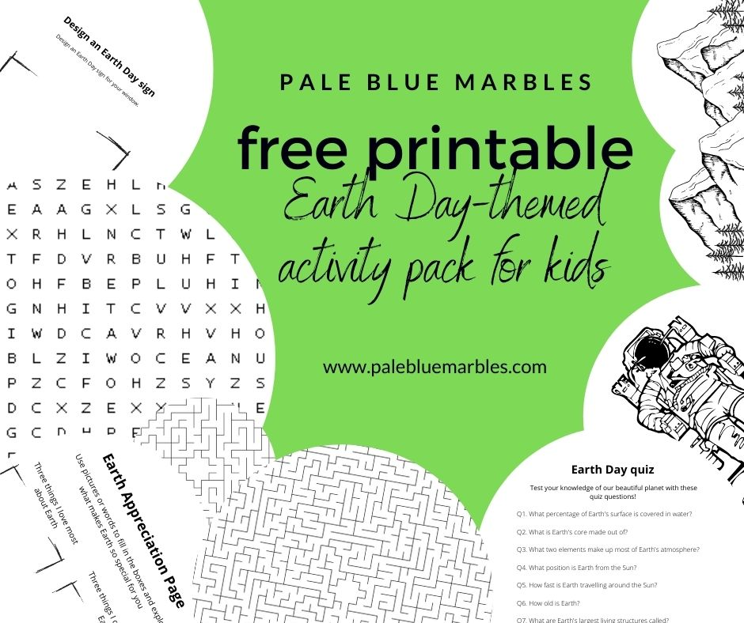
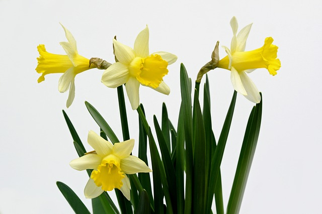

*Celebrate Earth Day and encourage your child to help protect their home planet with these Earth Day activities for kids! I’ve included several different ways for you to mark Earth Day with your child. All activities can be done on Earth Day, or any other day, from the comfort of your own home.*

It will be tough for the next generation: they are inheriting a global climate crisis. One of the most important things we can do to help is to equip them with the right mindset. Help them care. Keep them curious.

Celebrating Earth Day is a great way to start!

Here are 10 Earth Day activities for kids to help you celebrate our planet with your child on Earth Day. Use these activities to help your child appreciate the wonders of this beautiful world – the only one we know of so far that supports life in the Universe – and as a starting point for exploring the issues our planet faces and what we can all do to help.

*For more ways to celebrate Earth Day, I’ve created a free printable (use recycled paper!) Earth Day activity pack for kids that includes an Earth appreciation page, an Earth Day quiz, puzzles (including an Earth Day word search) and Earth-themed colouring pages.*


Download PDF


## 10 Earth Day activities for kids to celebrate our amazing planet

Children are naturally curious about their environment. Encourage this! Help them develop an increased awareness and a sense of joy in learning how amazing their planet is. This is a great way to celebrate Earth – on Earth Day and every day!

### Earth Day activity #1. Look for shapes in the clouds

This is a classic activity that brings joy to small children (and adults!) If you have some nice fluffy clouds in the sky sit with your child at a window or step onto your balcony or into your garden and have fun trying to identify crocodiles, elephants, smiley faces, hearts or anything else that comes into your child’s imagination. Use the opportunity to talk about:

- Types of clouds
- How clouds form
- What is evaporation
- Clouds on other planets



### Earth Day activity #2. Write a poem to the Earth

Grab a pen and paper and compose a poem with your child.

This is a great opportunity to practice rhyming and to talk about the beauty of nature. Write about blue whales or plankton, rainforests or deserts, mountains or fjords, rabbits or bees, rocks or sky.

If you want to give the activity (and the poem) more structure, start each line with the letters from Earth Day!



### Earth Day activity #3. Paint pebbles

Collect some pebbles from your garden, bring out the paints and let your child get creative!

My daughter enjoyed turning pebbles into planets, giving us lots of opportunities to talk about all the planets in [our solar system](https://www.palebluemarbles.com/how-big-is-the-solar-system/) and why [Earth is so special](https://www.palebluemarbles.com/what-does-habitability-mean/).



### Earth Day activity #4. Listen to the birds

Sit with your child in your garden, on your balcony or beside an open window and close your eyes.

What can you hear?

Can you pick out any birds singing?

How many different songs can you hear?

Learn to identify the birds by their songs following an online guide like this [guide from the Woodland Trust](https://www.woodlandtrust.org.uk/blog/2019/04/identify-bird-song/).

If you can’t hear any birds from where you are then listen to the [RSPB’s birdsong radio online](https://www.rspb.org.uk/get-involved/campaigning/let-nature-sing/birdsong-radio/).

If your child is curious you can watch this TED-Ed video on how birds learn to sing:



### Earth Day activity #5. Photograph nature

Give your child a camera and task them with photographing the nature around them – insects in the garden, clouds through a window or your indoor plants!

 on [Unsplash](https://unsplash.com/s/photos/child-with-camera?utm_source=unsplash&utm_medium=referral&utm_content=creditCopyText)")

To take it up a level ask them to create a video documentary about our planet.

### Earth Day activity #6. Start a nature journal

This is a favourite activity in our household, which we started while [homeschooling during lockdown](https://www.palebluemarbles.com/the-words-you-dream-of-hearing-from-your-child/) last Spring.

Give your child a notebook and pencil and ask them to go outside (or look out of a window) and write down their observations.

- What is the weather like?
- Is it warm or cold?
- What can you hear?
- What can you smell?
- Are there any signs of the changing seasons?
- Can you see any animals?
- Find an insect and draw it
- Measure buds
- Birdwatch and take notes

### Earth Day activity #7. Practise gratitude

This is a great exercise for boosting mental health – for kids and adults!

Try spending a few minutes with your child listing all the things that we can thank the Earth for. You can keep it close to home or put it in a cosmic perspective.

If you have some paper and pens handy then they may also enjoy drawing what they are grateful for.

Here are some ideas:

- Happy yellow daffodils in the spring
- Oxygen-rich atmosphere for us to breathe
- Orbiting the Sun in the [habitable zone](https://www.palebluemarbles.com/what-does-habitability-mean/)
- The magnetic field that protects us from solar winds and gives us beautiful aurora
- The ocean for absorbing CO2
- Gravity for keeping us on the ground
- Rain for letting things grow
- Birdsong in the morning
- Sunrise for painting the clouds purple and orange
- The polar ice caps
- Rainbows for brightening a rainy day
- Snow in the winter
- Colourful autumn leaves
- Bees in the clover

### Earth Day activity #8. Make an Earth Day window sign

 from [Pixabay](https://pixabay.com/?utm_source=link-attribution&utm_medium=referral&utm_campaign=image&utm_content=4867842)")

Get out your paints and help your child make a window sign to celebrate Earth Day. You can use cardboard from an old cardboard box for this.

Post a photo of the sign online or send it to your friends and family to raise awareness of Earth Day.

### Earth Day activity #9. Plant a tree

 on [Unsplash](https://unsplash.com/s/photos/gardening?utm_source=unsplash&utm_medium=referral&utm_content=creditCopyText)")

If you have a garden large enough for a tree then plant one! Planting trees is a great way to engage children in caring about their environment. If you can’t plant a tree then plant flowers or vegetables. Talk about how important plants are for capturing carbon dioxide from the atmosphere. Learn more about the [wonders of flowering plants](https://www.palebluemarbles.com/evolution-of-flowers/). 



### Earth Day activity #10. Send Happy Earth Day messages

This is a very easy and fun way for kids to celebrate Earth Day. Send your friends and family Earth Day messages or design a digital Earth Day card. You can even include a picture of your window sign or an Earth Day poem you wrote!
