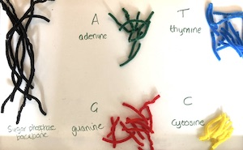
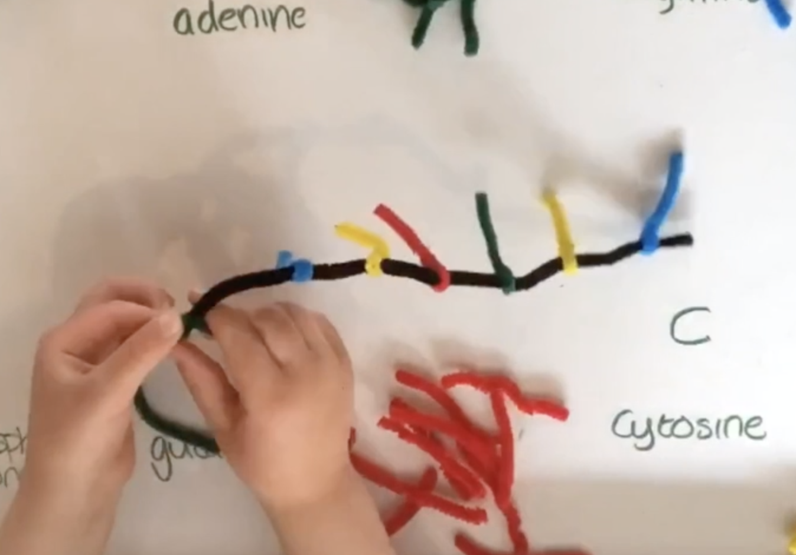
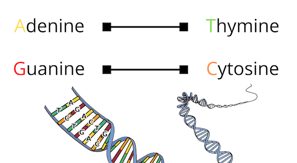
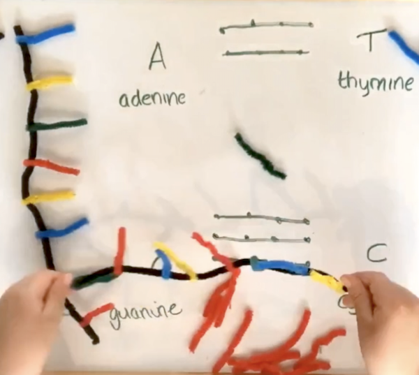

*This is the second post in my [‘DNA for kids’](/posts/dna-for-kids/) blog series. It will show you how to build a DNA model using pipe cleaners to help your child understand the structure of DNA and how it encodes information.*

If you have been through [part 1](/posts/what-is-dna/) in the series then your child now has an idea of why **DNA is the most amazing molecule in the Universe** and they are excited and curious to know more.

Give your child the opportunity to consolidate what they’ve learnt so far with this **fun, hands-on activity.**

My kids loved this!

## **Build a DNA model with pipe cleaners**

To give your child a better grasp of the **structure of DNA and how it encodes information**, let’s build a DNA model from pipe cleaners!

Watch the video for a quick recap on the structure of DNA and step-by-step instructions for building a DNA model with pipe cleaners. I’ve written out more details for each step below.

### You will need

- Pipe cleaners – two of each of at least five different colours
- Scissors to cut the pipe cleaners
- Pen and paper to make labels



### What to do

#### 1. Prepare your materials

- Choose a colour for your DNA **backbone** (we chose black)
- Choose four colours for your DNA **bases** (we chose blue, green, red and yellow)
- Set aside the pipe cleaners for the backbone
- Cut the pipe cleaners for your bases into segments around 5 cm long
- Make four piles of bases and add a label to each: **adenine, guanine, cytosine, thymine** (or you can use A, G, C, T)

#### 2. Build the first strand of DNA

- Give one of the DNA backbone pipe cleaners to your child and show them how to twist bases onto it at regular intervals.
- Let them complete this first strand. They can choose **any bases in any order**. If they want a longer molecule, twist additional backbone strands together and continue twisting bases onto the backbone.

#### 3. Build the second DNA strand

- Now take your child through the DNA **base-pairing rules**: 
    - A always pairs with T (and vice versa)
    - G always pairs with C (and vice versa)

> Does your child remember why the bases pair this way? It’s because of their shapes: any other configuration makes DNA unstable.

- Now give your child another backbone pipe cleaner
- Let them twist bases onto the second strand, **using the first strand as a guide and following the base-pairing rules**. 
    - E.g. if they made the first strand with A-C-G-T-T-A they would need the second strand to have T-G-C-A-A-T.

#### 4. Make a double helix

- Once your child has completed the second strand they can zip up the DNA by **twisting the base pairs together**
- Show them how to make a **right-handed double helix** by twisting the backbone: holding the top with your left hand and the bottom with your right, twist your right hand to the right and your left hand to the left.
- DNA model complete!   

## More learning fun

To supplement my [‘DNA for kids’ series](/posts/dna-for-kids/), I’ve created a **printable activity pack with DNA-themed puzzles, worksheets, quiz and colouring pages**. 


Download PDF
