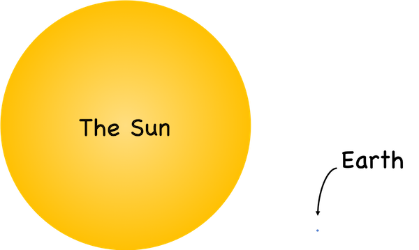
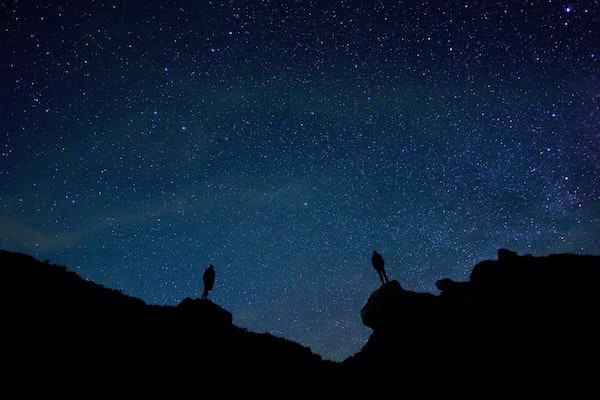
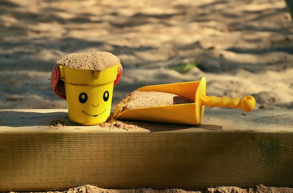
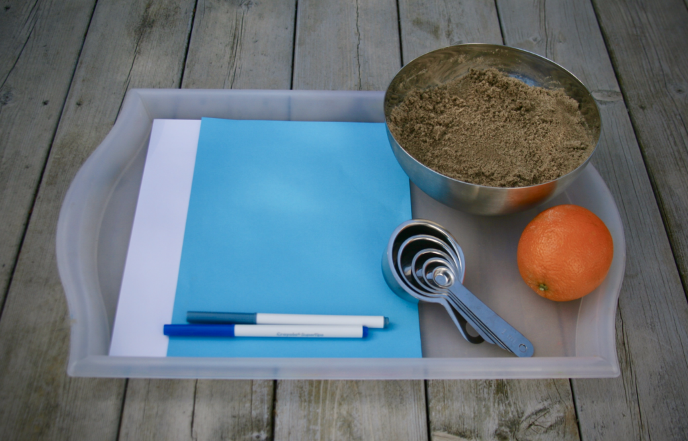
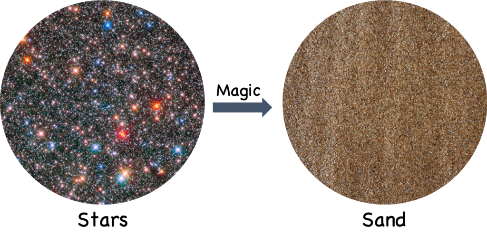
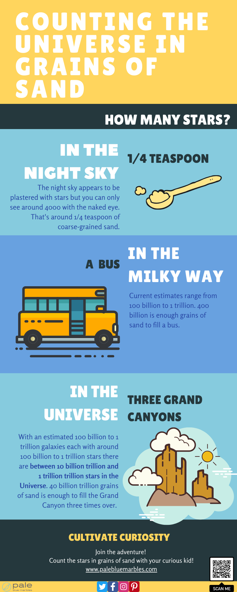
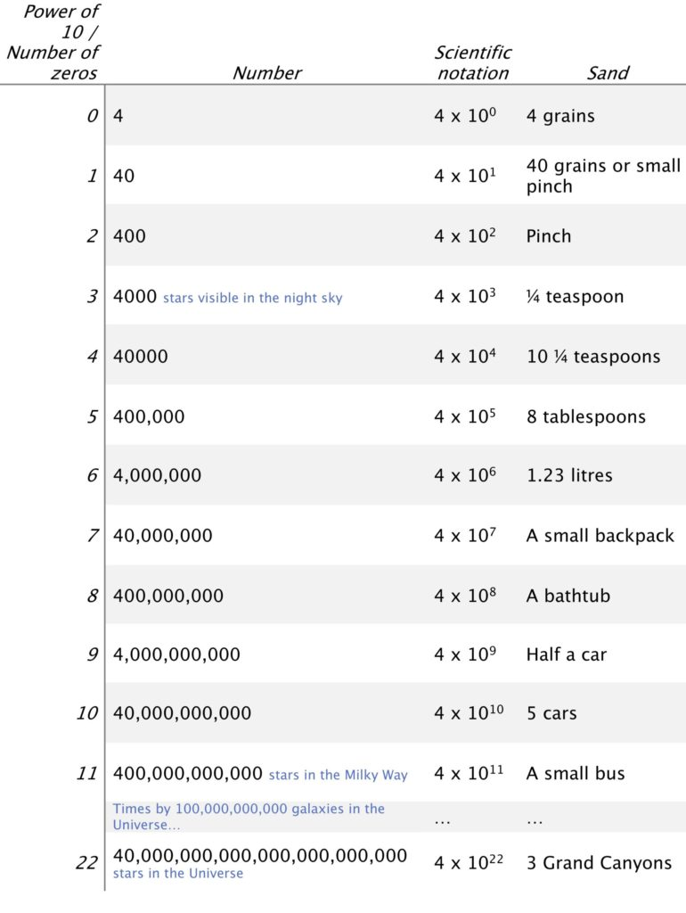

Is your child curious about the stars or the vastness of space? Cultivate that curiosity by combining it with another universal favourite of children: sand! This post will take you through how to count the stars in the Universe using grains of sand: a fantastic activity for all ages and will encourage your child’s love of astronomy.

First, before we start counting those sand grains, two quick questions to get your child thinking about the scale of the Universe.

## **1. How big is the Sun?**

You know it’s big. But, did you know…

**If the Sun were shrunk down to the size of a small orange, Earth would be the size of a grain of sand.**

Relative sizes of the Sun and Earth. The diameter of the Sun (1.3927 million km) is about 109 times that of Earth (12,742 km). If the Sun were the size of an orange the Earth would be the size of a grain of sand. The distances here are not to scale. The distance of the Sun to Earth is actually about 107 times the diameter of the Sun.

What?!

My kids thought this was incredible! They had never imagined that our home planet was so tiny!

If your child is curious to know more try creating scale models of the Sun and the planets in the Solar System using paper and fruit in my [activity post on the size of the Solar System](../how-big-is-the-solar-system).



Next question.

## 2. How many stars can you see in the night sky?

If it’s a dark, cloudless night, step outside and try to count those twinkling points of light.

Did you guess hundreds of thousands? Millions, perhaps?

**The answer is [around 4000.](https://skyandtelescope.org/astronomy-resources/how-many-stars-night-sky-09172014/)**

That cannot be!

It’s true.

**Depending on the level of light pollution in your area and how much of the sky is visible you can probably see fewer than this.**

Still, four thousand is a hard number to grasp for kids and the numbers are only going to get bigger: **time to bring in the sand!**

## Count the stars with grains of sand

This is a fantastic **activity for kids of all ages**. You can do it at home, inside or outside.

It ends with **open-ended play** that lets them explore what they’ve learnt at their own pace.

My kids were asking for more time on this for days afterwards!

### What you’ll need

- **1.5 litres of sand** (salt or sugar would also work)
- **A 1/4 teaspoon measure** (a 1/2 teaspoon or teaspoon will also work)
- **One or two blue or black sheets of paper**
- **White paper and a felt-tip pen**
- Tray (not essential but helps to contain the sand!)
- Other measuring spoons or small containers of different sizes (optional)
- An orange (optional)

Gather your supplies

### What they’ll learn

- How much sand we need to count all the stars in the Universe
- How to think about huge numbers
- That maths is used to solve hard problems
- How to multiply numbers by 10
- Scientific notation

**Follow the steps below and let’s get counting stars with grains of sand!**

### 1. Turn sand grains into stars

Put the sand in a bag or a container in front of you. Most kids love sand so they should be quite excited about this.

Once you’ve got their attention, try to pick out a single grain. Place it on a dark background (the screen of a phone works well).

If you have an orange you can amaze them with the relative sizes of the Sun and Earth.

Now for some magic.

**You’re going to shrink the Sun to the size of a grain of sand.**

Look how tiny it is! They can no longer see the Earth.

Remind them that the grain of sand in front of them (the Sun) is a star. The rest of the grains of sand are also tiny stars. You’ve borrowed them from the Universe.

Turning stars into grains of sand with a little bit of magic.

Challenge them to pick their own star and take a look (give them a magnifying glass if you have one).

Now, let’s start counting stars with sand grains.

### 2. Paint the sky with sand

**Scoop up 1/4 teaspoon of sand. This is around 4000 ‘stars’.**

The actual number of grains will vary greatly depending on how coarse your sand is but this estimate serves our purposes to compare the numbers. If your child is interested, you can compute a better estimate based on the sand you have: this is a great opportunity to practice computing volumes and talking about the geometry of circles and spheres (see bonus maths #1 below for a guide).

Now place your coloured paper on a tray and sprinkle the stars out on it. Create a slightly thicker band running diagonally across it. The paper is the night sky and the sand is the stars that your child can see when they look up on a dark night. Let them examine it for a moment.

>### Bonus maths #1
>
>**How many grains of your sand are there in 1/4 teaspoon?**
>
>1. Estimate the average diameter, in mm, of your sand grains
>2. Compute the average volume, in cubic mm, of one grain using the formula for the volume of a sphere: 4⁄3\* π \*r3, where r is the radius (half the diameter) and π is 3.14159265359 – here you can also talk more about the geometry of a circle
>3. We want the number of grains in 1/4 tsp, which is 1.23 cm3 or 12300 mm3 (there are 1000 mm3 in one cm3). Let’s assume that 64% of the [volume in a random pile of spheres is air](https://en.wikipedia.org/wiki/Sphere_packing) (you can also take this opportunity to demonstrate how spheres are packed by stacking some spherical items like oranges) so we actually have 12300 \* 0.64 = 7872 mm3 of actual sand in a 1/4 tsp scoop.
>4. Finally, to compute the number of grains in this volume we have to divide the volume of our sand (7872 mm3) by the volume of one grain of sand that you computed in step 3.
>5. Check your numbers! [Sand varies in diameter from 0.0625 mm to 2 mm,](https://en.wikipedia.org/wiki/Sand) so you should have a maximum of 61,580,953 and a minimum of 1,879 grains in 1/4 tsp. I am assuming a diameter of around 1.55 mm for this activity.
>

### 3. Take a peek at the Milky Way

Ask your child what they think the thicker band of sand on the paper is. Have they noticed that there is a milky band of stars across the night sky? It is only clear in very dark skies so you may want to show them a photo.

This is the plane of our galaxy, the Milky Way (named due to its milky appearance in the sky). You are looking into the disk of a galaxy! That’s pretty amazing.

**But, wait, what is a galaxy?**

A galaxy is a lot of stars, dust, gas all held together by gravity. They can be different shapes. Many are spirals like this one:

. Image credit: ESA/Hubble & NASA")

**We don’t have a photo like this of our galaxy because we can’t travel outside of it to take one**, but here is a picture of what we think it looks like, showing the names of the different arms of the spiral and the location of our Sun.

. Image credit: NASA")

Hold your hand, palm up, in front of you and demonstrate that our galaxy is like a disk (your hand) and that we are on the edge of this disk. Then tilt your hand so that their view moves from seeing the disk from the top to edge-on. That is the angle we see our galaxy from. There are more stars and dust in the centre of the disk than the edges. That is why we see a band in the sky. This is amazing!

### 4. How many stars are there in our galaxy?

Before you count more stars with sand grains, let your child guess the number of stars in the whole galaxy.

**There are around 400 billion** (current estimates range from 100 billion to 2 trillion).

This is not a number most people can grasp.

Let’s get back to the sand!

If 1/4 teaspoon of sand is 4000 stars, how much sand do we need for 400 billion?

**We would have to fill a small bus with our magic sand to get a galaxy’s worth of stars!**

I recommend taking your child step by step through the powers of 10 and how the piles of sand grow, by following the guide in the bonus maths #2 box below.

**Now it’s time for another jump.**

### 5. How many galaxies are there in the Universe?

There are around 400 billion stars in our galaxy. But our galaxy is just one of many. How many? Allow your child to guess. Is it a handful of galaxies? Hundreds? Millions?

**There are thought to be between 100 billion and 1 trillion galaxies in the observable Universe!** (We can only see part of the Universe since light from the rest has not had time to get here yet – so there are actually more galaxies than this).

If you find it hard to imagine a lot of galaxies, take a look at this photo:

 and the HUDF Team")

It was taken by the Hubble Space Telescope and is my personal favourite photograph of all time. See all those points of light? **Each one is a galaxy** (except for the ones with the cross-hairs: those are stars).

If that isn’t amazing enough, think about this: the photo was taken by pointing the telescope at **a tiny, tiny patch of what appeared to be completely empty space**, and the picture that came back was full of galaxies!

So, there are 100 billion galaxies in the observable Universe. How many stars is that?

### 6. How many stars are there in our Universe?

Let’s multiply the number of stars in our galaxy by the number of galaxies in the (observable) Universe (our galaxy is thought to be larger than average but we can ignore that for now as we are using a number on the lower end of the estimate for the number of stars it contains and the number of galaxies).

4 x 1011 (400 billion) stars multiplied by 1 x 1011 (100 billion galaxies) gives us 4 x 1022.

**That’s 40 billion trillion stars in the observable Universe!**

With that much sand (about 12,300 cubic km) **you could fill the Grand Canyon three times over.**

The Grand Canyon is enormous:

### 7. Counting the Universe in grains of sand

Here are our key numbers:

>### Bonus maths #2
>
>#### The power of ten
>
>- Use the cheat sheet below to take your child through the steps of getting from 4 to 400 billion.
>- If you need to introduce the concept of multiplication, you can grab some larger countable items (rice works well) and have them practice multiplying various numbers.
>- Take a piece of white paper and a pen and write each number out. If you have an older child they can do the writing.
>- Give them time to grasp how much sand it is and how rapidly the volume is growing at each power of 10 before moving to the next one.
>- Get them to count the zeros for each number and introduce scientific notation as a short way of writing them.
>- Demonstrate how much sand it is at each step as far as you can until their imagination can take over (I do not recommend filling a backpack, bathtub, car or bus with sand…)
>- Once you get to the number of stars in the Universe, show how you can get the number of zeros of the answer by adding the exponents (the number that 10 is raised to the power of) of the number of stars in the Milky Way and the number of galaxies in the Universe.
>
>
>
>The number of zeros, scientific notation and quantity of sand for each power of ten from 4 to 4000 (stars in the sky) to 400,000,000,000 (stars in the Milky Way) and the number of stars in the observable Universe.

### 8. How many planets are there?

We’ve counted all the stars in the Universe and it amounts to a colossal number of sand grains. What about planets?

[Our Solar system](../how-big-is-the-solar-system/) is home to 8 planets (sorry, Pluto).

So far, **we have detected solar systems around 3143 other nearby stars** (by the time you read this there will likely be more: [you can check the current number here](http://exoplanet.eu/catalog/)), with **over 4,247 planets confirmed so far**.

That’s more than 1 planet per star (1.3 on average). And these are only the ones that are ‘easy’ to find – there are likely more per star that we have yet to discover.

This means **hundreds of billions of planets in our galaxy and billions of trillions in the observable Universe!**

If you were to count planets with sand grains, **you’d have more than enough sand to fill the Grand Canyon four times over!**

### 9. Playtime!

Phew!

That’s a lot of big numbers to think about. You have counted all the stars in the sky, the galaxy and the Universe with grains of sand.

Now give your child the measuring spoons and paper and let them play with the sand! My daughter enjoyed scooping stars and drawing spiral galaxies.

<iframe allowfullscreen="allowfullscreen" frameborder="0" height="315" src="https://www.youtube.com/embed/fYQcZNjxbuc" width="560"></iframe>
