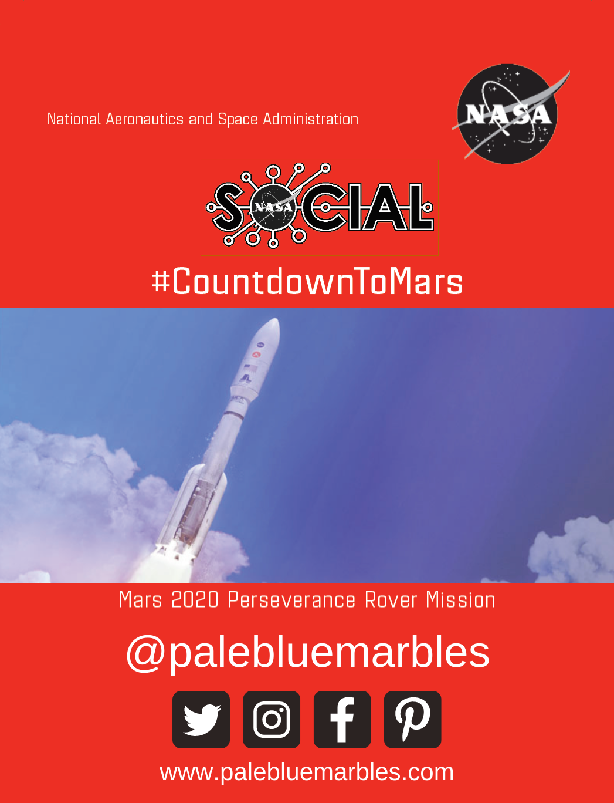
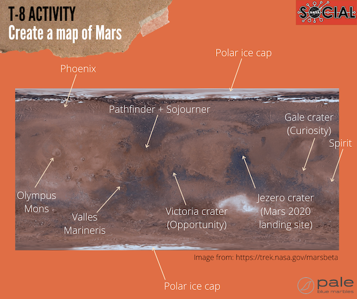
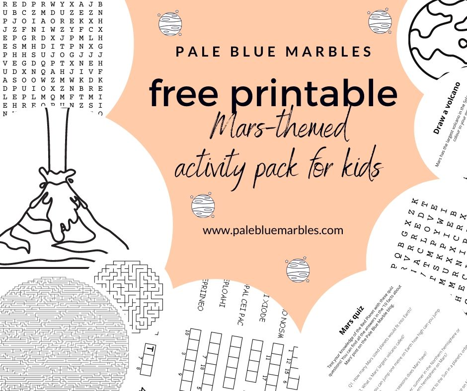

Join the **\#CountdownToMars** with fun Mars **activities for kids** that you can do at home.

As part of the #CountdownToMars #NASAsocial, I posted one Mars activity for kids per day on social media ([Facebook,](https://www.facebook.com/palebluemarbles) [Twitter](https://www.twitter.com/palebluemarbles) and [Instagram](https://www.instagram.com/palebluemarbles)) from T-10 days up until the launch of NASA’s Mars2020 Perseverance rover on the 30th July. 

I’ve collated everything together here so that if you missed an activity or want to repeat any of them – or if you are just looking for lots of Mars-themed activities – they are all here in one place. 

NASA’s Mars2020 mission will send a robotic astrobiologist to Mars to search for signs of ancient life on the Red Planet. This is incredibly exciting! 



Fuel the excitement of your little explorers and get them involved in the countdown to the beginning of the next stage of exploration on the Red Planet!  NASA’s Mars2020 was not the only mission that set off for the Red Planet this summer: three were launched! It’s been a rough 2020 but these missions are an inspiration for humankind. Space exploration shows what amazing things humans can achieve. Before we get to the #CountdownToMars activities for kids, here’s a quick overview of the missions to Mars this year.

## Missions to Mars in 2020

The window for sending spacecraft to Mars opens once every 26 months, due to the relative positions of Mars and Earth (see activity #1 below). Three nations sent missions to the red planet in the summer 2020 window – each will reach Mars in February 2021. This video from Nature gives a nice overview of the space agencies involved and why they are all launching in 2020:



### Emirates Mars Mission Hope Probe

First up, launched on 19th July, is the [Emirates Mars Mission Hope Probe](https://www.emiratesmarsmission.ae/). This is an orbiter that will help study the Martian atmosphere. Watch the moment it launched here:



## China’s Tianwen-1

Second, launched on 23rd July, is [China’s Tianwen-1](https://www.dw.com/en/the-facts-on-tianwen-1-mars-orbiter-and-rover/a-54014414), an orbiter and a rover. China has not released many details about this mission so far but you can watch the launch here:



## NASA’s Mars 2020 Perseverance rover

Third, launched on 30th July, is the U.S.A. with NASA’s [Mars 2020 Perseverance rover](https://mars.nasa.gov/mars2020/), which will search for signs of ancient life and collect samples for a future return mission to Earth. The first helicopter on Mars, Ingenuity, will also be deployed by Perseverance. We are counting down to this mission and, in February, following its robotic astrobiologist once it gets to Mars! Join the #CountdownToMars!



You can watch the moment the Perseverance rover launched here:



And you can [follow it on its journey to Mars here](https://eyes.nasa.gov/apps/orrery/#/sc_perseverance).

## Europe’s ExoMars mission postponed to 2022

The launch of Europe’s first rover on Mars, Rosalind Franklin, which is part of the [ExoMars mission](http://www.esa.int/Science_Exploration/Human_and_Robotic_Exploration/Exploration/ExoMars) has been postponed until 2022. When it arrives on Mars in 2023, it will drill down into the Martian subsurface looking for evidence of life.

## \#CountdownToMars activities for kids

Below are all the daily #CountdownToMars activity ideas I’ve posted so far on social media, starting from T-10 days. I will post one Mars activity for kids per day until launch ([currently scheduled for 30th July](https://mars.nasa.gov/mars2020/)). Follow along on [Facebook](https://www.facebook.com/palebluemarbles) or [Twitter](https://www.twitter.com/palebluemarbles) and share your comments or photos!

## T-10 days

### \#CountdownToMars activity for kids T-10: where is Mars?

<iframe allowfullscreen="allowfullscreen" frameborder="0" height="469" scrolling="no" src="https://www.facebook.com/plugins/video.php?href=https%3A%2F%2Fwww.facebook.com%2Fpalebluemarbles%2Fvideos%2F284243836351153%2F&show_text=0&width=560" style="border: none; overflow: hidden;" width="560"></iframe>

The launch window for missions to Mars happens every ~2 years due to the positions of Earth and Mars around the Sun.

For this first Mars activity, help your child visualise **where Mars is in relation to the Sun and Earth right now** and in **February 2021** when the Perseverance rover is due to land on the surface of Mars. The video has diagrams to help you. Here’s a summary:

1. Use a coin to mark the **position of the Sun**
2. Mark the **positions of the four inner planets** as they are right now (first diagram in the video)
3. Show how the planets will be positioned **when the Perseverance rover lands** on the surface of Mars (second diagram in the video)

You can also map out the **trajectory of the spacecraft** on its way to Mars and talk about why the launch window only happens every ~2 years due to the relative positions of the planets.





### Turn this activity into a game

We turned this Mars activity into a game: my two kids were the two planets (Earth and Mars) and had to **work together** to keep the correct relative positions while walking around their orbits (which we drew with chalk using relative distances to scale).

We marked out a few checkpoints and they got points if they both reached them at the same time. They had to start again if they got out of sync.

Complete with sound effects this was a lot of fun! It also **promotes cooperation and teamwork**! I tried joining in as Venus but quickly got dizzy.

## T-9 days

### \#CountdownToMars activity for kids T-9: how big is Mars?

<iframe allowfullscreen="allowfullscreen" frameborder="0" height="469" scrolling="no" src="https://www.facebook.com/plugins/video.php?href=https%3A%2F%2Fwww.facebook.com%2Fpalebluemarbles%2Fvideos%2F327809531594120%2F&show_text=0&width=560" style="border: none; overflow: hidden;" width="560"></iframe>

**Mars is half the diameter of Earth but only a 6th of the volume.** Give your child a better grasp of this by modelling it with playdough in the second of the Mars activities for kids ([more details for this activity here](https://www.palebluemarbles.com/facts-about-mars/)).



## T-8 days

### \#CountdownToMars activity for kids T-8: create a map of Mars

<iframe allowfullscreen="allowfullscreen" frameborder="0" height="469" scrolling="no" src="https://www.facebook.com/plugins/video.php?href=https%3A%2F%2Fwww.facebook.com%2Fpalebluemarbles%2Fvideos%2F207315847312375%2F&show_text=0&width=560" style="border: none; overflow: hidden;" width="560"></iframe>

What are the landmarks on Mars? Where is Perseverance going to land? Where are the other rovers? Draw a map and mark them out to get an overview of the Martian landscape, including:

- Polar ice caps
- Olympus Mons – the largest volcano in the Solar System
- Valles Marineris – a deep gash in the surface of Mars
- Phoenix (lander)
- Spirit (rover)
- Pathfinder (lander) and Sojourner (rover)
- Victoria crater (landing site of Opportunity rover)
- Gale crater (landing site of Curiosity)
- Jezero crater (landing site of Mars 2020 with the Perseverance rover and Ingenuity helicopter)



Explore the surface of Mars virtually at [NASA’s Mars Trek](https://trek.nasa.gov/mars/). You can also see the current locations of all active orbiters, rovers and landers at [NASA’s Mars Now](https://mars.nasa.gov/explore/mars-now/).

## T-7 days

### \#CountdownToMars activity for kids T-7: build a cardboard rover

<iframe allowfullscreen="allowfullscreen" frameborder="0" height="469" scrolling="no" src="https://www.facebook.com/plugins/video.php?href=https%3A%2F%2Fwww.facebook.com%2Fpalebluemarbles%2Fvideos%2F280687526326432%2F&show_text=0&width=560" style="border: none; overflow: hidden;" width="560"></iframe>

Grab some cardboard, pencils, elastic bands, tape and scissors and design and build your own rover.

- Make a base, use the pencils as axles and cut six wheels out of cardboard.
- Add cardboard cut outs for robotic arms and cameras.
- Google images of Mars rovers for inspiration or let your child use their imagination.
- Figure out how to make the wheels turn using elastic bands.



For older children (or adults) interested in engineering, you can build a more advanced rover using [these instructions from JPL](https://github.com/nasa-jpl/open-source-rover).

## T-6 days

### \#CountdownToMars activity for kids T-6: make an erupting volcano

<iframe allowfullscreen="allowfullscreen" frameborder="0" height="469" scrolling="no" src="https://www.facebook.com/plugins/video.php?href=https%3A%2F%2Fwww.facebook.com%2Fpalebluemarbles%2Fvideos%2F340209360713740%2F&show_text=0&width=560" style="border: none; overflow: hidden;" width="560"></iframe>

Mars has a lot of large volcanoes – including the largest volcano in the Solar System. They are likely all extinct now but let’s make one erupt anyway. This is a classic experiment for kids and a lot of fun. Try experimenting with the quantities of each ingredient to see what makes the most impressive lava flow. See my blog post ‘[10 facts about Mars](https://www.palebluemarbles.com/facts-about-mars/)‘ for more detailed instructions.



## T-5 days

### \#CountdownToMars activity for kids T-5: make a paper helicopter

<iframe allowfullscreen="allowfullscreen" frameborder="0" height="469" scrolling="no" src="https://www.facebook.com/plugins/video.php?href=https%3A%2F%2Fwww.facebook.com%2Fpalebluemarbles%2Fvideos%2F322097378964568%2F&show_text=0&width=560" style="border: none; overflow: hidden;" width="560"></iframe>

The first helicopter to fly on another world, Ingenuity, will be deployed by the Perseverance rover. Let’s make some paper helicopters to celebrate! All you need is a sheet of paper, scissors and a paperclip. Fold and cut the paper along the lines shown in the video and have fun experimenting with the design.



You can learn more about Ingenuity here:



## T-4 days

### \#CountdownToMars activity for kids T-4: family portrait on Mars

<iframe allowfullscreen="allowfullscreen" frameborder="0" height="469" scrolling="no" src="https://www.facebook.com/plugins/video.php?href=https%3A%2F%2Fwww.facebook.com%2Fpalebluemarbles%2Fvideos%2F313112459724709%2F&show_text=0&width=560" style="border: none; overflow: hidden;" width="560"></iframe>

Strike a pose, take a photo and put your family on Mars using [NASA’s Mars Photobooth](https://mars.nasa.gov/mars2020/participate/photo-booth/). My kids were very excited about this one!



## T-3 days

### \#CountdownToMars activity for kids T-3: packing list for Mars

<iframe allowfullscreen="allowfullscreen" frameborder="0" height="469" scrolling="no" src="https://www.facebook.com/plugins/video.php?href=https%3A%2F%2Fwww.facebook.com%2Fpalebluemarbles%2Fvideos%2F617990408868157%2F&show_text=0&width=560" style="border: none; overflow: hidden;" width="560"></iframe>

You are one of the first group of humans to travel to Mars. What do you take with you? Brainstorm, list, draw, plan your mission!

## T-2 days

### \#CountdownToMars activity for kids T-2: how high can you jump on Mars?

<iframe allowfullscreen="allowfullscreen" frameborder="0" height="469" scrolling="no" src="https://www.facebook.com/plugins/video.php?href=https%3A%2F%2Fwww.facebook.com%2Fpalebluemarbles%2Fvideos%2F1155110248180822%2F&show_text=0&width=560" style="border: none; overflow: hidden;" width="560"></iframe>

Gravity on Mars is 38% that on Earth, which means you can jump 2.6 times higher on Mars than you can on Earth.

Have fun seeing how high you and your child can jump on Earth and how much higher that would be on Mars.

1. Jump in the air
2. Measure the height of your jump with a metre stick or tape measure
3. Multiply the height by 2.6 – this is how high you can jump on Mars!
4. Mark the height you can jump on Mars


 
## T-1 days

### \#CountdownToMars activity for kids T-1: make a rocket

<iframe allowfullscreen="allowfullscreen" frameborder="0" height="469" scrolling="no" src="https://www.facebook.com/plugins/video.php?href=https%3A%2F%2Fwww.facebook.com%2Fpalebluemarbles%2Fvideos%2F756564741757104%2F&show_text=0&width=560" style="border: none; overflow: hidden;" width="560"></iframe>

This is the penultimate day in our #CountdownToMars – we’re so excited!

Get ready for launch by building your own rocket from recycled materials. Have fun decorating it and then do your own countdown and launch. Take a look at this [album of photos from the United Launch Alliance](https://www.flickr.com/photos/ulalaunch/sets/72157714410183007/with/50166219877/) for inspiration.

You can do the launch by hand or you can use baking soda and vinegar for thrust (adult supervision and eye protection required):

1. Include a stoppered container inside your rocket
2. Add vinegar
3. Drop in the baking soda
4. Stopper the container
5. Stand back and watch your rocket launch

This requires some experimentation to get the quantities right: there needs to be enough pressure from the carbon dioxide produced in the reaction to push the stopper out and lift the rocket.

Have fun!



## T-0 days

### \#CountdownToMars activity for kids T-0: watch the launch!

This is the final day in our #CountdownToMars and there is only one thing left to do: watch the launch!

Tune in to see it live on [NASA TV](https://www.youtube.com/nasa). The launch window opens at 07:50 a.m. EDT (11:50 a.m. UTC) on July 30th 2020 with coverage starting at 07:00 am EDT.

Enjoy!

And here’s the moment it launched:



## What next?

It will take the Perseverance rover 7 months to reach Mars. Here’s an overview of its journey including several trajectory correction maneuvers (TCMs) to adjust its flight path (image credit: NASA/JPL-Caltech):

<iframe frameborder="0" height="400" scrolling="no" src="https://mars.nasa.gov/embed/25156/" width="100%"></iframe>

[You can track it live here.](https://eyes.nasa.gov/apps/orrery/#/sc_perseverance)

Once Perseverance lands on Mars its main objective is to search for signs of ancient life and take rock samples for a return mission to Earth. More on that in a later post!

## Free printable activity packs for kids

I’ve created several **astrobiology activity packs** for kids that you can download and print off. Each one contains puzzles, colouring pages and worksheets around a particular theme – to supplement my activity posts on these themes. **The latest one is Mars-themed and great for helping your child #CountdownToMars!**


Download PDF


## More Mars activity resources

Other great resources for Mars activities for kids:

- [Mars activities](https://mars.nasa.gov/participate/funzone/) from NASA
- [Mars activities for the classroom](https://mars.nasa.gov/classroom/pdfs/MSIP-MarsActivities.pdf) from NASA’s Jet Propulsion Laboratory
- [Mars glider challenge](https://www.discoverspace.org/video_lesson/mars-glider-challenge/) from The Space Foundation Discovery Center
