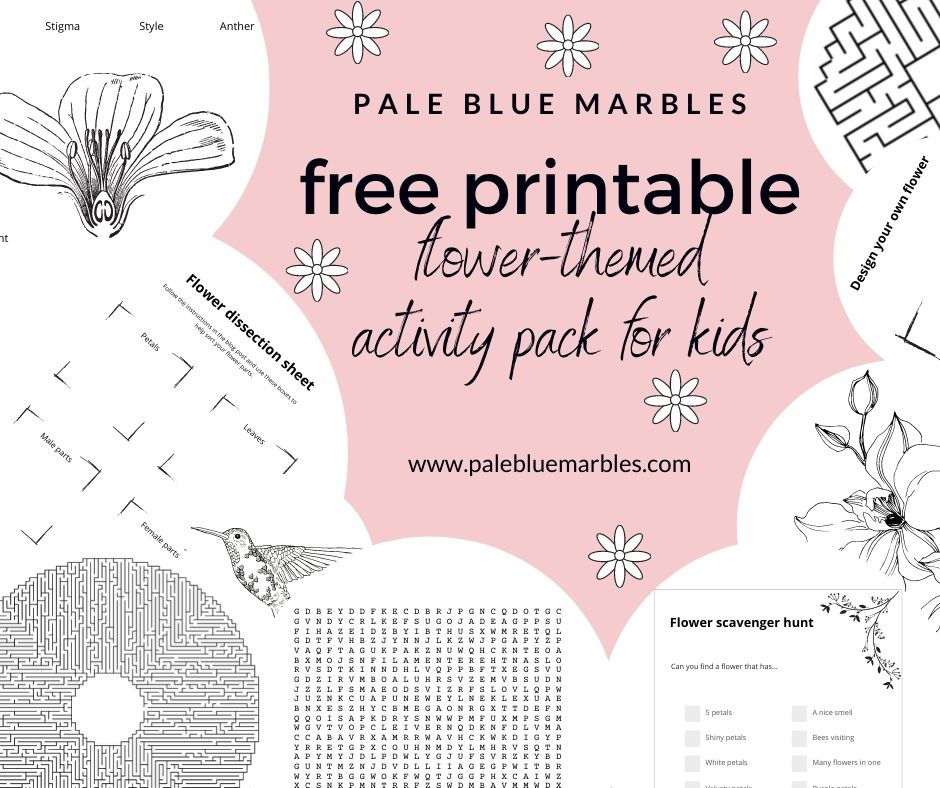
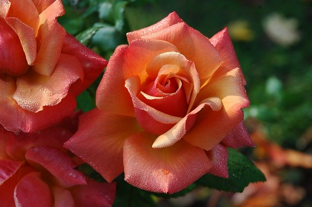
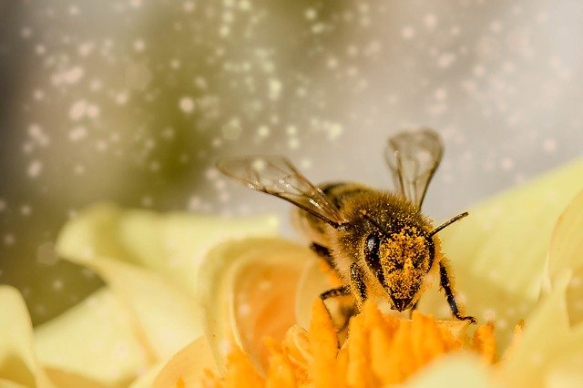
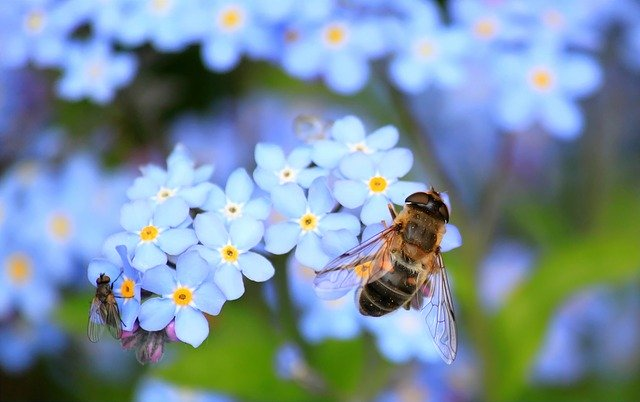
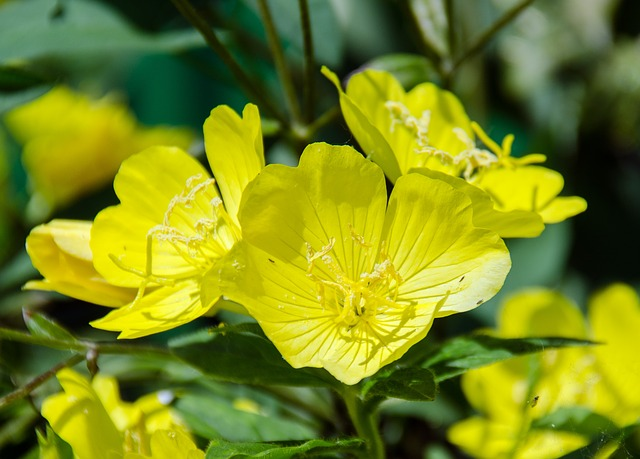
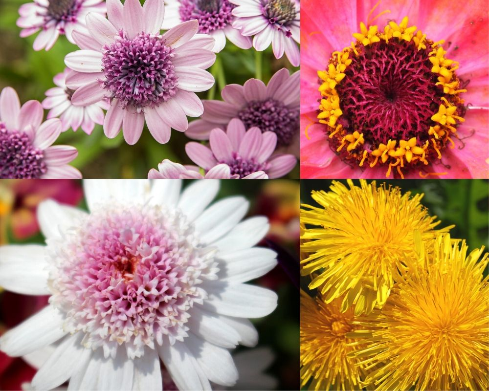
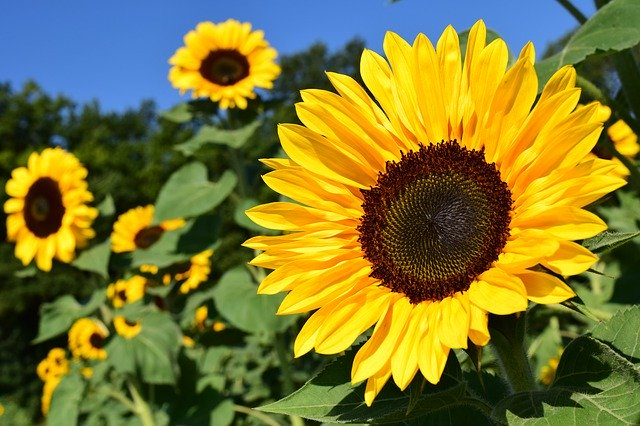
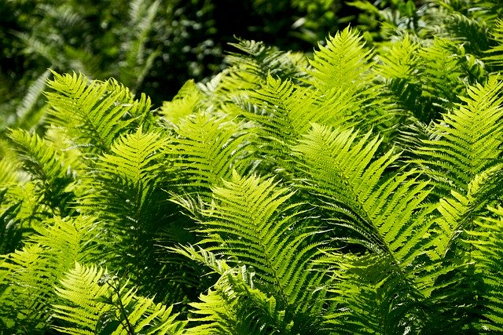
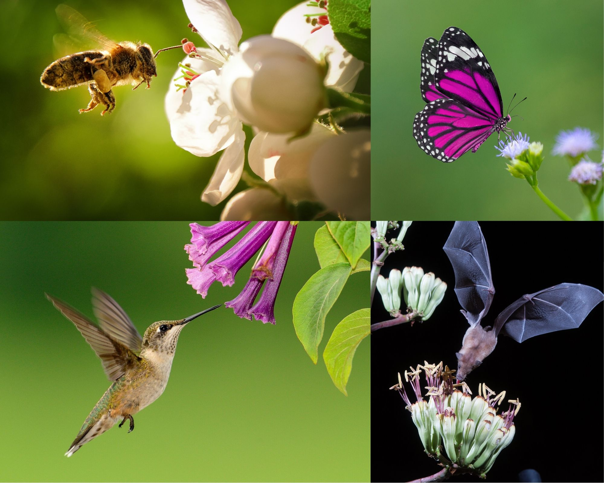

The evolution of flowers is a fascinating topic for kids to explore. Flowers are amazing. Children and adults alike love them. They are ingrained in human culture and much of the animal kingdom depends on their nectar or their fruits.

Since their evolution, flowering plants have come to **dominate the land** on our planet. Flowers and pollinators have evolved weird, wonderful and increasingly complex ways of interacting with each other. Flowering plants also account for a lot of [**water transport into our atmosphere**](https://www.sciencemag.org/news/2010/06/world-without-flowers).

Understanding the evolution of such a **planet-altering lifeform** is an important topic for [astrobiology](https://www.palebluemarbles.com/why-kids-will-one-day-learn-astrobiology-before-their-abcs/). Earth would be a very different place if it weren’t for the evolution of flowers. And given their success on this planet, perhaps flower-like structures have also evolved on other worlds.

So **what are flowers?** Why are they such **marvels of evolution**? **How did flowering plants evolve?** Read on to find out and take your child on an exciting adventure of discovery, learning about one of the most important life forms on Earth – with fun facts, photos, short videos and hands-on activities.

To supplement this post I’ve created a flower-themed activity pack.


Download PDF


## The highlight of springtime

Right at the end of a long, dark winter, as the COVID-19 pandemic marched into Europe, Norway went into nationwide lockdown. Schools and kindergartens closed and we were all advised to stay home.

But this was not going to stop us **celebrating the arrival of spring**!

We made it part of our daily [homeschool](/posts/the-words-you-dream-of-hearing-from-your-child/) routine to go outside every morning after breakfast and **“pay attention” to signs of life reawakening**. Notebooks and pencils in hand, we explored our garden and hunted down every new bud. We listened to the birdsong and, for most of the first couple of weeks, the sound of the rain.

I highly recommend this activity, it’s great for **cultivating mindfulness** in kids.

In the Autumn, we had planted bulbs in a little patch of earth in the middle of the lawn and it was a happy day when the daffodils started to bloom. After weeks of careful observations, my kids knew each flower as if it were a pet.

A few days later they came running into the house.

“Come and see! Come and see!”

They were so excited!

We went out to have a look and there amongst a sea of yellow flowers was a **daffodil with an orange trumpet**. Fascination with the new variant ensued. Why was it different?

**Surprise is a powerful fuel for curiosity.**

## Variation in flowers

The orange trumpet on a daffodil, while the delight of my children, is a small variation in what is a stunning myriad of colour and form across all flowering plants.

Take a look at some of them blooming in this video from National Geographic:



Count up all the plant species with flowers (the angiosperms) and you’ll find that they comprise a staggering [94% of all the vascular land plants](https://stateoftheworldsplants.org/2016/) (plants with a transport system for water and minerals) on Earth (369,000 out of 391,000). This is why flowering plants play such a **big role in [transporting water into the atmosphere](https://www.sciencemag.org/news/2010/06/world-without-flowers)**: they take water up from the soil, through their roots, and release it into the air, through their leaves (this process is called transpiration).

**Flowering plants dominate our planet.**

So what is it about flowers? Why are they so important to plants? And how did flowers evolve?

## What is a flower?

Humans have loved flowers for millennia. We give them as gifts, decorate our homes with them, put their pictures on our walls and on our clothes, and we go out of our way to smell like them.

But what do plants use flowers for?

### **The job of a flower is to make new plants.**

Special structures inside flowers create the male and female cells (the building blocks of life) that are fused to make plant embryos.

These **baby plants are protected by seeds and spread with the help of the fruit** that develops around them and the animals that eat them (fruit in this context means not only the sweet fruits you are familiar with but also nuts and vegetables).

A single flower can hold the parts that make the male cells (the **stamen** with its **anthers**, which produce **pollen**), the parts that make the female cells (the **pistil** with its **stigma** and **ovary**, where the **seeds** and **fruit** develop) or both. The name **carpel** is used to refer to one or more pistils, which can be fused together.

Have a look at the diagram below to show your child what these typically look like. If you’ve downloaded the activity pack to support this post then you can also do the flower parts worksheet and puzzles. Then try and find these parts in a real flower following the flower dissection activity below.

 include anthers, which produce pollen (containing the male reproductive cells). The female parts (the carpel) include the stigma, which receives the pollen, and the ovary, which forms the fruit and contains seeds that develop from the ovules (female reproductive cells) after fertilisation. Flowers can have either the male or female parts, or both, and there can be multiples of each in a single flower.")

>### Activity #1: Dissect a flower
>
>Find a flower that has **clearly visible male and female parts**. Make sure the flower is not poisonous to you or your pets ([lilies are highly toxic to cats](https://www.fda.gov/animal-veterinary/animal-health-literacy/lovely-lilies-and-curious-cats-dangerous-combination), even a few pollen grains can be fatal; daffodils are great to dissect but are also poisonous so treat with care).
>
>Read on to learn about composite flowers if you want to dissect parts of a daisy or dandelion.
>
>Pick your chosen flower apart to find the male and female parts. If your flower is big enough, break open the carpel and see if you can find the ovules. Use a magnifying glass to inspect each part. You can also add labels to the parts and show your child how pollination happens (see below for more on pollination).
>
>The activity pack that supplements this post has a printable worksheet to help you sort the flower parts.

## Pollination in flowers

When **pollen lands on the stigma** (the tip of a female pistil) it creates a tube into the style that leads to the ovary and allows the male cells inside the pollen to travel to the female ovules. This is called **pollination** and is very important for most flowering plants. It leads to **fertilisation** (where the male and female cells fuse) and the **formation of seeds containing plant embryos**.

So, **flowers hold essential reproductive organs**. This is very important to the flower. But what do you notice first when you look at a flower?

## Pretty petals

With most flowers, it’s the **petals that grab your attention**. Petals have an amazing array of shapes, colours, patterns, scents, and even surface textures.

**Why do flowers go to such trouble?**

**The job of petals is to attract animals that can carry the flower’s pollen from its anthers to the stigma of another of its flowers**, which allows pollination to happen.

That’s not to say all flowers are so showy. The plants with the least showy flowers (like grasses) usually rely on the **wind for pollination** and so don’t need to go out of their way to make fancy petals that attract animals.

Those that rely on animals, though, have to keep up appearances.

## What’s in it for the pollinators?

Pollinators don’t usually visit flowers just because they look nice.

Some, like the bumblebee, are there to eat pollen. It’s a rich source of protein. But flowers have evolved another trick to **ensure a steady stream of animals that will carry their pollen far and wide**.

**Flowers make a sugary liquid, called nectar, that pollinators love to feed on.**

Watch the hummingbird feed on nectar in this clip from BBC Earth:



So what does this nectar have to do with what the flowers look like?

## The tricks and treats of flowers

Pollinators learn where they can get nectar by **recognising the flowers** – by colour, shape, pattern and smell. They find the ones they like best and remember what they look and smell like. Some petals also have [cells on the surface shaped like cones ](https://www.nationalgeographic.com/science/phenomena/2009/05/14/bumpy-petals-help-bees-get-a-grip-on-flowers/)that make it easier for bees to maintain their grip and stay on the flower.

As fancy as they look to us, flowers have evolved **even more signals to pollinators** than we can see. Some of the patterns on petals are only visible in **ultraviolet**, which bees can see but we can’t.

The patterns, colours and textures on the petals also act like **signposts to guide pollinators to the centre of the flower**. The centre is where all the important work happens: it’s where the nectar is kept, where the pollen is waiting and where pollination happens. Bees can even feel changes in the shape of the cells on the petal’s surface as they get closer to the centre of the flower.

Sunflowers are famous for tracking the sun during the day. One of the benefits they get from this is that the **extra warmth helps them to attract bees**. The evolution of flowers is full of surprises.

This short video gives a nice summary of how this works:



## Sneaky flowers

Some flowering plants have evolved very sneaky ways to **entice pollinators**.

### Flowers have evolved mimicry

There are flowers that look like insects and some, in an astounding feat of evolution, even imitate rotting meat!

 looks and smells like rotting meat. The fly orchid (top right) and bee orchid (bottom right) look like insects.")

That’s right. [Carrion flowers look and smell like rotting meat](https://www.cell.com/current-biology/pdf/S0960-9822(15)00881-7.pdf), they even generate heat that **mimics the heat of decay**. This attracts insects that are looking for **a good place to lay their eggs**, and while they do this they also **pollinate the flowers**.

Some of these flowers also have traps for the insects that load them with pollen before releasing them. These are not the kind of flowers you want to keep in your home!

### Flowers have evolved hearing

Flowers can also hear their pollinators.

Yep. Plants actually do have “ears”.

Evening primroses can [sense the buzzing of bees](https://www.nationalgeographic.com/science/2019/01/flowers-can-hear-bees-and-make-their-nectar-sweeter) nearby. What do they do with this information? They **make their nectar sweeter for the bees**. Kind of them. And sneaky.

### Flowers have evolved to masquerade as one

In another remarkable feat of sneakiness, and more recent evolution of floral complexity, many of the beautiful blooms we enjoy are not actually single flowers at all. They are **composite flowers.**

Composite flowers are clusters of flowers that work together to [look like one large flower](https://en.wikipedia.org/wiki/Pseudanthium), making them more enticing to pollinators. If you haven’t noticed this before (I hadn’t) then prepare to be amazed. My daughter showed a large degree of skepticism towards the idea so here are a few photos of composite flowers as evidence to show your child:

Composite flowers include all the lovely daisy flowers and sunflowers. That central disc in a daisy or sunflower? It’s actually a huge cluster of teeny tiny flowers, **each with an ovary that produces a seed**, surrounded by more showy flowers with larger petals around the outside to draw the insects.

Dandelions are another example of these composite flowers. Each of the tiny flowers in the centre produces one of the dandelion’s characteristic parachute seeds in the dandelion clocks that are so fantastic at attracting children (who happily help to disperse them).

## Flowers are mathematical wonders

If you look closely at the head of a sunflower you’ll notice the amazing order to the tiny flowers, and the seeds they produce after pollination, in the central disk. The seeds are arranged into **two sets of spiral arms winding in opposite directions** from the centre out.

This arrangement is a well-known mathematical wonder of nature that has been used in many places in the evolution of flowers, and other life on Earth. It’s a fantastic topic to explore with curious kids, especially those that enjoy maths, sorting and ordering. Stay tuned for a separate post on the Fibonacci sequence in nature.

>### Activity #2: A flower hunt
>
>Now your child has learnt a lot about flowers and what characteristics they have evolved. It’s time for some more hands-on fun. Go into your garden, visit a local park or just take a stroll along a hedgerow or roadside, and look at the different types of flowers there.
>
>**The activity pack that supplements this post includes a printable scavenger hunt checklist for even more floral fun.**
>
>Here are some of the things to pay attention to when looking at the flowers you find (be careful not to handle any poisonous flowers).
>
>- What colour(s) are they?
>- How many petals do they have?
>- Do they have any patterns?
>- What do the petals feel like?
>- Are they shiny or matt?
>- Do they smell?
>- Are they really single flowers or a cluster masquerading as one?
>- Can you see the anthers?
>- Is there any pollen?
>- Are there any insects foraging for nectar on them?

Flowers are important life forms on present-day Earth. But they are actually a relatively recent evolutionary innovation. Let’s explore the evolutionary history of flowers.

## A world without flowers

Can you imagine a world without flowers? If you get yourself a time machine and jump back between [422-340 million years](https://nph.onlinelibrary.wiley.com/doi/full/10.1111/nph.15011) you would see for yourself (I recommend building a time machine out of cardboard boxes as a bonus activity!)

At this time **your ancestors were just emerging from the oceans**. Look around at the landscape and you would see the **ancestors of all seed plants**, including flowering plants and conifers.

These were large **fern**-like plants with **seeds and pollen on their leaves**. But there were **no flowers and no fruit**: the landscape was shades of green, brown and beige with none of the splashes of colour we enjoy from our floral friends today.

This was still very different to what the planet looked like before plants colonised the land around half a billion years ago. Back then the landscape was covered in rock.

The earliest plants helped convert that rock to soil, which paved the way for the evolution of other plants.

Get back into your time machine and travel a few hundred years back towards the future, to the Triassic, and take a look at what the earliest flowers may have looked like.

## The earliest flowers

The most recent [ancestor of all existing flowers](https://www.nature.com/articles/ncomms16047#MOESM6) (which lived [256-149 million years ago](https://nph.onlinelibrary.wiley.com/doi/full/10.1111/nph.15011)) may have looked something like this (click to play a short video that rotates the flower):



These early flowers were probably **small**, around 1 cm across, and had more than ten stamens (male parts), more than five carpels (female parts), and more than ten petal-like structures. **All flowers that exist today are modified versions of this template.**

## How did flowers evolve?

All life is the result of evolution.

**Evolution is a process of gradual changes in a population, over many generations, caused by variation in individuals, a struggle for survival and selection of the fittest. It started at the origin of life and continues today.**

In the case of the evolution of flowers, gradual changes started in **some of the leaves** of a non-flowering ancestor plant over 200 million years ago. These modified leaves grew to enclose the seeds (which were previously exposed on the leaves) giving the seeds extra protection.

This extra protection for the seeds meant that a plant with these modifications **reproduced more successfully than others**, leading to more plants with the same new instructions for growing these modified leaves.

Further changes that helped survival led to the evolution of the other structures of flowers, including the petals and fruit we love so much.

## DNA mutations

Each modification in the evolution of flowers (and in the evolution of all life) was caused by one or more [mutations in the DNA instruction manual](https://www.nature.com/scitable/topicpage/genetic-mutation-1127/) of the cells that fuse to form seeds for the next generation (if the mutations happened in the DNA of other cells they would not be passed on).

## Whole genome duplication

The evolution of flowers was probably also helped by a **duplication of the whole genome** (the entire set of DNA molecules) that happened in one of the ancestors of flowering plants. This duplication of all its DNA meant that the plant gained a second copy of each piece of its instruction manual, allowing **one of the two copies to get re-purposed** while keeping the original instruction. This may have allowed more tinkering of the DNA in flowering plants than would otherwise be possible, leading to more rapid changes in the evolution of flowers.

### Learn more about DNA

*DNA is the single most amazing molecule in the Universe. If your child is not familiar with it then check out my 'DNA for kids' blog series: it covers what DNA is with fascinating facts and hands-on activities*



### Co-evolution of flowers and pollinators

Another force that helped flowers evolve the stunning diversity they have today was their co-evolution with pollinators.

**Co-evolution is where two or more species influence the evolution of each other.**

The lives and survival of some flowers and pollinators are completely intertwined. Flowers have evolved better ways of attracting pollinators and pollinators have evolved better ways of extracting nectar.

### Buzz pollination

One example of co-evolution, which my son found fascinating, is the evolution of **buzz pollination**.

Certain flowers have evolved the ability to give up their pollen only in response to a **specific frequency of vibrations**. And certain bees have evolved **the ability to buzz at this frequency**. The flowers and the bees evolved these features in tandem. They are completely dependent on each other.

Buzz pollination benefits both flowers and pollinators: the bees with this ability to buzz at the right frequency have **exclusive access to a resource** that other pollinators don’t have, and the flowers that they visit get a **higher chance that their pollen is taken to other flowers of the same species** (since the bees only feed from their species).

The bees get their nectar, the flowers get pollinated. Win-win.

Show your child the following video and let them be amazed.



## Long tongues

Here is another fantastic example of the co-evolution of flowering plants and pollinators: the **long tongues of bats and the deep tubes of flowers**. Check out this video to see how the bats use their tongues to drink.



## An ‘abominable mystery’

There is still a lot we don’t know about the evolution of flowers. The **oldest known fossil flower is from 135 million years ago**, which is hundreds of millions of years after the origin of the first structures that led to flowers and tens of millions of years after the most recent ancestor of flowering plants existed. A lot happened in those millions of years of flower evolution.

Scientists are still piecing together the evolutionary history of flowers and new techniques in molecular biology are helping with this.

Charles Darwin, famous for his theory of evolution and natural selection that our study of life is now built on, called the explosion of flowers on Earth an ‘abominable mystery’.

**Luckily, mysteries make for the most exciting science.**
