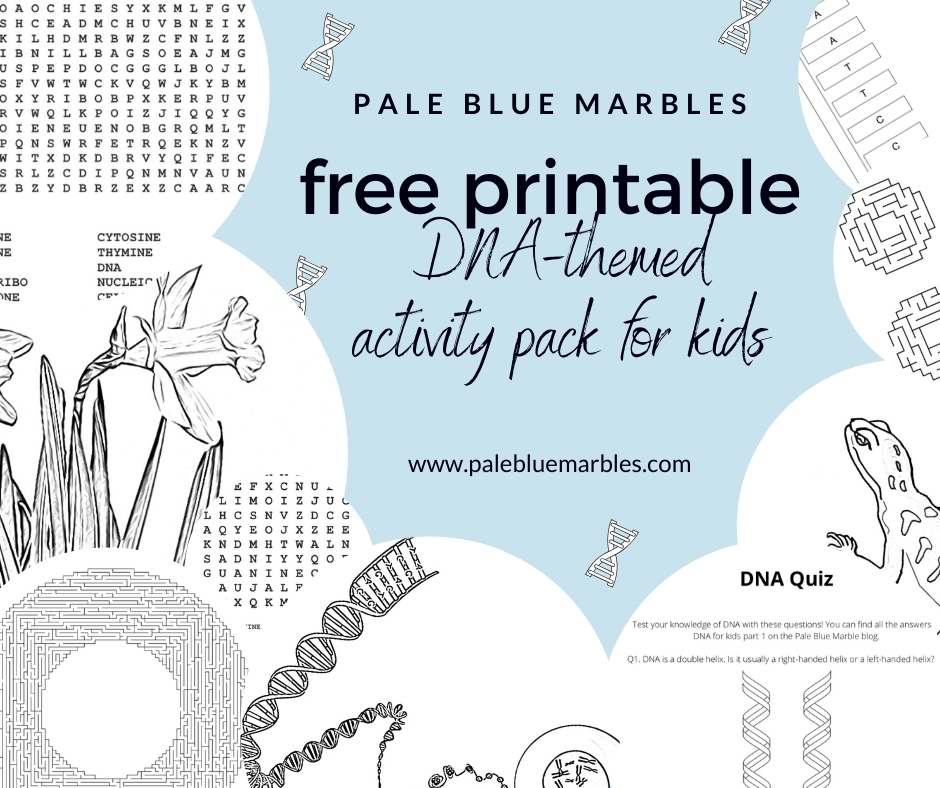

*This is the third post in my [‘DNA for kids’](/posts/dna-for-kids/) blog series and the second hands-on activity to help you **introduce your child to the wonderful molecular world of life**. I will take you through the very easy steps for how to **extract DNA from an apple** (or other fruit) so that your child can **play with real DNA**!*

**If you’ve already been through parts 1 and 2** your child will understand that DNA it is:

- A very big molecule in the shape of a **double helix**
- **Instructions** for building living things from a single cell
- Written in a **four-letter code** (A, T, G, C) with special **base-pairing rules**
- Found inside **almost every living cell**
- Read differently by different cells at different times
- Controlled by the very **molecular tools** it encodes
- The most amazing molecule in the Universe

**Now for some hands-on fun!**

## How to extract DNA

With your help, your child can actually **extract and play with real DNA!** They can watch it precipitate out of a solution, fish it out, hold it in their hand and **feel how squishy it is between their fingers.**

**They can see the most amazing molecule in the Universe with their own eyes. No special equipment necessary – only common household supplies!**

This was a big hit with my kids. They never imagined they could actually extract DNA themselves and see it with their own eyes. They were so excited – **we could have spent all day on it**!

It is very easy. **Watch the video for a recap on DNA and the step-by-step instructions for extracting DNA from an apple** (or other fruit). I’ve written out more details for each step below.

Here goes!

### You will need

- **A piece of fruit** (fruit that is easy to squash like strawberries, kiwi fruits or bananas work well but if you have a blender most fruits or vegetables will work: we used an apple)
- 2 dl **water**
- 1 tsp **salt**
- 1/2 dl **washing-up liquid**
- About 50 ml of **alcohol-based hand-sanitiser** (the higher the alcohol content the better – we used 80%)
- Something to cut and crush the fruit (like a knife and a wooden spoon – or a **blender**)
- Access to a **freezer**
- A **cheesecloth** or similar loosely-woven cloth for filtering – if you don’t have a cheesecloth you can try a tea towel (a coffee filter should also work if it’s strong but ours kept breaking)
- A funnel (optional but helps with the filtering)
- One or two medium-sized drinking **glasses** or similar containers (we used an old jam jar)
- A small glass – the smaller the diameter of the glass the less hand sanitiser you will need and the easier it will be to fish out the DNA (we used a small shot glass)

<iframe allowfullscreen="allowfullscreen" data-mce-fragment="1" frameborder="0" height="315" src="https://www.youtube.com/embed/siiAuu6c2Hw" width="560"></iframe>

### What to do

#### 1. Prepare your materials

- Put the alcohol-based hand sanitiser **in the freezer**. It works best when it’s cold.
- Wash and remove any leaves, peel/skin or stalks from your fruit.

#### 2. Free the DNA from the cells

- **Crush your fruit together with the salt and water** – we sliced the apple then blended it together with the water and salt with a hand blender. This starts the process of **breaking up the cells**. The **salt helps to make the DNA come out of solution (precipitate)** while keeping other molecules (like proteins) in solution.
- Pour the crushed/blended fruit into a medium-sized drinking glass and carefully pour and **mix in the washing up liquid** **(try not to create bubbles).** The washing up liquid helps to break down the cells further.
- Leave the mixture for **10 minutes.**

#### 3. Filter your solution

- Place the funnel (if you have one) over a medium-sized drinking glass and put your filter inside. We used a cheesecloth folded over twice and that worked well. You can also try a coffee filter.
- **Pour your solution through the filter**. This is to remove as much cell debris as possible.

#### 4. Pull the DNA out of solution

This is the fun part! Make sure your child is watching the alcohol layer. They should see **white stringy material floating upwards – that’s DNA!**

- Pour your solution into your smallest glass until it is about **half full**
- Grab your **hand-sanitiser** from the freezer.
- Tilt the glass and carefully squeeze the hand-sanitiser onto one side of the glass. **Don’t squeeze it directly onto the solution** – you want a nice layer to trickle down the side of the glass and rest on top. Add until the **alcohol layer is about as high as the layer of solution**.
- Place the glass back on a flat surface and watch the DNA precipitate into the alcohol layer. The longer you wait the more DNA there will be.

#### 5. Fish out the DNA

- Give your child a toothpick, or similar, and let them **fish for DNA**! It should be easy for them to see the white clumps floating around. Let them collect some in a small container (or a measuring spoon) and experiment with it!

#### 6. Experiment

Does your child have a lot of questions about how this process works or what else they can get DNA out of? **Set up an experiment to test their ideas.**

- Does it work as well if the alcohol is warm? You can try this straight away using any solution you have left over.
- What if you use less washing-up liquid?
- Does it matter how long you leave the solution before filtering?
- What else can you get DNA out of? Do some fruits have more DNA than others?

**My kids wanted to extract DNA from everything after this!**

## More learning fun

To supplement the first three posts of my [‘DNA for kids’ series](/posts/dna-for-kids/), I’ve created a **printable activity pack with DNA-themed puzzles, worksheets, quiz and colouring pages**. 


Download PDF


In part 4 of the ‘DNA for kids’ series, we will take a closer look at how the instructions encoded in DNA are followed to bring the blueprint to life: starting with another amazing molecule; RNA!
