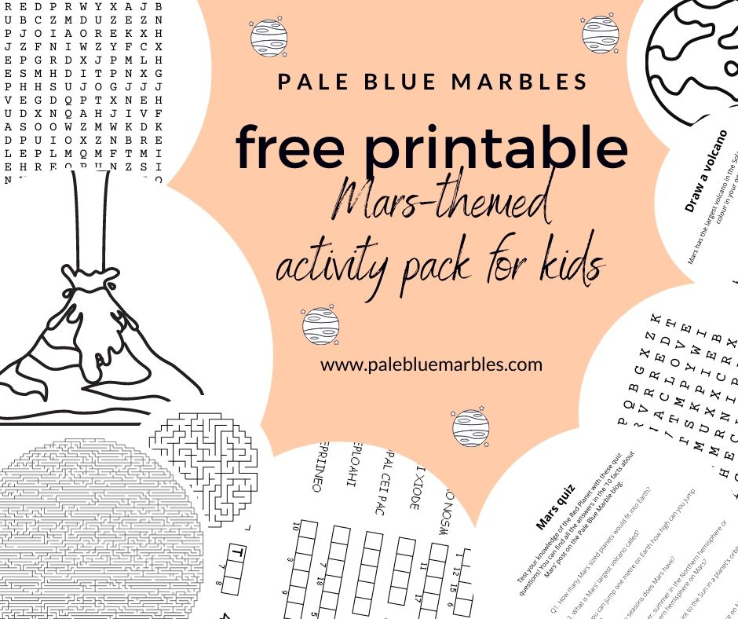
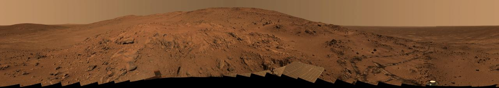
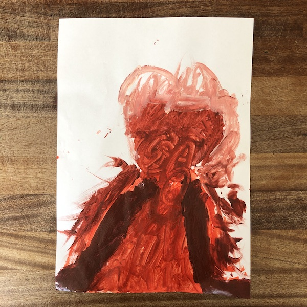

Get ready to **explore the Red Planet** with these activities and key facts about Mars for curious kids. This post gives you **10 facts about Mars** with videos and **6 hands-on activities** to fuel your child’s excitement for all things Martian:

1. Use playdough to find out **how many of Mars fit into Earth**.
2. Calculate **how high you could jump on Mars**
3. Make your own **erupting Martian volcano**
4. Go on a **scavenger hunt for rusty things**
5. Simulate the **changing seasons on Mars** using playdough and a candle
6. Paint **pictures of Mars** while listening to Mars-inspired music

To supplement this post I’ve also created a printable activity pack containing **Mars-themed puzzles, worksheets, colouring pages and a quiz**.


Download PDF


## **The Red Planet**

**Mars has fascinated and inspired humans for centuries.** We have movies about Mars, books about Mars, songs about Mars and we have sent orbiters and robots to Mars. People have been talking and singing about the possibility of life on Mars for decades. Mars has become **a key target for the search for life** elsewhere in the Universe.

")

So what is so interesting about Mars? A lot! There are far too many fascinating facts about Mars to cover in one blog post – so I am creating a **new series on the Red Planet**, focusing on why it’s so important for astrobiology. This first post will **introduce your child to Mars** and get them excited about the prospect of looking for life there. Let’s get started! Watch this video for a summary of the 10 facts about Mars we’re going to cover, then read on for the details and activities. 



## Mars facts: 10 facts about Mars

Get your child excited about the Red Planet with these **10 facts about Mars** and enjoy doing the activities that go with them to help consolidate that excitement.

### Facts about Mars #1: Mars is the 4th planet from the Sun

Mars is the **4th planet from the Sun**. It’s the outermost rocky planet and orbits the Sun at roughly **1.5 x the distance from the Sun to the Earth**.



### Facts about Mars #2: Mars is about half the size of Earth

Mars is about **half the size of Earth**, by diameter. By volume, you would need **6.6 planets the size of Mars to fill the Earth**.

### Mars activity #1. How big is Mars compared to Earth?

Use playdough to show that Earth is twice the size of Mars by diameter but **more than 6 times as big by volume**.

Expand the activity by introducing the formula for **calculating the volume of a sphere**.

This is a great way to do some **hands-on maths** while cultivating curiosity about Mars.

#### What you’ll need

- Playdough – this is easy to make (see the video below). You can use red for Mars and blue/green for Earth but any colours will do.



#### What you’ll do

Make Mars and Earth-sized balls of playdough and see **how many of Mars are needed to match the Earth**.

#### Step 1. Make Earth

Roll playdough into **a ball to represent Earth**. Make it as big as you like but ensure you have the same amount of playdough in your second colour. Make Earth look more realistic by forming continents and oceans.

#### Step 2. Measure Earth

**Measure the diameter** of your playdough Earth (put it between two rulers, or other flat surfaces, and measure the distance between the rulers).

#### Step 3. Calculate the diameter for Mars

Divide the diameter of your playdough Earth by **1.88**. This will be the diameter for your playdough Mars. (**The diameter of Earth is 1.88 x the diameter of Mars**).

#### Step 4. Make Mars

Roll a ball of playdough in your second colour with the diameter you calculated in step 3. This is your **playdough Mars**.

#### Step 5. Compare Earth and Mars

Compare the sizes of your Earth and Mars models.

#### Step 6. How many Mars does it take to fill Earth?

- Make **another Mars model** with the **same diameter** as the first.
- Combine your two Mars models into one ball.
- Measure the diameter and compare it to your Earth model.
- Repeat until you’ve **combined enough Mars models to match the size of your Earth model**.
- You will need **6-7 Mars models**.

### Expanding this activity

Take this activity a step further by introducing the formula for calculating the **volume of a sphere**:

**V = (4/3)πr3**

Explain the following:

1. Introduce the **mathematical constant pi (π)** – explain that when a circle is 1 unit in diameter it is 3.141592 (π) units in circumference (C = πd = 2πr)
2. **The radius (r) of a sphere is half the diameter**.
3. To get the volume of a sphere, you have to multiply the radius by itself 3 times (**r3**) then times that number by **4/3 π**.
4. When the radius is multiplied by 1.88 (the radius of Earth is 1.88 x larger than the radius of Mars) **the volume is multiplied by 6.6** (since 1.883 = 6.6 and the other numbers stay the same).
5. This means that while Earth is 1.88 x bigger than Mars by diameter, **Earth is 6.6 x bigger than Mars by volume.**

### Facts about Mars #3: The gravity on Mars is 38% of the gravity on Earth

Not only is Mars smaller than Earth, but Mars is also **30% less dense than Earth** (it has less mass per unit volume).

Due to these differences in size and density, **gravity on Mars is about 38% of that on Earth.**

### Mars activity #2. How high can you jump on Mars?

Let your child have fun seeing **how high they can jump on Earth and how much higher this would be on Mars**.

 on [Unsplash](https://unsplash.com/s/photos/jump?utm_source=unsplash&utm_medium=referral&utm_content=creditCopyText)")

#### What you’ll need

- A metre stick or other way of measuring height

#### What you’ll do

- Jump and measure
- Explain gravity
- Have fun with some basic maths

#### Step 1. Jump and measure

Ask your child to **jump up in the air** as high as they can and **measure the height** from the floor to the bottom of their feet.

#### Step 2. Explain gravity

**[Gravity](https://spaceplace.nasa.gov/what-is-gravity/en/) is the force from one object (e.g. a planet) that draws another object to its centre.**

How much force an object experiences on the surface of a planet depends on the **radius** of the planet and the **mass** of the planet.

If your child is interested in the maths you can explain the following:

- Gravity causes acceleration towards the centre of mass
- The acceleration due to gravity on a planet is calculated by dividing the mass of the planet by the squared radius of the planet and multiplying by the gravitational constant, G (6.67408 × 10-11). This works out as: 
    - 9.8 ms-2 on Earth (2.6 times that on Mars)
    - 3.7 ms-2 on Mars (38% of that on Earth)

#### Step 3. How high can you jump on Mars?

**Gravity on Mars is 38% that on Earth, which means you can jump 2.6 times higher on Mars than you can on Earth.**

Multiply the height your child jumped by 2.6. This is how high they would be able to jump on Mars!

### Facts about Mars #4: Mars has the **biggest volcano in the Solar System**.

Mars has the biggest volcano in the Solar System: it’s called [**Olympus Mons.**](https://www.esa.int/Science_Exploration/Space_Science/Mars_Express/Olympus_Mons_-_the_caldera_in_close-up) Here are a few interesting facts about this massive Martian volcano:

- Olympus Mons is about **as high as three [Mount Everests](https://en.wikipedia.org/wiki/Mount_Everest)** (the highest mountain above sea level on Earth) stacked on top of one another
- It covers **an area about the size of Arizona**, or about 80% of the size of Germany.
- Olympus Mons has not erupted for several million years but it’s unclear if the volcano is [extinct or just dormant](https://agupubs.onlinelibrary.wiley.com/doi/full/10.1029/2006JE002826).

To learn more about volcanoes watch this nice video from National Geographic:



### Mars activity #3. Make your own Martian volcano

**Make a volcano then watch it erupt**.

I recommend doing this outside or on a tray – it can get messy!

#### What you’ll need

- Soil, sand or other material for shaping the volcano
- 2 tbsp baking soda (or 6 tbsp baking powder)
- 3 tbsp washing up liquid
- 1 dl vinegar
- Red and yellow food colouring (optional)
- A small container that fits inside the top of your volcano

#### What you’ll do

1. Ask your child to **build a volcano out of sand** (or soil)
2. Make a small hollow in the top, a little deeper than your container
3. Put your container into the top of your volcano
 
4. **Add the baking soda, washing-up liquid and food colouring to the container**
5. Talk about how there is magma deep underneath the volcano  
    and the pressure is building
6. When you are ready for the volcano to erupt **add the vinegar** to the container inside your volcano and watch the “lava” bubble down the sides of your Martian volcano!

   In this case, the lava is caused by bubbles of carbon dioxide gas that are released when the [vinegar and baking soda react](https://www.primaryconnections.org.au/sites/all/modules/primaryconnections/includes/SBR/data/Chem/sub/baking/baking.htm#:~:text=The%20reaction%20is%3A,dioxide%2C%20water%20and%20sodium%20acetate.&text=The%20solid%20baking%20soda%20was,bubbles%20in%20the%20foaming%20mixture.).

### Facts about Mars #5: Mars is red because its soil contains iron oxide (rust)

Mars is red because **its soil contains iron** that has been oxidised (turned to rust) by trace amounts of oxygen in its atmosphere.

Explore Mars’ surface interactively below:



#### Mars activity #4. Rust scavenger hunt

Go on a scavenger hunt for rusty things and talk about how **oxygen has reacted with the iron** to make rust (iron oxide).

### Facts about Mars #6: Mars has two moons

Mars has two small moons called **[Phobos](https://solarsystem.nasa.gov/moons/mars-moons/phobos/in-depth/) and [Deimos](https://solarsystem.nasa.gov/moons/mars-moons/deimos/in-depth/)**.

### Facts about Mars #7: One day on Mars is 24h 40m

**Mars takes almost the same time as Earth to rotate once on its axis**, making a day on Mars only 40 minutes longer than a day on Earth.

A **solar day** is the time it takes for the **Sun to return to the same position** in the sky. This is slightly longer than the **sidereal day**, which is **one rotation** (since the planet has also moved relative to the Sun).

Watch this animation to see all the planets in our Solar System with their relative sizes, tilts, sidereal day lengths and rotational speeds.



### Facts about Mars #8: A year on Mars is almost twice as long as a year on Earth and has four seasons

A year on Mars lasts **687 days**. This is how long it takes Mars to complete one orbit around the Sun.

**The tilt of Mars on its axis (25°) is similar to Earth’s (23.5°)**. This gives it winter, summer, autumn and spring seasons as it orbits the Sun.

Earth’s orbit is nearly circular but Mars’ is more elliptical. This makes the seasons different lengths, since Mars travels more slowly when it is further from the sun.

It is **summer** in Mars’ **Northern** hemisphere when the planet is at its farthest from the sun (**aphelion**). This makes the **Northern hemisphere’s summer longer**.

When Mars is closest to the sun (**perihelion**) it is summer in its Southern hemisphere. Since Mars is closer to the Sun at perihelion, it gets more radiation, which makes the **summers in the southern hemisphere warmer**. But they are also **shorter** since the planet travels faster when it is closer to the sun.

### Mars activity #5. Simulate the seasons

Have fun **demonstrating the changing seasons on Mars** using a **candle** and a ball of **playdough**. Kids love candles and being in the dark (at least mine do!) so this is an exciting activity to do to stimulate their curiosity.

#### What you’ll need

- Playdough
- A wooden skewer
- An elastic band
- A candle
- A dark room
- String or yarn

 from [Pixabay](https://pixabay.com/?utm_source=link-attribution&utm_medium=referral&utm_campaign=image&utm_content=2038736)")

#### What you’ll do

Simulate the changing seasons on Mars.

#### Step 1. Set up Mars in orbit around the Sun

- Roll a ball of playdough or other material into a sphere. **This is Mars.**
- Push the skewer all the way through the centre of the sphere and out the other side. This represents **the pole-to-pole axis of Mars.**
- Put an elastic band around the middle of the sphere to mark the **equator of Mars**
- Put the candle in the middle of the table. **This is the Sun.**
- Lay your string out around the candle in an ellipse. **This is the orbit of Mars.**
- Point out the closest point in Mars’ orbit. **This is perihelion.** Optionally add a label.
- Point out the farthest point in Mars’ orbit. **This is aphelion.** Optionally add another label.

#### Step 2. Simulate summer in Mars’ Northern hemisphere

- Place Mars at **aphelion**.
- Tilt the planet so that the angle of its axis from vertical is around 25 degrees (this is the tilt of Mars). **It should point towards the Sun at aphelion.**
- At this point, you should see that the area above the equator of Mars (the **northern hemisphere**) gets more light than the area below the equator (the **southern hemisphere**). 
    - This is **summer in the Northern hemisphere and winter in the Southern hemisphere.**

When Mars is at its farthest from the Sun (aphelion) it is summer in its Northern hemisphere

#### Step 3. Simulate winter in Mars’ Northern hemisphere

- Move Mars around its orbit while keeping the direction of its axis the same. Follow it around until **perihelion**.
- At perihelion you should see that the **Northern hemisphere gets less light than the Southern hemisphere**.
- This is **winter in the Northern hemisphere** and summer in the Southern hemisphere.
- You can explain that because this also coincides with being closest to the Sun, **summer in the Southern hemisphere is warmer than the summer in the Northern hemisphere** (when the planet was farthest from the Sun).

When Mars is at its closest to the Sun (perihelion) it is summer in its Southern hemisphere

#### Step 4. Optionally, compare to Earth’s seasons

- Change the orbit so that it is more circular then **repeat the activity for Earth**
    - As with Mars, **aphelion on Earth coincides with the Northern hemisphere’s summer** and perihelion coincides with the Northern hemisphere’s winter
- Notice that because the distance at aphelion and perihelion are more similar on Earth there is **less variation in the Southern and Northern hemisphere’s seasons**. 
    - The temperature difference is also offset by the larger volume of water, which absorbs heat, in the Southern hemisphere.

### Facts about Mars #9: It is cold on Mars

Mars is further from the Sun than Earth. It also has **an atmosphere that is 100 times thinner**. This means it gets **less heat** from the Sun and **quickly** **loses the heat** it does get.

**The average temperature on Mars is -63 °C.**

This is much lower than Earth’s average of 14 °C.

On Mars, the temperature can fall **as low as -143 °C** at the poles during the winter and can rise **as high of 35 °C** at midday at the equator during summer (but [at night it can still fall to -73 °C](https://www.space.com/16907-what-is-the-temperature-of-mars.html) since there is very little atmosphere to trap the heat).

### Facts about Mars #10: Mars has polar ice caps

There are sheets of ice at both the north and south poles of Mars.

These polar ice caps are mostly **permanent water ice** but in the autumn, and throughout the winter, about [25% of the carbon dioxide in the thin atmosphere of Mars freezes and forms a blanket over the pole](https://marsed.asu.edu/mep/ice/polar-caps). In spring and summer, the temperature rises and the carbon dioxide at the pole forms a gas once more. There is also evidence for [liquid water beneath the ice caps](https://www.sciencemag.org/news/2018/07/liquid-water-spied-deep-below-polar-ice-cap-mars) on Mars. ## Mars is fascinating!

Let’s summarise all that we’ve learnt about Mars before we get to the final activity.

Here’s a recap of our **10 facts about Mars**.

Here’s the summary video. Text below.



Mars:

1. Is the **4th planet** from the Sun
2. Is **half the size** of Earth by **diameter** and less than a **6th of the size** of Earth by **volume**
3. Has **38% of Earth’s gravity** (you can jump 2.6 x as high on Mars)
4. Is home to the **Solar System’s largest volcano**, Olympus Mons
5. Has a **red surface** due to its rusty soil
6. Has **two small moons**: Phobos and Deimos
7. Days are **only 40 minutes longer than on Earth**
8. Takes nearly **twice as long as Earth to orbit the Sun** and has **four seasons** that differ between hemispheres due to **Mars’ elliptical orbit**
9. Is very **cold**
10. Has **polar ice caps** made of **water and carbon dioxide**

### Mars activity #6. Paint pictures of Mars

Your child now has a good idea of the key facts about Mars. In this final activity let their imagination run wild and allow them to consolidate their knowledge by painting Mars or its features.

Add some extra drama to this activity by playing **“Mars” from “The Planets Suite” by Gustav Holst**
