**You already know the Solar System is vast**. But have you ever wondered just **how big the Solar System really is**? The distances in space can be hard to grasp but the activities in this post will **put the size of the Solar System into perspective** in a way that is fun and accessible for children (and adults!)

To supplement this post, I’ve also created a printable Solar System-themed activity pack with puzzles, worksheets, colouring pages and a quiz.

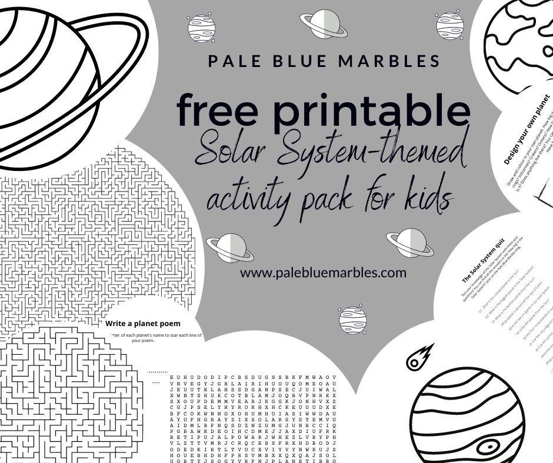


Download PDF


## How big is the Solar System?

The scale of the Solar System is important to consider when planning missions to the other planets or their moons, and has consequences for the search for life in our solar system.

It’s also a source of amazement for kids and adults.

**The Solar System is bigger than you think.**

Let’s start with the basics.

## What is a solar system?

The Solar System is the collective name for our Sun and all of its orbiting planets, moons, [asteroids](https://solarsystem.nasa.gov/asteroids-comets-and-meteors/asteroids/overview/?page=0&per_page=40&order=name+asc&search=&condition_1=101%3Aparent_id&condition_2=asteroid%3Abody_type%3Ailike), comets and other celestial bodies.

**Anything that is gravitationally bound to the Sun is part of the Solar System.**

This simulated image shows the orbits of the planets around the Sun in our solar system:

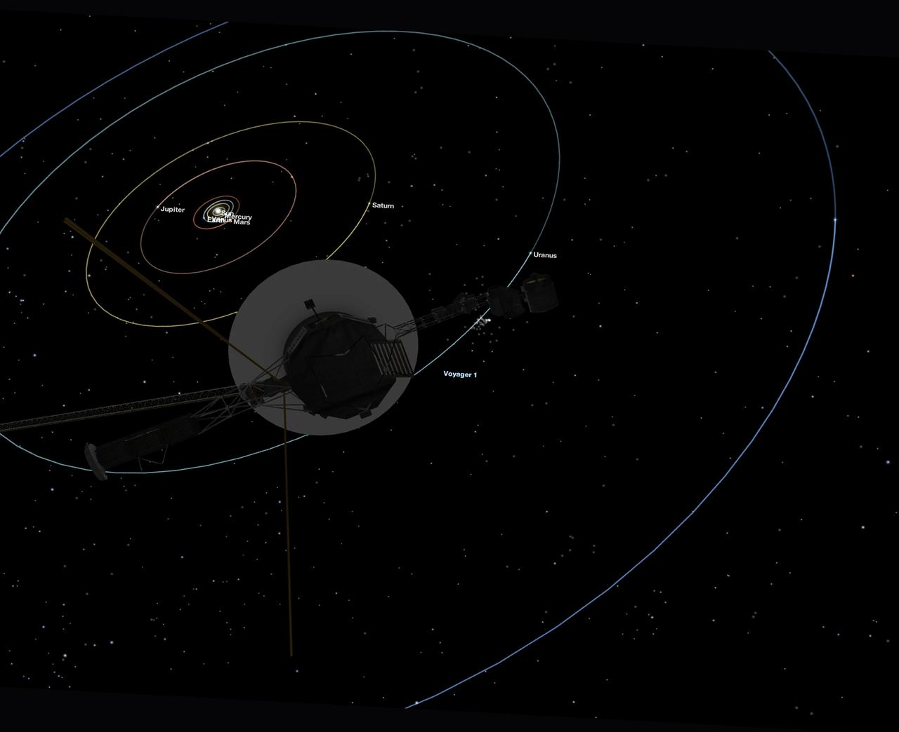

The Solar System extends well beyond the planets though. It doesn’t end until you travel to the outer edge of the **Oort cloud,** which forms a giant bubble around the disc of orbiting planets. Inside the Oort cloud are chunks of ice and dust left over from the formation of the Solar System 4.6 billion years ago. This short video from NASA gives a nice overview:



In order to fit the Oort cloud into the same picture as the planets, the Solar System has to be placed on a log scale, where each step on the scale is 10 times larger than the previous:

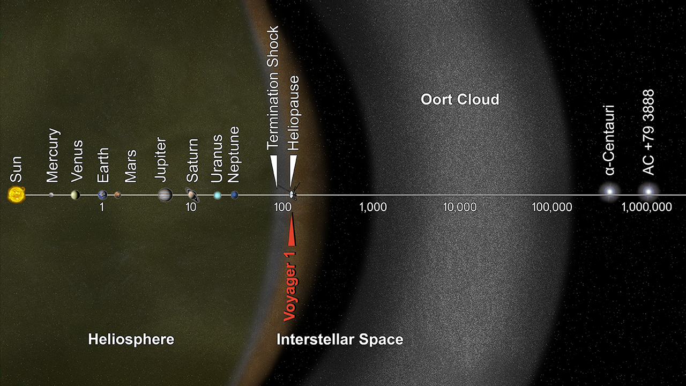

Some objects in the Oort cloud got displaced may (most likely billions) of years ago and were flung towards the Sun. We call these objects **long-period comets** and they take hundreds, thousands, or even millions of years to get to the inner Solar System.

[You can see one of these comets in the skies right now](https://earthsky.org/space/how-to-see-comet-c2020-f3-neowise) – it’s called comet C/2020 F3 (NEOWISE). Take a look at this amazing footage showing NEOWISE from the international space station.



**The Solar System is a specific name for our solar system.** The more general name for a star and its orbiting planets is “**planetary system**“. There are billions of other planetary systems in the Universe – each with their own star (or stars – our solar system has one star but many planetary systems have multiple stars).

## How many planets are there in the Solar System?

There are officially **8 planets in the Solar System**.

- Four rocky, terrestrial, inner planets (Mercury, Venus, Earth and [Mars](/posts/facts-about-mars/))
- Two gas giants (Jupiter and Saturn)
- Two ice giants (Uranus and Neptune)

Here are a few photos of the 8 planets:

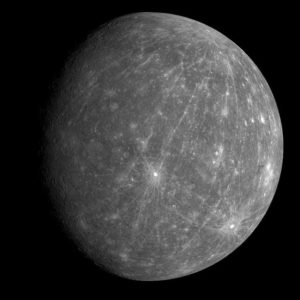

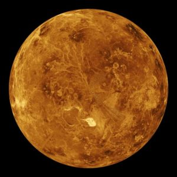

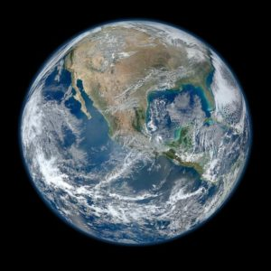

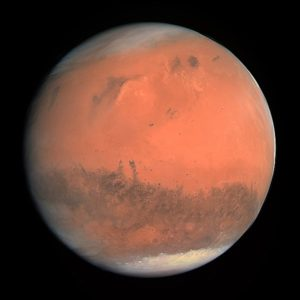

")

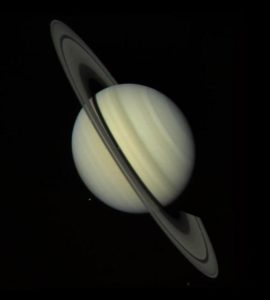

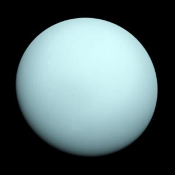

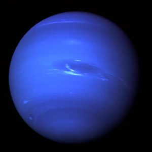

Pluto, that much loved ninth planet, was [downgraded to “dwarf planet”](https://www.iau.org/public/themes/pluto/) status in 2006. The useful mnemonic for learning the order of the planets doesn’t work quite as well now: ‘my very easy method just speeds up naming…’ (planets).

If your child is not familiar with the names and order of the planets in the Solar System, I recommend watching this planet song on YouTube – it was a big hit with my kids!



Despite knowing all the planets, perhaps even the [dwarf planets](https://www.jpl.nasa.gov/infographics/infographic.view.php?id=11268), does your child have a good grasp of the sheer size of the Solar System? Do you?

Most pictures of the planets and the Solar System are **misleading when it comes to the relative sizes of the planets and their relative distances to the Sun**.

The rest of this post describes **three hands-on activities for kids** to help your child understand: 1) how big the Sun and the planets in the Solar System are; and 2) how big the distances between the planets in the Solar System are.

## How big are the planets in our solar system?

Let’s put the size of the Sun and all the planets into perspective by **creating scale models**. First in 2D, using paper, then in 3D using fruit!

In each case, start with how big the Sun is and then introduce the sizes of the planets in order of their position from the Sun.

### Activity #1. Create scale models of the Sun and planets out of paper

This is a great activity for all ages and abilities. To get a better grasp of the **relative sizes of the planets and our sun**, you will draw them to scale on paper and cut them out.

See my suggestions below for adjusting/expanding according to age/ability.

#### What you’ll need

- Paper, cardboard or fabric 
    - For the Sun you will need a sheet that is 109 cm by 109 cm. You can tape separate sheets of paper together to make one big sheet. We used a yellow bed sheet and folded it to the right size.
- Pencil or pen
- Scissors
- Crayons or paints
- Ruler or tape measure

#### What you’ll do

- Draw and cut out circles to represent the Sun and all the planets (details below).
- In order to compare everything to the size of Earth, we will **measure everything in Earth diameters** (the diameter of Earth is 12,742 km).
- Use **1 cm to represent one Earth diameter**.
- Don’t worry if you don’t make perfect circles – none of the planets are perfect circles.

### Step 1. Make a scale model of the Sun

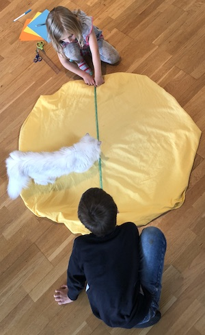

Take your 109 cm square sheet of paper, or piece of fabric, and fold it in half three or four times, then cut a slight curve at the widest end. Unfold to reveal a 109 cm diameter circle. (Alternatively, fold the fabric into a circlular shape – this is what we did with a bedsheet.)

**This is the Sun.**

If you are using paper your child can **paint the Sun.**

**Make a label** on a separate piece of paper with the word “Sun” written on it.

### Step 2. Make scale models for all the planets

Take your smaller squares of fabric or paper and **cut out circles** with the following diameters for each planet:

- Mercury (grey): 0.4 cm
- Venus (orange/yellow): 1.0 cm
- Earth (blue/green): 1.0 cm
- Mars (red): 0.5 cm
- Jupiter (orange and white stripes): 11.2 cm
- Saturn (beige): 9.5 cm
- Uranus (light blue): 4 cm
- Neptune (blue): 3.9 cm

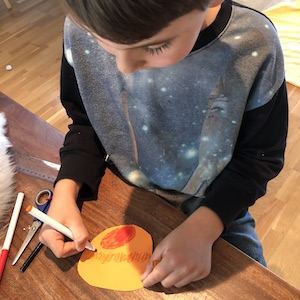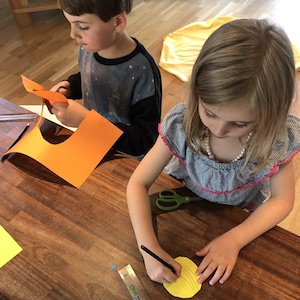

Colour and create labels for each one and follow the guide below for expanding the activity.

Notice how huge the Sun is compared to all the planets.

You can fit all the planets inside the Sun many times over.

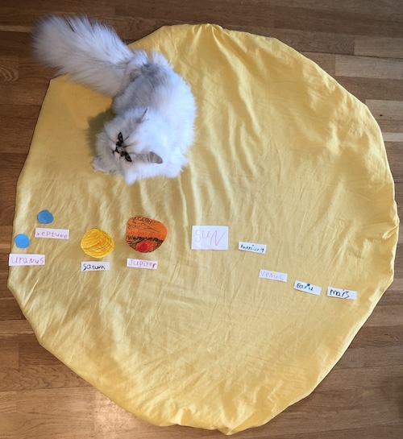

At this scale, Earth would be 117 m away from the Sun – that’s about the length of a football field (activity #3 demonstrates relative distances on a smaller scale).

>### Guide to adjusting or expanding activity #1
>
>Here’s a short guide for adjusting activity #1 (draw and cut out the Sun and planets to scale) according to age or ability.
>
>#### Level 1
>
>- You do the measuring, drawing and cutting
>- If you are using paper, let your child colour or paint the Sun and planets
>- You can use the opportunity to talk about colours and shapes
>- Then let your child play with the resulting discs
>- They can practice putting them in order by size or position from the Sun
>- Talk about the letter that each planet’s name starts with
>
>#### Level 2
>
>- Let your child do the cutting
>- If your child is learning to read or write, once you have created the planets you or they can also create labels with the names of the planets and match each planet to its name
>
>#### Level 3
>
>- Allow your child to do the measuring, drawing and cutting
>- They can also write the names of each planet on the labels
>- Optionally, draw some features on the larger planets, like Jupiter’s red spot, Earth’s oceans and continents, Saturn’s rings
>- Sort the planets into the rocky planets, gas giants and ice giants
>
>#### Level 4
>
>- If your child is interested in geometry this is a great opportunity to talk about the geometry of a circle 
>    - [Introduce pi](https://www.mathsisfun.com/numbers/pi.html)
>    - Show your child that the circumference of Earth and Venus is pi
>    - Ask your child to calculate the circumference of the other planets
>- Help your child figure out how they would calculate the time it would take to travel around each planet when travelling by car (at 80 km/h) or plane (around 800 km/h) 
>    - (Divide the circumference by the speed)
>- Follow your child’s curiosity and learn more about each planet
>- If they love numbers, you can find lots of [numerical facts from NASA all in one nice table here](https://nssdc.gsfc.nasa.gov/planetary/factsheet/)

### Activity #2. Create the Solar System with fruit

Now that your child has a grasp of the relative sizes of each planet in 2D, let’s reinforce their learning with this fun activity **creating a scale model of the Solar System in 3D – using fruit**.

You don’t have to use fruit – substitute any spherical object the right size for fruit you don’t have.

We turned this activity into a **scavenger hunt** to find and measure suitable fruit!

#### What you’ll need

Below, I’ve listed each planet with a suggested fruit and an **approximate diameter** for swapping these for other spherical objects (marbles, beads, tennis balls, ping pong balls etc.)

The diameters are the same as those used in activity #1 so if you’ve done that activity you can use your 2D models as templates.

- Sun – unless you have a giant peach I suggest finding something approximately 1 m wide and using that as a reference for the size of the Sun (if you’ve done activity #1 you can use your 2D Sun).
- Mercury – peppercorn – 0.4 cm
- Venus – blackcurrant – 1 cm
- Earth – blackcurrant – 1 cm
- Mars – large peppercorn – 0.5 cm
- Jupiter – grapefruit – 11.2 cm
- Saturn – orange – 9.5 cm
- Uranus – cherry tomato – 4 cm
- Neptune – cherry tomato – 3.9 cm

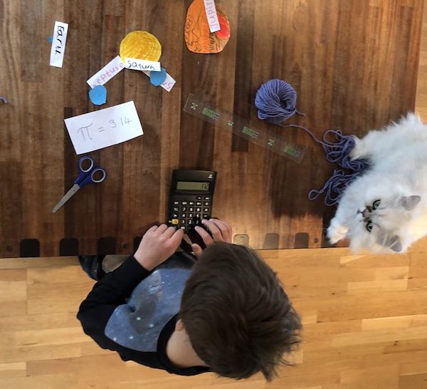

#### What you’ll do

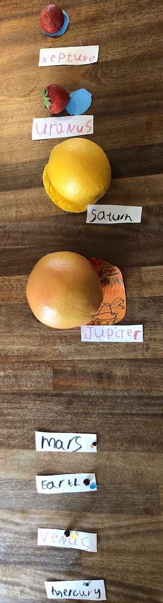

- Gather a selection of suitable fruit or other items
- **Measure the fruit.** Either use the diameter or, for extra mathematical fun for the larger planets: 
    - **Calculate the circumference** for each sphere by multiplying the diameter by pi (3.14)
    - Measure and cut pieces of yarn, string or strips of paper to the right length for each circumference
    - Ask your child to measure each fruit using the yarn to find the right size for each planet
- Put the fruit into the right order according to their position from the Sun
- Find the largest planet
- Find the smallest planet
- Compare the sizes of the terrestrial planets and the gas and ice giants
- Label the planets
- Eat the planets

## How big are the distances in our solar system?

Now your child has a good grasp of the relative sizes of the planets. But the planets occupy a really tiny part of the Solar System. **Most of the Solar System is empty space.**

It’s hard to imagine how far apart the planets are and how far away the planets are from the Sun. This final activity will help with that!

### Activity #3. Walk the distances in the Solar System to scale

For this activity, you will start at the “Sun” then **walk and mark the distance to each planet**. This activity is best to do outdoors.

Remember that the orbits stretch out in a circle around the Sun at this distance so **the diameter of each orbit is twice each distance you will mark**.

Also, bear in mind that the Solar System extends well beyond the planets, out into the spherical Oort cloud which is **over 1000 times the distance from the Sun to its eighth planet**.

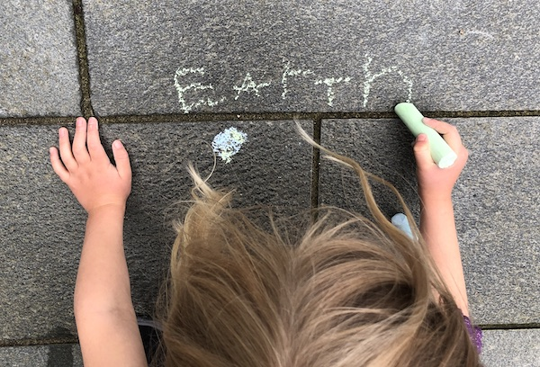

#### What you’ll need

- Space: about **30 m in at least one direction** to walk the distance to the eighth planet.
- Chalk or a few markers (e.g. pebbles) to represent the Sun and the planets
- A meter stick or a tape measure – or you can approximate a metre with one large step

#### What you’ll do

- Start by placing a marker (or drawing a circle) about 1 cm in diameter for the Sun.
- As the Sun is very small in this case, **each planet to scale would be smaller than a mote of dust**!
- Measure and walk the following distances from the Sun for each planet. (If you have space, measure out in different directions to demonstrate that **the planets are not actually all in a line**.) 
    - Mercury – 0.4 m from the Sun
    - Venus – 0.7 m
    - Earth – 1 m
    - Mars – 1.5 m
    - Jupiter – 5.2 m
    - Saturn – 9.6 m
    - Uranus – 19.8 m
    - Neptune – 30 m
- If you are using chalk, write the names next to each planet
- Talk about how, in order to measure the whole Solar System to scale (including the Oort cloud), **you’d have to walk another 30 km** (think of a city or landmark that’s 30 km away to put this into perspective).

The Solar System is mostly empty space!

You can also show your child the distances to scale on a computer screen using this [scrollable map of the Solar System](https://joshworth.com/dev/pixelspace/pixelspace_solarsystem.html).
