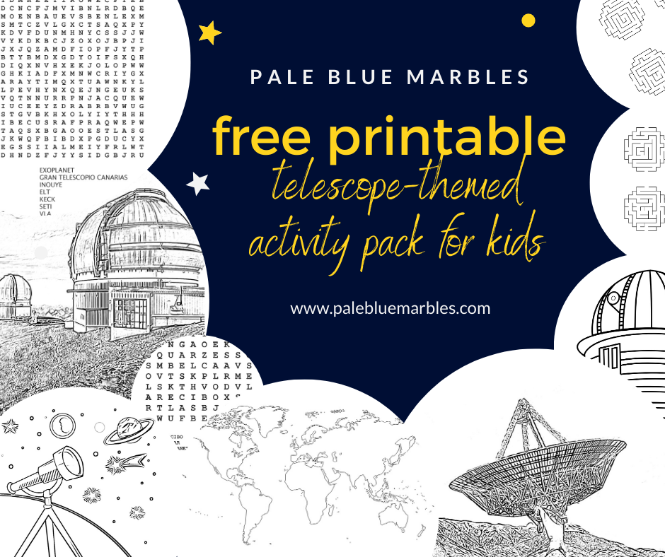
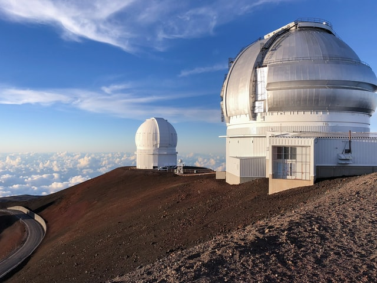
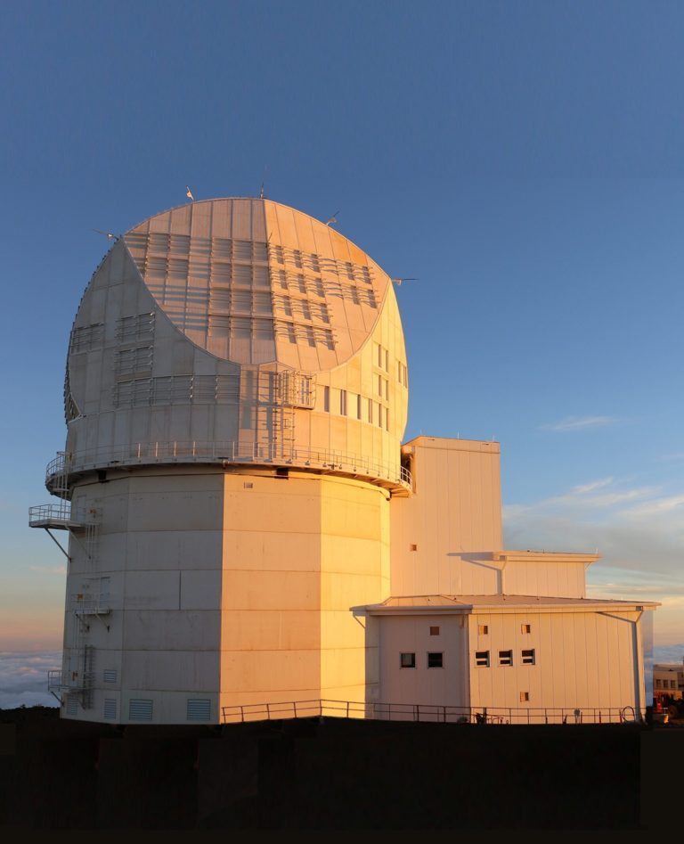
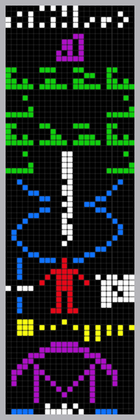

Travel to the most famous telescopes on Earth from the comfort of your own home and learn about some of the amazing things they are used to study. Suitable for adults and children alike.

**Astronomy Day** is celebrated across the world twice a year – in spring and autumn. **It’s the perfect opportunity to encourage curiosity in the Universe and cultivate your child’s excitement for all things space-related.**

In 2021, Astronomy Day falls on the **15th May** and the **19th October**. Due to the COVID-19 pandemic, most of the spring events that normally allow the public access to telescopes and interaction with astronomers were cancelled. The fate of the autumn events are still unclear.

**But you can still celebrate Astronomy Day at home, any day of the year!**

Take yourself and your child on a virtual trip around the globe and discover how astronomers observe the Universe with some of the world’s most famous giant ground-based telescopes.

To supplement this post with additional activities for kids, I’ve created a **printable telescope-themed activity pack** with worksheets, puzzles and colouring pages. 

  


Download PDF


### Telescopes give us a window into the Universe

First, before we get to the world’s most famous telescopes, here’s a quick introduction to ground-based telescopes in general.

Ground-based telescopes give us **a window into the Universe from Earth**. To get the best view, they are located in observatories in areas with low light pollution and usually high altitude where the atmosphere is thinner.

Some telescopes collect **light** in the visible part of the spectrum using **curved mirrors** to focus the light, other telescopes collect **radio waves or near-infrared** using large dishes that focus the radio waves into a receiver. A larger mirror, or dish, can **collect more light and see fainter and more distant objects**. To see deep into the Universe requires giant telescopes.

Other wavelengths of the electromagnetic spectrum, like X-rays, gamma rays and UV can’t get through our atmosphere so can only be collected by space-based telescopes.

**We’ll take a look at 8 of the most famous telescopes on Earth and a selection of the incredible things astronomers study with them.**

To make this more interactive for you and your child I have also created [**a journey for you to follow on Google Earth**](https://drive.google.com/open?id=1Ds5vLg28oHfCDZoKKKOsztAoDIpBrXqZ&usp=sharing). Click on the link and select each of the world’s telescopes in the list on the left to go on a tour of their locations. Enjoy zooming from the surface to orbit and back and explore the surrounding terrain, landmarks and host countries. Don’t forget to try street-view wherever possible.

Let’s get started!

### 1. Daniel K. Inouye Solar Telescope

Our first stop in our tour of the world’s most famous telescopes is [the Daniel K. Inouye Solar Telescope.](https://www.nso.edu/telescopes/dki-solar-telescope) This is the largest **solar telescope** in the world, located 3000m above sea level on the island of Maui, Hawaii. It has a mirror measuring 4 m in diameter.

The Daniel K. Inouye Solar Telescope, with its 4m mirror, is the largest solar telescope on Earth. Image credit: NSO/AURA/NSF

Check out the telescope’s [first images of the surface of our sun](https://www.nso.edu/press-release/inouye-solar-telescope-first-light/) released at the end of January 2020 showing “boiling” gas in cell-like structures each one around the size of Texas, or a bit bigger than France!



### 2. W. M. Keck Observatory

Let’s stay on Hawaii a bit longer and hop over to the Big Island for another of the most famous telescopes on Earth.

At 4,145m above sea level near the summit of the dormant volcano, Mauna Kea, on Hawaii is the [W. M. Keck Observatory,](http://www.keckobservatory.org/) hosting two 10m Keck Telescopes. Their mirrors are made up of 36 hexagonal segments that work together to focus the light. If it were all one piece, a mirror this size would sag under its own weight.

Check out the observatory’s [cloud cam](http://www.keckobservatory.org/media/cosmic-cams/) for impressive views over the clouds.

This world-famous telescope has been used to make a host of important discoveries. You can [read about some of them here](https://www.space.com/20234-keck-observatory-amazing-space-discoveries.html). Recently, using six years of Keck data, astronomers announced they had discovered an exoplanet three times the size of Jupiter:

<iframe allowfullscreen="allowfullscreen" frameborder="0" height="405" src="https://player.vimeo.com/video/412904385?title=0&byline=0&portrait=0" width="640"></iframe>

You can learn more about the Keck Observatory in this video:



### 3. Gran Telescopio Canarias

Now let’s zip over to La Palma in the Canary Islands (don’t forget to follow along using [the Google Earth journey](https://drive.google.com/open?id=1Ds5vLg28oHfCDZoKKKOsztAoDIpBrXqZ&usp=sharing)) for another world-famous telescope.

The [Gran Telescopio Canarias telescope](http://www.gtc.iac.es/) is currently the world’s largest single-aperture telescope, located 2,267m above sea level.

It recently helped observe the [birth of a blazar](https://www.iac.es/en/outreach/news/la-palma-telescopes-participate-discovery-young-blazar-produced-merger-two-galaxies), one of the most violent phenomenon in the Universe.

**What is a blazar?**

When dust and gas fall into a supermassive black hole at the centre of a galaxy it emits a jet of high energy particles and radiation. This is called a quasar. When a quasar’s jet points directly towards Earth it’s called a blazar. In this case, the blazar was born by the merging of two young spiral galaxies, each with a supermassive black hole in its centre.



Experience a night at Gran Telescopio Canarias in the video below:



For a look at this world-famous telescope in real-time, you can also check out [their webcams.](http://www.gtc.iac.es/multimedia/webcams.php)

### 4. Jodrell Bank Observatory

Next stop on our tour of the world’s most famous telescopes and we take a trip to the U.K.

Jodrell Bank Observatory, in Cheshire, is the UK’s latest [UNESCO World Heritage Site.](https://www.jodrellbank.net/a-unesco-world-heritage-site/)

It contains the [Lovell Telescope](https://www.jodrellbank.net/visit/whats-here/lovell-telescope/), one of the biggest and most powerful radio telescopes in the world, with a 76.2m diameter bowl that collects radio waves from [different sources across the Universe](http://www.jodrellbank.manchester.ac.uk/research/), including [a spiral galaxy emitting Fast Radio Bursts (FRBs).](https://www.jodrellbank.net/a-repeating-fast-radio-burst-from-a-spiral-galaxy/) The origins of FRBs is one of the greatest mysteries in astronomy – you can learn more about them in this video:



Once the COVID-19 pandemic is over, if you are near Cheshire, I recommend a visit to Jodrell Bank, it has a lot for curious kids to explore!

### 5. Southern African Large Telescope

Onwards on our tour of Earth’s most famous telescopes. We’re going to South Africa.

The [Southern African Large Telescope](https://www.salt.ac.za/) [(SALT) is an optical telescope](https://www.salt.ac.za/telescope/) with a mirror 11m in diameter. It has recently been used to study exploding stars (supernovae) and [hunt dark energy](https://www.darkenergysurvey.org/) (a mysterious force that accelerates the expansion of our Universe and accounts for an estimated 70% of the energy/matter in the Universe).

You can learn more about dark energy and dark matter in this video from National Geographic:



### 6. Very Large Array

Back to the U.S.A for the next on our list of world famous telescopes!

The [Very Large Array](https://public.nrao.edu/telescopes/vla/) is one of the most widely used radio telescopes in the world. Located in New Mexico, U.S.A., it has 28 antennas (including one spare) each of which is a 25m dish with 8 receivers nestled inside.

Some of the ways astronomers use the VLA include observing black holes, studying the formation of the Universe and learning how planets form around young stars.

In February 2020, a team of astronomers from SETI (Search for Extra-Terrestrial Intelligence) announced that they would start using the [VLA to search for signs of alien technology](https://www.seti.org/seti-institute-and-national-radio-astronomy-observatory-team-up-for-seti-science-at-very-large-array) (technosignatures).

You can see beautiful aerial views of the VLA in this video:



### 7. Arecibo Observatory

Let’s fly over to the Caribbean to the Arecibo Observatory.

This world-famous [radio telescope in Puerto Rico](http://www.naic.edu/ao/) has a dish 305 m in diameter constructed inside the depression left by a sinkhole (remember to check it out on Google Earth).

By collecting echos of radar beamed out by the planetary radar at the observatory it is used to study planets, moons, comets and asteroids in our solar system. Most recently it tracked the near-Earth asteroid (52768) 1998 OR2 that passed safely by on the 29 April 2020.



This famous telescope is also an important telescope for astrobiology: the [first exoplanets to be discovered](https://exoplanets.nasa.gov/alien-worlds/historic-timeline/#first-exoplanets-discovered) were detected using the Arecibo telescope in 1992 and, together with the [Green Bank telescope](https://greenbankobservatory.org/science/telescopes/gbt/), the Arecibo telescope provides the data for the [SETI@home](https://setiathome.berkeley.edu/) project where members of the public help in the search for signs of extraterrestrial intelligence.

In 1974, Arecibo broadcast [humanity’s first message](https://www.naic.edu/pkg/webutils/challenge/about-message.html) out into space, aimed at the globular star cluster named M13. Encoded in ones and zeros, it included information about DNA, humans and our solar system. [A new message](https://www.naic.edu/pkg/webutils/challenge/about-challenge.html), this time created by students, will be broadcast later in 2020.

The Arecibo telescope is also used to study our planet’s atmosphere as well as radio sources further afield in our Universe.

**Update: Sadly, the [Arecibo telescope collapsed](https://www.theguardian.com/world/2020/dec/01/arecibo-radio-telescope-collapses-puerto-rico) at the end of 2020**

### 8. The Extremely Large Telescope

We’ll finish our journey of the world’s most famous telescopes by heading over to the Atacama Desert in Chile and taking a look at what the future holds for giant telescopes.

[The Extremely Large Telescope](https://www.eso.org/public/teles-instr/elt/) will have a main mirror with a diameter of 39 metres. It will be the largest optical/near-infrared telescope in the world. Currently under construction on the Cerro Armazones mountain in Chile, this giant telescope will be used to search for signs of life on planets outside our solar system as well as study the origins of the Universe and the nature of dark energy and dark matter. You’ll have to wait until 2025 to see its first light. Here’s what it will look like:



### 9. The Square Kilometer Array Observatory (SKAO)

**March 2025 update!**

I'm adding another telescope-in-the-making to my list - this is my favourite and is where I currently work!

Powering the future of radio astronomy, the Square Kilometer Array Observatory ([SKAO](https://www.skao.int)) is building the largest radio telescopes in the world - one in South Africa and the other in Australia - with global headquarters at Jodrell Bank.

SKAO has [just released its first image](https://www.skao.int/en/news/621/ska-low-first-glimpse-universe) created using just 1,024 of the planned 130,072 antennas in Australia. When complete, both telescopes will revolutionise our understanding of the universe and see things we can't even imagine. 



I will be posting more about SKAO in other posts.

### Continue the journey

Did your child have fun exploring the world’s most famous telescopes? Have you visited an observatory before? What would your child want to look at if they had control over a telescope? What message would they send to extraterrestrials?

