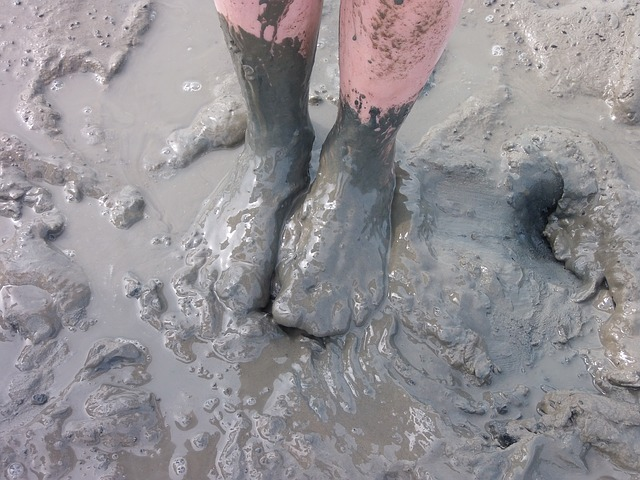
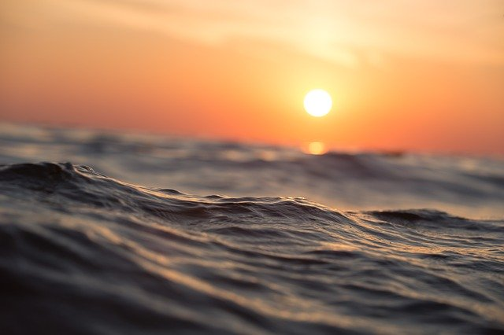
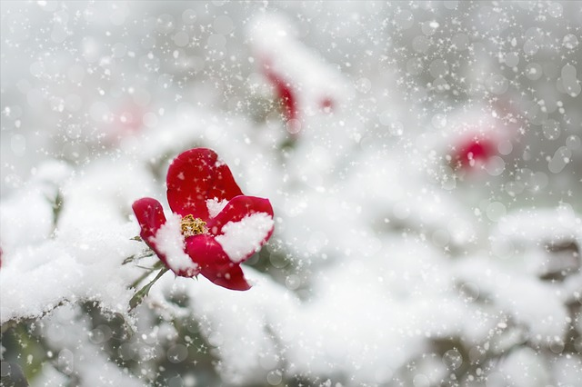

Read these nature poems for kids with your child to **inspire their curiosity of both our planet and poetry.**

Planet Earth is the only place that we know for sure is [habitable](/posts/what-does-habitability-mean/) for life in the Universe. It is a very special place. The world celebrates Earth and raises awareness of its need for protection on **[Earth Day](https://www.earthday.org/)** every year, on 22nd April. This year (2020) was its 50th anniversary.

April is also [**National Poetry Month**](https://poets.org/national-poetry-month) in the U.S., introduced to raise awareness and appreciation of poetry.

Combining poetry and nature is a great way to celebrate both the art of language and our planet – on Earth Day or **any day of the year**. It’s also a great way to encourage your child’s curiosity in the world around them. Make it part of your daily routine to read a poem together.

I’ve selected twenty of the best nature poems for kids that celebrate our planet and its diversity of life. They include winter poems, spring poems, animal poems, poems about plants and poems about the sea. Most of the poems are short and easy to read. All of them are great poems for kids.

## Reading poems with your child

You can read poetry anywhere – all you need is your imagination to enjoy a poem. But if you can get outside and **read nature poems for kids in nature**, it will add a wonderful extra dimension that will help your child **connect the words of the poem with the natural world around them** and see nature in a new light.

If you don’t have a garden or can’t get outdoors then sitting by a window is also good. You can also match the poem to the season or weather. **Reading a poem for kids about rain is perfect on a rainy day!**

### How to read a poem aloud

When you read each poem aloud, **speak slowly** and **pause at the punctuation**, rather than at the end of each line.

### What to notice when reading a poem

**Encourage your child to pay attention to what they notice when you read each of the following poems for kids.**

**Talk about using language as art.**

- What images does a poem conjure up?
- Does the poem remind your child of anything?
- How do they feel when they listen to the poem?
- Did they find anything exciting or surprising in the language of the poem?
- Did they notice any unusual sounds?
- Can they identify any rhyming words?
- Were there any words they didn’t understand?
- Is there a message in the poem?
- What do they think inspired the poet?

**Read the poem more than once**. Did your child notice anything new with each reading?

Talk about the themes in the poems and discuss how we can take better care of nature.

Follow your child’s curiosity – do some research into the topics that interest them – and **encourage them to write their own nature poems for kids!**

Share your experience reading poetry with your child by leaving a comment below and enjoy!

## 20 of the best nature poems for kids

## I’m Glad the Sky is Painted Blue

###### Anonymous

I’m glad the sky is painted blue,  
And the earth is painted green,  
With such a lot of nice fresh air  
All sandwiched in between.

## The Crocus

###### Walter Crane

The golden crocus reaches up  
to catch a sunbeam in her cup.

## The Secret Song

###### Margaret Wise Brown

Who saw the petals
&nbsp; drop from the rose?  
I, said the spider,  
But nobody knows.

Who saw the sunset  
&nbsp; flash on a bird?  
I, said the fish,  
But nobody heard.

Who saw the fog  
&nbsp; come over the sea?  
I, said the sea pigeon,  
Only me.

Who saw the first  
&nbsp; green light of the sun?  
I, said the night owl,  
The only one.

Who saw the moss  
&nbsp; creep over the stone?  
I, said the gray fox,  
All alone.

## Trees

###### Sara Coleridge

The Oak is called the King of trees,  
The Aspen quivers in the breeze,  
The Poplar grows up straight and tall,  
The Peach tree spreads along the wall,  
The Sycamore gives pleasant shade,  
The Willow droops in watery Glade,  
The Fir tree useful timber gives,  
The Beech amid the forest lives.

## The Wind

###### James Reeves

I can get through a doorway without any key,  
And strip the leaves from the great oak tree.

I can drive storm-clouds and shake tall towers,  
Or steal through a garden and not wake the flowers.

Seas I can move and ships I can sink;  
I can carry a house-top or the scent of a pink.

When I am angry I can rave and riot;  
And when I am spent, I lie quiet as quiet.

## The Ferns

###### Gene Baro

High, high in the branches  
the seawinds plunge and roar.  
A storm is moving westward,  
but here on the forest floor,  
the ferns have captured stillness.  
A green sea growth they are.

The ferns lie underwater  
In a light of the forest’s green.  
Their motion is like stillness,  
As if water shifts between  
And a great storm quivers  
Through fathoms of green.

## Mud

###### Polly Chase Boyden

Mud is very nice to feel  
All squishy-squash between the toes!  
I’d rather wade in wiggly mud  
Than smell a yellow rose.

Nobody else but the rosebush knows  
How nice mud feels  
Between the toes.

## Until I Saw the Sea

###### Lilian Moore

Until I saw the sea  
I did not know  
that wind  
could wrinkle water so.

I never knew  
that sun  
could splinter a whole sea of blue.

Nor  
did I know before,  
a sea breathes in and out  
upon a shore.

## The Rain Has Silver Sandals

###### May Justus

The rain has silver sandals  
&nbsp; For dancing in the spring,  
And shoes with golden tassels  
&nbsp; For summer’s frolicking.  
Her winter boots have hobnails  
&nbsp; Of ice from heel to toe,  
Which now and then she changes  
&nbsp; For moccasins of snow.

## First Snow

###### Marie Louise Allen

Snow makes whiteness where it falls.  
The bushes look like popcorn-balls.  
And places where I always play,  
Look like somewhere else today.

## Beyond Winter

###### Ralph Waldo Emerson
Over the winter glaciers  
&nbsp; I see the summer glow,  
And through the wild-piled snowdrift  
&nbsp; The warm rosebuds below.

## Maytime Magic

###### Mabel Watts

A little seed  
For me to sow…

A little earth  
To make it grow…  
A little hole,  
A little pat…  
A little wish,  
And that is that.

A little sun,  
A little shower…  
A little while,  
And then – a flower!

 

## Hurt no living thing

###### Christina Rossetti

Hurt no living thing:  
Ladybird, nor butterfly,  
Nor moth with dusty wing,  
Nor cricket chirping cheerily,  
Nor grasshopper so light of leap,  
Nor dancing gnat, nor beetle fat,  
Nor harmless worms that creep.

## Green Stems

###### Margaret Wise Brown

Little things that crawl and creep  
In the green grass forests,  
Deep in their long-stemmed world  
Where ferns uncurl  
To a greener world  
Beneath the leaves above them;  
And every flower upon its stem  
Blows above them there  
The bottom of a geranium,  
The back side of a trillium,  
The belly of a bumblebee  
Is all they see, these little things  
Down so low  
Where no bird sings  
Where no wind blows,  
Deep in their long-stemmed world.

## A Dragonfly

###### Eleanor Farjeon

When the heat of the summer  
Made drowsy the land,  
A dragon-fly came  
And sat on my hand,  
With its blue jointed body,  
And wings like spun glass,  
It lit on my fingers  
As though they were grass.

## Fireflies in the Garden

###### Robert Frost

Here come real stars to fill the upper skies,  
And here on earth come emulating flies,  
That though they never equal stars in size,  
(And they were never really stars at heart)  
Achieve at times a very star-like start.  
Only, of course, they can’t sustain the part.  

## A Wee Little Worm

###### James Whitcomb Riley

A wee little worm in a Hickory nut  
Sang, happy as he could be,  
“O I live in the heart of the whole round world,  
And it all belongs to me!”

## Fishes’ Evening Song

###### Dahlov Ipcar

Flip flop,  
Flip flap,  
Slip slap,  
Lip lap;  
Water sounds,  
Soothing sounds.  
We fan our fins  
As we lie  
Resting here  
Eye to eye.  
Water falls  
Drop by drop,  
Plip plop,  
Drip drop.

Plink plunk,  
Slash splish;  
Fish fins fan,  
Fish tails swish,  
Swush, swash, swish.  
This we wish …  
Water cold,  
Water clear,  
Water smooth,  
Just to soothe  
Sleepy fish.

## The Sandpiper

###### Frances Frost

At the edge of tide  
He stops to wonder,  
Races through  
The lace of thunder.

On toothpick legs  
Swift and brittle,  
He runs and pipes  
And his voice is little.

But small or not,  
He has a notion  
To outshout  
The Atlantic Ocean.

 

## The Eagle

###### Alfred Tennyson

He clasps the crag with crooked hands  
Close to the sun in lonely lands,  
Ring’d with the azure world, he stands.  
The wrinkled sea beneath him crawls  
He watches from his mountain walls,  
And like a thunderbolt he falls.
