*Where did atoms come from? If you are looking for an engaging hands-on activity to spark your child’s curiosity in the Universe then this post is for you. It covers big bang and stellar nucleosynthesis for kids of all ages and abilities – using a classic favourite of kids: playdough. It’s also challenging enough for adults! Playdough is easy to make with basic kitchen supplies.*

To supplement this post and, I’ve created a **free** **printable activity pack with nucleosynthesis-themed puzzles, worksheets and quiz**. Submit your email below to get your copy.

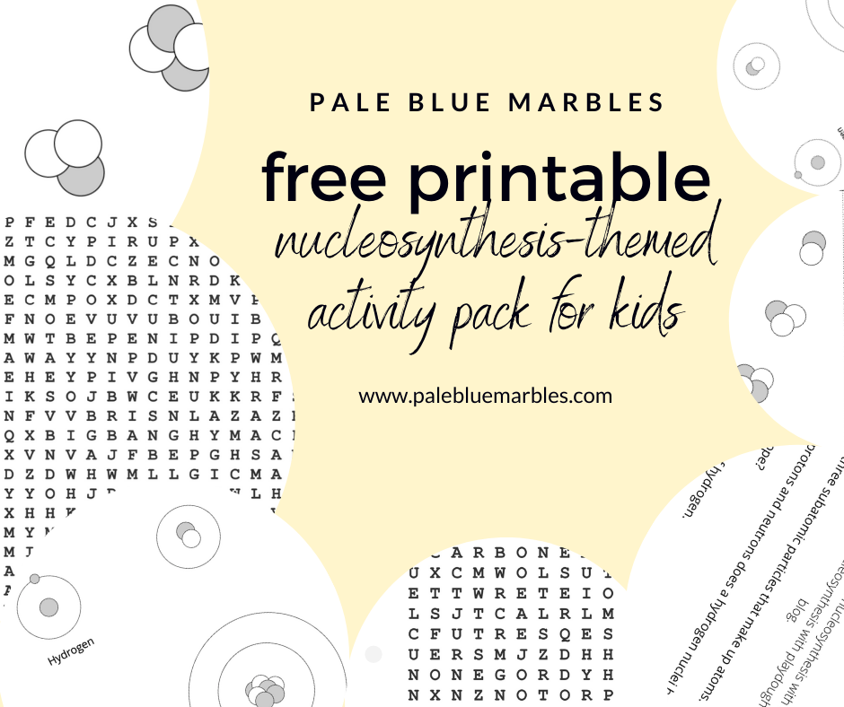


Download PDF


The building blocks of all matter, living and non-living, are atoms. The air we breathe, the food we eat, the trees, the oceans, the soil, the worms, the sun that shines in our sky: all made from atoms. Take a look at this video from CERN to see how small they are:

<iframe allowfullscreen="allowfullscreen" frameborder="0" height="315" src="https://www.youtube.com/embed/7WhRJV_bAiE" width="560"></iframe>

## **Where did atoms come from?**

**Nucleosynthesis is the process that creates new atomic nuclei** (the nucleus of an atom is its core). You might have heard that you are made of star-stuff. This is partially true. Let’s explore the idea with the help of some playdough!

First, what types of atoms are found in [life on Earth](/posts/what-does-habitability-mean/)?

## The elements of life

Hydrogen, carbon, nitrogen, oxygen, phosphorus and sulphur.

These six elements (types of atoms) are necessary to create the [molecular bricks, mortar, tools](/posts/moleculemonday/) and machinery of all life on Earth. They are what make up all the proteins, carbohydrates, lipids and nucleic acids ([DNA](/posts/what-is-dna/) and RNA) in your body.

Other elements are also needed, but in much smaller amounts. Here are a few examples:

- Iron is found in all of your red blood cells
- Your bones contain calcium
- Zinc is important for many of the molecular tools that regulate your [DNA](/posts/what-is-dna/)

### The importance of carbon

**Carbon is the foundation for life on Earth.**

Since each carbon atom can form strong, stable bonds with **four other atoms**, it can create the backbone for very long molecules: [a single molecule of your DNA stretched out is around 4 cm long](/post/what-is-dna/)!



### Your ancient atoms – big bang nucleosynthesis

Almost **all hydrogen**, which is the lightest and most common element in the Universe (and in living things), was created **13.8 billion years ago by nucleosynthesis during the big bang**.

This means that **most of your atoms, including the ones in your DNA, are as old as the Universe!**

### Your stellar atoms – stellar nucleosynthesis

The other five, heavier, atoms required for life, are **created via nucleosynthesis inside stars** (more on how they do this below).

When they reach the end of their lives, most stars expand into **red giants** and shed their outer layers, releasing these heavier elements into space. This results in stunning **planetary nebulae**, like the ones below.

 captured by NASA’s Chandra X-ray Observatory. Image credits: X-ray: NASA/CXC/RIT/J.Kastner et al.; Optical: NASA/STScI")

**This is what will happen to the Sun in a few billion years.**

What does this mean for your building blocks? It means that **most of the rest of your atoms (apart from hydrogen) were born inside stars during stellar nucleosynthesis.**

**You are part star-stuff!**

### Your supernova atoms

Some elements, including many trace elements in living things, are only made when massive stars (8 or more times the size of our Sun) reach the end of their lives and **explode as [supernovae](https://www.nasa.gov/audience/forstudents/5-8/features/nasa-knows/what-is-a-supernova.html).**

**This explosion is so bright that it can outshine a whole galaxy of stars.**

It is so powerful that it sends shock waves into space, heating any dust and gas it passes through to millions of degrees.

")

Here’s an animation of a supernova that was caught by the [Kepler space telescope](https://www.nasa.gov/mission_pages/kepler/overview/index.html):

<iframe allowfullscreen="allowfullscreen" data-mce-fragment="1" frameborder="0" height="315" src="https://www.youtube.com/embed/kLlILnQjGfc" width="560"></iframe>

This means…

**You contain traces of supernovae!**

## Nucleosynthesis with playdough

The creation of new atomic nuclei from existing nuclei, or protons and neutrons, is called **nucleosynthesis**. It’s how hydrogen and helium were made right after the big bang (big bang nucleosynthesis) and how they are combined into heavier elements in stars (stellar nucleosynthesis).

To help your child understand these processes and give them a better grasp of what makes up an atom and how atoms are made, we are going to model it with playdough.

**I created a video to summarise the key information on nucleosynthesis and how to model it with playdough. Watch this for an overview then read on!**

<iframe allowfullscreen="allowfullscreen" frameborder="0" height="315" src="https://www.youtube.com/embed/w3xsFANk4eg" width="560"></iframe>

**Read the information associated with each step first for background, then follow the steps that follow.**

If you don’t have any, **playdough is very, very easy to make**! We used [this playdough recipe from the BBC.](https://www.bbcgoodfood.com/howto/guide/playdough-recipe) I also included instructions in my video. My 5-year-old daughter actually spent several hours experimenting with the recipe and trying to make slime: a great activity in itself!

### What you’ll need

- Playdough in two different colours 
    - To make your own you need: 
        - Flour
        - Salt
        - Water
        - Vegetable oil
        - Food colouring

### What they’ll learn

- The basic structure of an atom
- What makes the elements different from one another
- What an isotope is
- How atoms were created at the beginning of the Universe (big bang nucleosynthesis)
- How nuclei are fused in stars to make the heavier [elements required for life](/posts/what-does-habitability-mean/) (stellar nucleosynthesis)
- What the periodic table is

>### Tips for adapting the activity to different levels
>
>This activity can be adapted to all ages and abilities. Here is some guidance as to what to cover at different levels.
>
>#### Level 1
>
>Focus more on **shaping, counting, sorting and grouping** balls of playdough to make “atoms”.
>
>Rather than talk about how the atoms are made you can talk about how many protons are in hydrogen, how many in helium, etc.
>
>#### Level 2
>
>Follow each numbered step as-is and take cues from your child for how much of the terminology and detail to go into. If their eyes glaze over and they start smashing the balls of playdough you know you have probably reached saturation point!
>
>#### Level 3
>
>Follow all steps, including optional ones, and take cues from your child for how much of the terminology and detail to go into. If they are interested to know more use the opportunity to explore the elements in more detail using the recommended resources.
>
>#### Level 4
>
>**Some kids will want to know even more** – if this is the case, and you have reached the limits of googling their questions, let me know in the comments and I will try to help!

Let’s synthesise some nuclei!

### 1. Sub-atomic particles

Atoms are made up of protons, neutrons and electrons.

#### Step 1. Make protons and neutrons

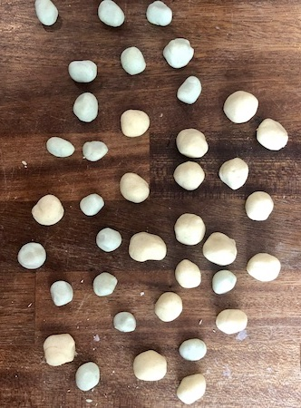

- Roll your first colour of playdough into small balls 
    - These are your **protons – they are positively charged**
- Repeat for the second colour 
    - These are your **neutrons – they do not have a charge**
- **Optional**: roll some playdough into very tiny balls 
    - These are **electrons – they are negatively charged**
- **Optional**: write a ‘+’ and a ‘-‘ on small pieces of paper and ask your child to match the charge with the subatomic particles.

### 2. Big bang nucleosynthesis

The **first atomic nuclei were created via nucleosynthesis about 1 minute after the Big Bang** when the temperature of the baby Universe started to drop. It was still too hot for complete atoms (with electrons) to form.

#### The formation of hydrogen nuclei

The first atomic nuclei to be created were three different **isotopes** (same number of protons but different numbers of neutrons) of hydrogen.

**Hydrogen makes up around 75% of the Universe and about 66% of all living things on Earth.**

#### Step 2. Make hydrogen

- Take one of your protons and place it in the middle of a flat surface 
    - This is the **nucleus** of a **hydrogen atom**
    
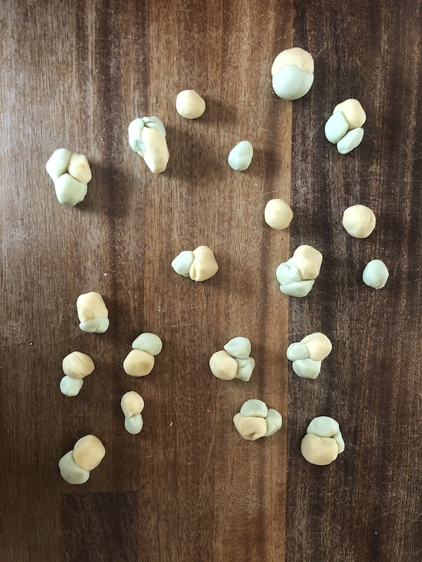

- Take one of your neutrons and place it with to your proton 
    - This is a nucleus of **deuterium** – an isotope of hydrogen (it’s still hydrogen because it has only one proton)
- Now take a second neutron and place it with your deuterium nucleus. 
    - This is a nucleus of **tritium** – another isotope of hydrogen
- Ask your child to make some more nuclei 
    - Make a mixture of the three isotopes of hydrogen

#### The formation of helium nuclei

**Around 24% of the Universe is helium.**

As **helium does not react with other atoms,** it is not part of living things – but it is an essential stepping stone for making the building blocks of life.

#### Step 3. Make helium

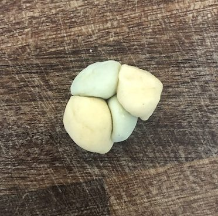

- Add a proton to one of your tritium nuclei 
    - You’ve made a nucleus of **helium** (2 protons and 2 neutrons)
    - Your child may have encountered helium in balloons – talk about this to give them an anchor for what helium is
- Crack a joke (optional))")

- Ask your child to make a few more helium nuclei by adding a proton to tritium

#### The formation of atoms

It took about 380,000 years for the early Universe to become cool enough for **electrons to combine with nuclei to make stable atoms**.

#### Optional step: make atoms

- Place one of your electrons near one of your hydrogen nuclei 
    - **You’ve made a hydrogen atom!**
- Tell your child that if this was to scale the electron would have to be about **half a kilometre away**
    - **Atoms are mostly empty space!**  
    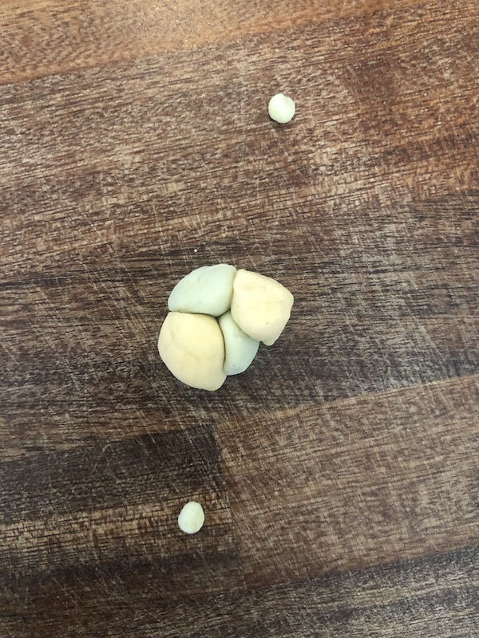
        
- In **neutral atoms** the **number of positively charged particles (protons) is the same as the number of negatively charged particles (electrons)**
    - Show your child that helium has two electrons
- Ask your child to complete the other atoms by adding the correct number of electrons 
    - All nuclei of **hydrogen isotopes should have one electron**
    - All **helium nuclei should have two electrons**

### 3. Stellar nucleosynthesis

Stars like our sun are too hot for neutral atoms. Instead, nuclei and free electrons form a state of matter called **plasma**. Stars fuse hydrogen nuclei to make helium nuclei for most of their lives, creating a lot of energy in the process, which is vital to life.

Once a star runs out of hydrogen to fuse, it starts to **fuse helium**. Eventually it runs out of helium and starts to fuse heavier nuclei leading to the elements that form the building blocks for biological molecules, as well as other non-biological matter.

#### **The formation of helium in a star**

Making helium in stars is slightly different to the nucleosynthesis that followed the big bang: its raw materials are **hydrogen nuclei** rather than free protons and neutrons.

There are two ways helium is made in stars.

- The **proton–proton chain reaction**, which is happening in our Sun right now. To fuse hydrogen this way requires a temperature of at least 5 million degrees.
- The C-N-O cycle, which happens in stars that are bigger than the Sun, using carbon.

**We’ll take a look at the proton-proton chain reaction.**

It looks complicated but it’s easy once you start modelling it with playdough (see also the video).

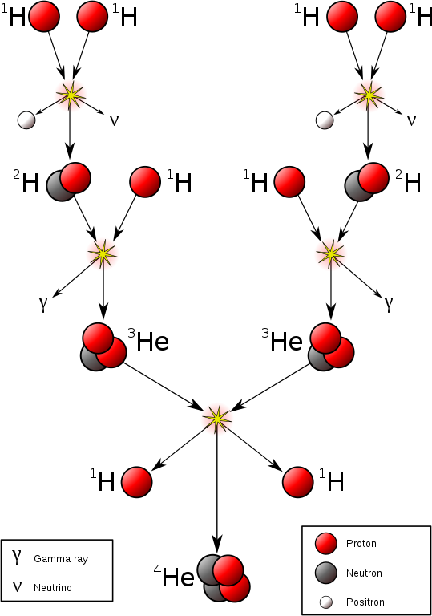

#### Step 4. **Make helium like a star**

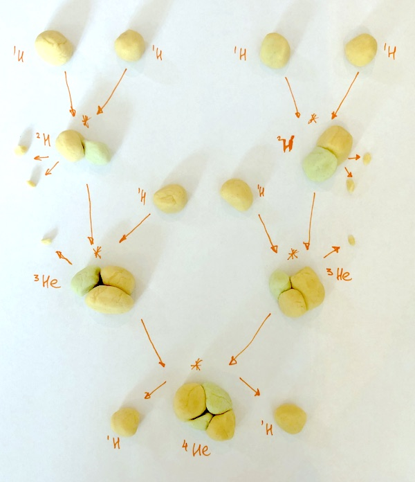

- Take **two protons (hydrogen nuclei)**
- Bring them together
- **Replace one proton with a neutron**
    - A proton is converted into a neutron as the two protons ‘fuse’ together
    - Optionally, break off two small pieces from this proton before you swap it for a neutron and tell your child that **even protons and neutrons have tiny tiny building blocks**. These building blocks can change when atoms are fused or broken apart. One of these pieces is a [positron](https://en.wikipedia.org/wiki/Positron) – a positively charged antielectron – and the other is a [neutrino](https://en.wikipedia.org/wiki/Neutrino)
- Now you have a **deuterium nuclei** (one proton and one neutron)
- Ask your child to repeat what you just showed them 
    - Now you have **two deuterium nuclei**
- Take another proton (hydrogen nucleus) and fuse it to your deuterium nucleus. Ask your child to do the same with theirs. 
    - Now you have **two helium-3 nuclei** (helium with only one neutron)
    - Optionally, tell your child that this fusion emits [gamma radiation](https://en.wikipedia.org/wiki/Gamma_ray): the **highest energy electromagnetic radiation** (other types of lower energy electromagnetic radiation include microwaves, visible light and x-rays)
- Take **two helium-3 nuclei**
- Pull one proton off from each and fuse the two resulting deuterium nuclei together 
    - You now have **one helium nucleus** (two protons and two neutrons) and **two hydrogen nuclei** (one proton each).
- You have just completed one proton-proton chain reaction!
- Ask your child to repeat the steps to **make more helium**

### The formation of carbon inside a red giant

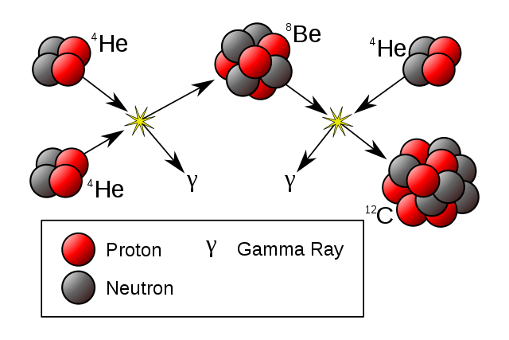

When our sun runs out of hydrogen (this will happen in a few billion years) its outer layers will puff out and consume Mercury and Venus.

Meanwhile, its inner layers will collapse and **heat the core to around one billion degrees**.

At this temperature **helium nuclei can fuse to make heavier elements.**

This results in one of the most important building blocks of life: **carbon**.

This is called the **triple-alpha process** (because it uses three helium nuclei, which are also called alpha particles).

Now that your child can make helium, **making carbon will be very easy**!

#### Step 5. Make carbon like a red giant

- Take **two helium nuclei** that you made in your **proton-proton cycle**
- Put them together to make **beryllium** (4 protons, 4 neutrons).
- Take **another helium nucleus** and merge it with your beryllium nucleus. Now you have a **carbon** nucleus (6 protons, 6 neutrons)!
- Repeat the process to make more carbon

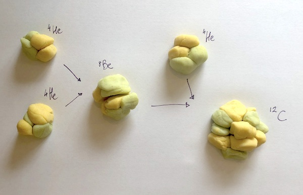

### The formation of other elements

Other, heavier, elements are created by nucleosynthesis in stars when additional helium nuclei are fused. Oxygen (8 protons, 8 neutrons) is formed when helium fuses with carbon.

#### Step 6. Make heavier elements

- Let your child experiment with creating different nuclei by adding helium to existing nuclei
- If you add helium to carbon you get oxygen – what do you get if you add another helium nuclei, and then another? Can you make the elements up to iron?
- My 8-year-old had a lot of fun with this and enjoyed making new, ‘surprise’ elements!
- Once they’ve made a new nucleus check what element it belongs to by looking it up in the periodic table below (use its atomic number, which is the number of protons it has).

## 4. The periodic table of the elements

You can use the following version of the periodic table to find out how each element that occurs in the Universe was made:

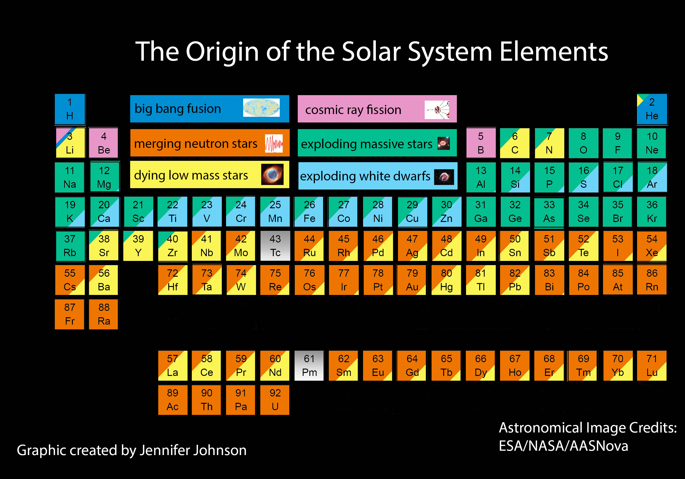

**The periodic table is a wonderful thing.**

It **arranges all the known elements in the Universe by atomic number**, into groups according to how many electrons are in an atom’s outer shell (and therefore how many other atoms it can bond with).

I recommend watching this video with your child to get them excited about the periodic table!

<iframe allowfullscreen="allowfullscreen" data-mce-fragment="1" frameborder="0" height="315" src="https://www.youtube.com/embed/rz4Dd1I_fX0" width="560"></iframe>

There is also a very nice[ interactive periodic table from the royal society of chemistry](https://www.rsc.org/periodic-table) that gives a lot of information for each element and visualises what state each element is at different temperatures.

If your child is curious to know more about each element, there is also a [periodic table of videos about each element here!](https://ed.ted.com/periodic-videos)

## 5. Building molecules outside stars

At this point you can also show your child an example of how atoms are assembled into molecules. Molecules cannot exist on stars (they are too hot) but they do form in space – in planetary nebulae and in molecular clouds of dust and gas.

We’ll **use water as an example** as this is a simple molecule, abundant in the Universe, and essential for life as we know it.

Related post: [Astrobiology’s marvellous molecules](/posts/moleculemonday/)

#### Optional step: make a water molecule

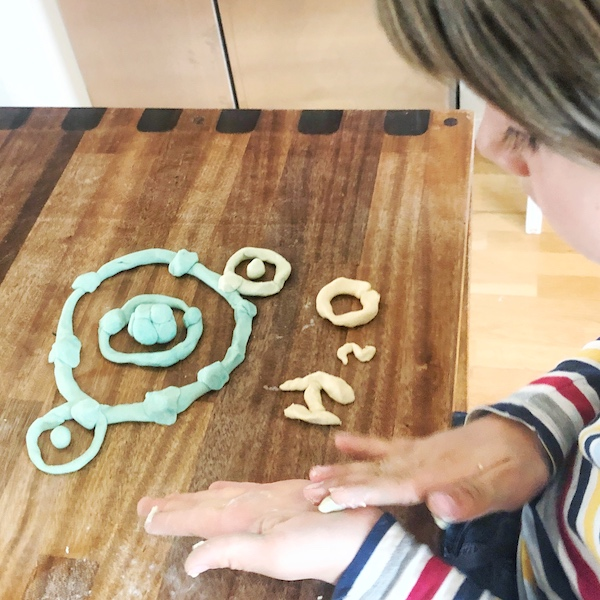

- Make an **oxygen nucleus** (8 protons, 8 neutrons)
- Make **two hydrogen nuclei** (1 proton each)
- Add **electrons in ‘shells’** around the nuclei 
    - For oxygen 
        - Add 2 electrons to the first shell (this is all the first electron shell of an atom can hold)
        - Add 6 electrons to the second shell (which can contain a maximum of 8 electrons) 
            - Two at the top, two at the bottom and one on either side
    - For hydrogen 
        - Add 1 electron around each nucleus
- Move the hydrogen atoms to either side of the oxygen atom and align the electrons so that a pair is “shared” between hydrogen and oxygen.
- You’ve made a molecule of water (H2O)!

This is a fun video about atomic bonds that made this concept stick with my kids:

<iframe allowfullscreen="allowfullscreen" data-mce-fragment="1" frameborder="0" height="315" src="https://www.youtube.com/embed/ljvX-RMv_lw" width="560"></iframe>
