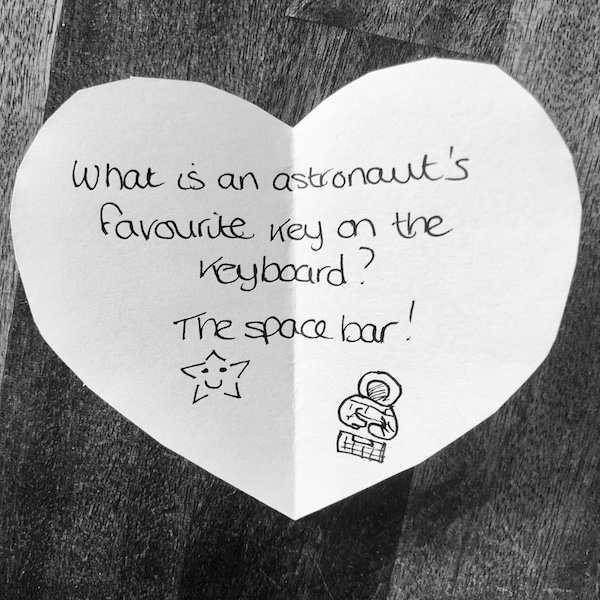

There are so many benefits to sharing funny jokes with your child, especially funny science jokes for kids. **Jokes stimulate laughter, learning, creativity, curiosity and help foster a sense of humour in children**. Science jokes are not only entertaining for kids: they also **open a door for endless questions**.

Sharing a joke is also a great way to **bond with your child** and explaining why a science joke is funny and seeing their eyes light up with understanding is a joy in itself.

In this post, I’ve compiled some of the **best science jokes for kids**, with explanations to engage their curiosity. It’s a growing list that I will add to over time.

If you have any suggestions for science jokes for kids, let me know in the comments!

Before we get to the science jokes, let’s take a quick look at **why jokes are so good for you and your child**.

## The benefits of sharing jokes with your child

Laughter is a way for humans to **communicate, share and bond**. When we have someone to laugh with it makes us happy and gives us a **sense of belonging**. Laughter may also [relieve stress and pain and boost your mood](https://www.forbes.com/sites/daviddisalvo/2017/06/05/six-science-based-reasons-why-laughter-is-the-best-medicine/#78f6ec1f7f04). It can also [lead to the generation of new ideas and improved problem-solving](https://www.psychologytoday.com/us/blog/the-tao-innovation/201406/the-power-humor-in-ideation-and-creativity). Perfect for learning science!

**Babies can laugh before they can talk** and there is nothing that delights parents more than hearing their baby giggle. It’s one of the rewards for all the sleepless nights.

From when your child reaches [the age of 3 months old](https://ideas.ted.com/meet-a-scientist-with-a-most-delightful-job-he-studies-baby-laughter/), finding new ways to trigger their gurgles of laughter becomes an obsession. Peekaboo is a sure winner for the early years, but eventually, the novelty wears off.

**Challenge your child with science jokes from an early age**. Kids love to be surprised and jokes are great for creating **unexpected connections** between words and topics. When you explain a science joke, use it as an opportunity to **create a discussion**.

In addition to providing all the benefits of laughter, science jokes for kids are a great way to initiate and **deepen the learning of complex topics.**

## Lunchbox notes with science jokes

When my son returned to school after the COVID-19-induced lockdown, he had to deal with many new rules around hand-washing and social distancing. To **make him smile** as he adjusts to this new ‘normal’, I leave him notes in his lunchbox with a **new science joke for kids each day**.

Some days I slip the topic of the joke into our breakfast-time conversation, if I know it’s a new concept for him, and other days we discuss it after school. In each case, he learns something new and has a giggle. It also gives him **practice reading and keeps him curious**.

Lunchbox notes are one of many possibilities for sharing science jokes with your child. You can also leave notes under their pillow or with their breakfast. Or tell science jokes for kids at mealtimes or bedtime. They also work well for **diffusing tension and de-escalating conflict**!

## The best science jokes for kids

Here are our favourite science jokes for kids – with explanations and fun facts to encourage discussion. All of these made my son laugh and engaged his curiosity.

### Physics jokes for kids

 

**Don’t trust atoms: they make up everything!**

*All matter, from the whiskers of a cat to the water in your tap, is made of tiny tiny [building blocks](/posts/nucleosynthesis-for-kids-with-playdough/) called atoms.*

 

**What does a subatomic duck say?**

**Quark!**

*Each tiny atom has a core, called a nucleus, that is made up of even smaller building blocks called protons and neutrons. These are **subatomic particles** (subatomic because they are smaller than atoms).*

*Protons and neutrons also have building blocks. These are called **quarks**!*

*There are six different types, or flavours, of quarks called up, down, top, bottom, strange and charm.*

 

**I was reading a book about helium.**

**I couldn’t put it down!**

*Atoms come in different types depending on the [number of protons in their nucleus](/posts/nucleosynthesis-for-kids-with-playdough/). **Helium atoms are very light** – they contain only two protons and two neutrons. Only hydrogen, with one proton, is lighter. Because helium is lighter than the other elements in air (like oxygen and nitrogen), it floats.*

 

**What do we want?**

**Time travel!**

**When do we want it?**

**Irrelevant!**

*Time is the fourth dimension of our universe after the three dimensions of space. Because time and space are linked, the faster you travel through space, the slower you travel through time.*

*If you travelled almost at the speed of light, time would slow down so much that [one year for you would be 2000 years on Earth](https://www.syfy.com/syfywire/time-travel-science-speed-gravity-back-future). It would be a bit like travelling into the future.*

*Gravity also bends spacetime so could be used to connect different points in time. None of this is possible yet, but it makes for **excellent conversation starters for curious kids**!*

 

**A photon checks into a hotel and is asked if he needs any help with his luggage.**

“No, I’m travelling light.”

*Photons are the basic units of light. They have no mass and, in empty space, travel at a constant speed (299,792,458 m/s).*

### Space jokes for kids

 

**How do you organise a space party?**

**You planet!**

*The [definition of a planet](https://www.iau.org/public/themes/pluto/) has changed over time. The latest definition says that **a planet must orbit a star and have enough gravity to make the planet spherical and to clear away other objects in its orbit**. There are billions of trillions of planets in our universe.*

[Learn about what makes a planet habitable.](/posts/what-does-habitability-mean/)

 

**What kind of music do planets sing?**

**Neptunes!**

*[Neptune](https://solarsystem.nasa.gov/planets/neptune/overview/) is the most distant planet (8th) from the Sun. It is a ball of gas and ice with the strongest winds in the Solar System.*

 

**What is an astronaut’s favourite key on the keyboard?**

**The space bar!**

As of April 2020 [566 astronauts have been into space](https://en.wikipedia.org/wiki/List_of_space_travelers_by_name#:~:text=Of%20those%20566%2C%20three%20people,100%20person%2Ddays%20of%20spacewalks.). The name ‘astronaut’ literally means ‘starsailor’: it comes from the Greek words for star (*ástron:* ἄστρον), and sailor (*nautes:* ναύτης).

 

**What school do planets and stars go to study?**

**University!**

The Universe is the name we give to all of spacetime and its contents, which includes planets and stars. It began with the big bang 13.8 billion years ago. [The word ‘universe’ comes from the latin word ‘universum’, meaning ‘all things, everybody, the whole world’](https://www.etymonline.com/word/universe).

The word ‘university’ comes from shortening the latin phrase ‘*universitas magistrorum et scholarium*‘, which means a community of teachers and scholars.

 

**When do astronauts eat their lunch?**

**At launch time!**

When a person has been trained and certified to work in space by the space agencies of the U.S.A. ([NASA](https://www.nasa.gov/)), Europe ([ESA](https://www.esa.int/)), Canada ([CSA](https://www.asc-csa.gc.ca/eng/Default.asp)), Japan ([JAXA](https://global.jaxa.jp/)) or China ([CNSA](http://www.cnsa.gov.cn/english/)) they are called an astronaut. If a person was trained and certified by the Russian Space Agency ([Roscosmos](http://en.roscosmos.ru/)) they are called a cosmonaut. The first human in space was the Soviet cosmonaut Yuri Gagarin in 1961.

  

**What do planets like to read?**

**Comet books** 

*A [comet](https://solarsystem.nasa.gov/asteroids-comets-and-meteors/comets/overview) is a ball of ice, dust and small pieces of rock that orbits the Sun, usually in an elliptical orbit. As it approaches the Sun a comet warms up and releases gases that create a visible atmosphere (a coma and a tail that stretches away from the Sun).*

### Biology jokes for kids

 

**How much room do fungi need to grow?**

**As mushroom as possible!**

*[Fungi](https://herbarium.usu.edu/fun-with-fungi/what-are-fungi) are more closely related to animals than plants and, as well as mushrooms, include yeasts (like the yeast we use to bake bread) and molds.*

**Why did the germ cross the microscope?**

**To get to the other slide!**

*“Germ” is another name for a microorganism (or microbe) – usually a bacteria, fungi or virus that causes disease. Germs are tiny and can only be seen with a [microscope](https://en.wikipedia.org/wiki/Microscope) (“micro” comes for the ancient greek word meaning small). To look at microbes under a microscope you first mount it onto a small strip of glass, called a **slide**, and cover it with an even thinner piece of glass called a cover slip.*

**I wish I was adenine, then I could get paired with U.**

***Adenine** is one of the building blocks (bases) of [DNA (the blueprint of life)](/posts/what-is-dna/) and RNA (which among other jobs works as a messenger for DNA).*

*When RNA messages are created from DNA, the bases follow special pairing rules (there are also similar [pairing rules between two DNA strands](/posts/build-a-dna-model-with-pipe-cleaners/)). The base in RNA that pairs up with adenine is called **uracil**. Bases are often represented by their first letters. So **uracil is often written as ‘U’**.*

*These pairing rules are also followed within an RNA molecule (the picture shows a simplified tRNA, which helps make proteins from an RNA message and forms a clover shape with adenines paired with uracils).*

### Chemistry jokes for kids

**Want to hear a joke about sodium?**

**Na**

*Sodium is a chemical element (a type of atom). All the chemical elements have symbols to represent their names: sodium’s symbol is ‘Na’.*

*Learn about where the elements came from in my [blog post on nucleosynthesis](/posts/nucleosynthesis-for-kids-with-playdough/).*

**If you’re not part of the solution, you’re part of the precipitate.**

*When a substance (like salt) dissolves in another (like water) they form a solution (like brine). **If a dissolved solid comes out of solution it is called a precipitate.***

*Try [extracting DNA from fruit](https://www.palebluemarbles.com/extract-dna-from-an-apple/) and watch it precipitate out of solution!*
