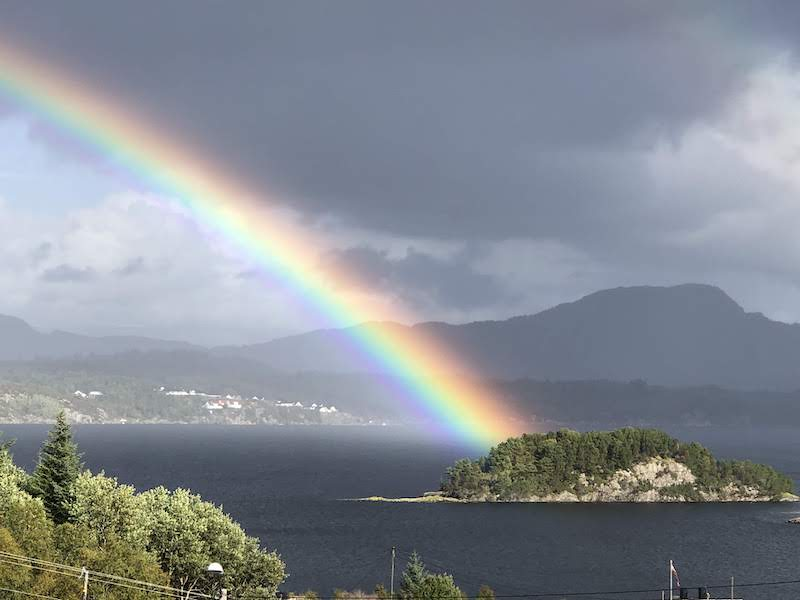

As I write, we are in the middle of a pandemic.

**COVID-19, a novel coronavirus, continues its march across the planet.** As of today, [over 1.2 million people have been infected.](https://www.worldometers.info/coronavirus/#countries)

Lockdowns, including school closures and orders to stay at home, are in force for more than a third of the global population.

**Parents and children have been thrown into homeschooling**, with little time to prepare and other responsibilities to juggle. But we all have to adapt to this new way of life and, for our own mental well-being, **we must look for silver linings.**

## **A remedy for parental anxiety**

Here in Norway, we have just completed our third week of school closures.

The education system here consistently [ranks high in global surveys](https://www.oecd.org/pisa/PISA%202018%20Insights%20and%20Interpretations%20FINAL%20PDF.pdf). Our local school is modern and surrounded by forests and fjords. There is a strong focus on social skills.

My son has a fantastic teacher who is enthusiastic and willing to adapt his learning materials to fit his needs. My daughter attends a kindergarten full of adults who care about the children’s development.

Nevertheless, I regularly suffer from some anxiety over whether their **curiosity is sparked or stifled** in such large groups, whether they are **bored or being challenged at the right level**, whether they are on a **track towards reaching their full potential or on a track towards disillusionment**.

I feel responsible for their curiosity, their love of learning, their happiness. They are so excited, so inquisitive, about the world around them.

**I don’t want them to lose that.**

“You should do more at home,” says a little voice in my head.

“But there are not enough hours in the day,” another voice barks back.

This is true.

I work full time and in the evenings we barely have enough time to eat dinner and get homework done.

But now, in the midst of the coronavirus chaos, there is this **golden opportunity to play a bigger role in their education** and I am seizing it.

## Words of joy

**“Please can we learn more, Mamma, pleeease?”**

Hearing these words from the mouths of my two young children filled my heart with joy. They are what many parents dream of hearing.

We all want the best for our children. **For me, a love of learning follows hot on the heels of health and happiness.**

**When children love to learn, they absorb knowledge like little sponges and develop the discipline, motivation and perseverance to master skills that will set them up for life.**

If my children love to learn then I am confident they will succeed in life, no matter what their definition of success may be.

Because they will find joy in the process.

## The start of something new

The past three weeks have been filled with moments of joy: eyes alight with the excitement of discovery; smiles of understanding; and pleads for more learning.

We have covered topics ranging from the big bang to the brains of octopuses.

It has been a lot of fun and has inspired me to start Pale Blue Marbles.

**My mission is to help other parents cultivate their children’s love of learning.** I want to help you give them the understanding they crave from the world around them, the best answers we have to their questions about the Universe.

It will be fun for parents and children alike.

I hope you will join me on the journey.
