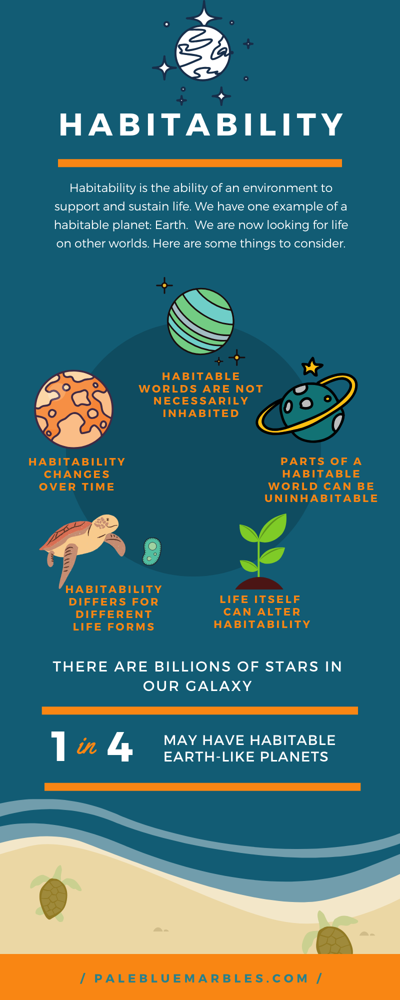
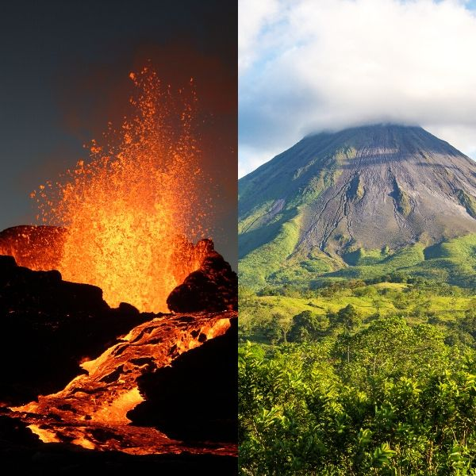
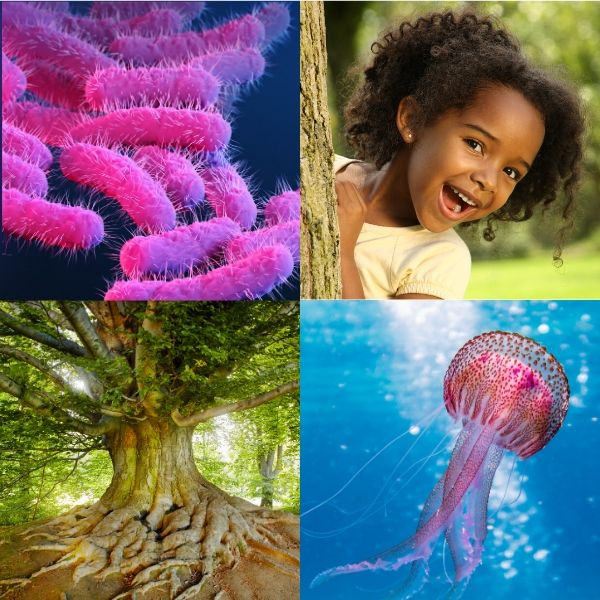
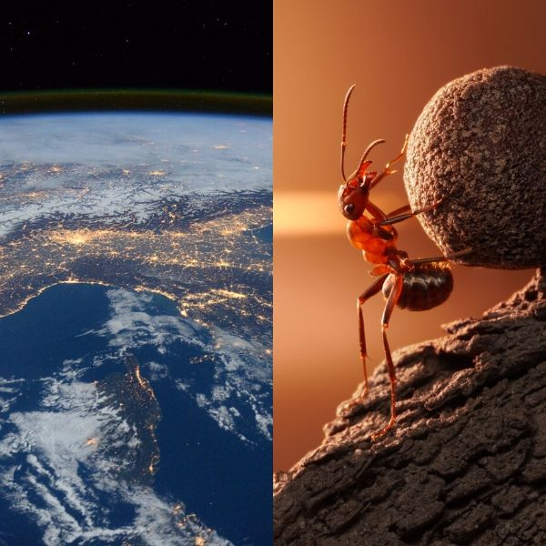
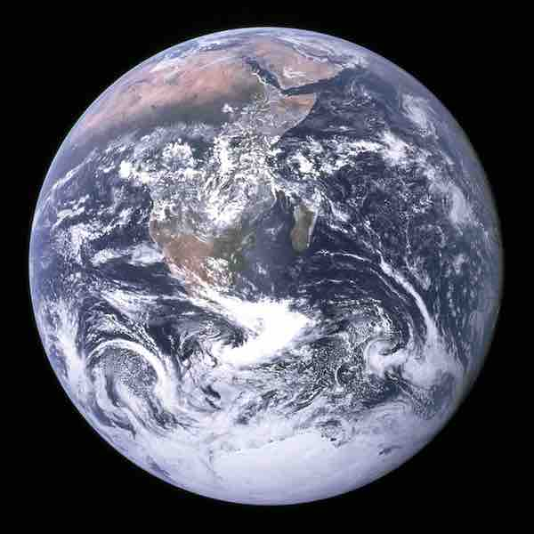
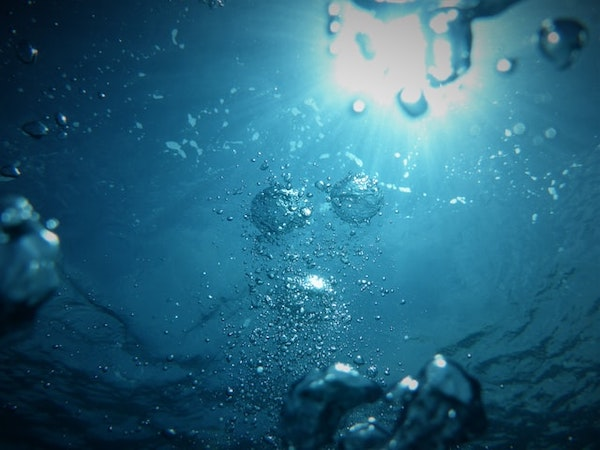
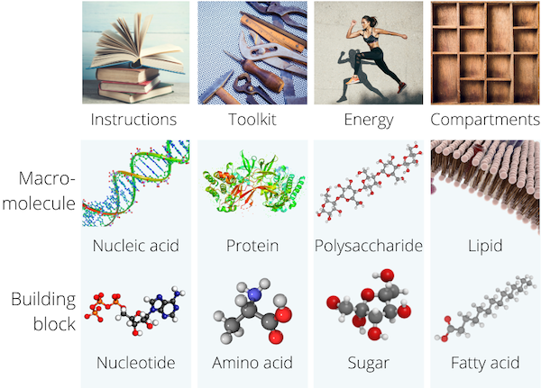
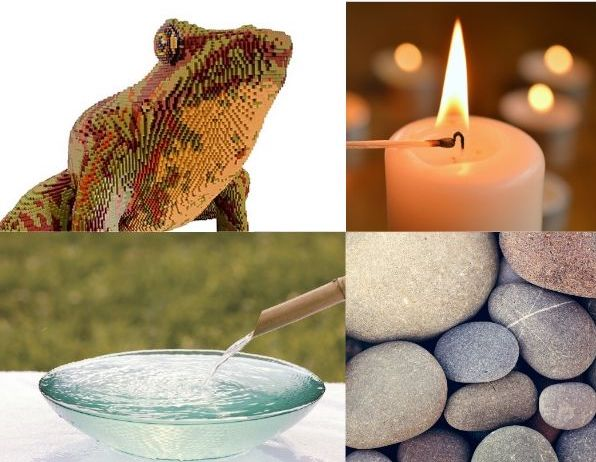
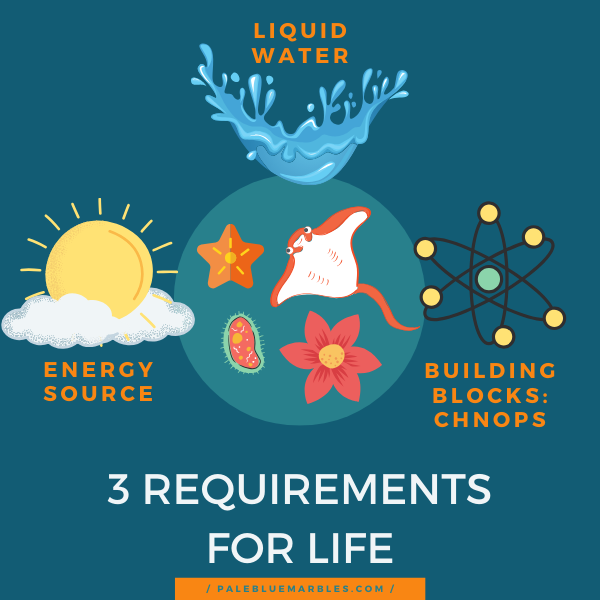

*This is the first post in my [‘habitability’](https://www.palebluemarbles.com/habitability-series/) blog series that will take your child on an adventure of discovery, learning about what makes life possible here and elsewhere in our Universe. Find out what habitability means and what the limits and requirements are for life on Earth.*

**What makes a world habitable? What are the requirements for life? What are its limits?**

These are key questions in **astrobiology**.

Habitability is also a fascinating topic to talk about with children.

Perhaps your child hasn’t thought about what makes life possible or what might live on the billions of other planets and moons out there in space. Or perhaps they are fascinated by the idea and have hundreds of drawings of alien life.

Either way, this topic is a sure way to stimulate their curiosity!

As well as the background material, I have included questions to discuss with your child and suggestions for hands-on activities to encourage learning through play. We will explore:

- What planetary habitability means
- Inhospitable environments on Earth
- Defining life
- The essential ingredients of all known life

For the rest of this post, I will mainly refer to worlds as planets but I could equally well be talking about moons.

First things first: let’s define habitability!

## What does habitability mean?

**Habitability is the ability of an environment to support and sustain life.**

The environment must allow for life to not only survive but also **be active and reproduce**. If life does not reproduce, unless it is immortal, it will go extinct.

Now for some important points to consider when we talk about habitability.

### 1. Habitable worlds are not necessarily inhabited

If a planet (or moon) is habitable it means that life **could** exist there. It doesn’t necessarily mean that there **is** life there: it means that the **conditions there are compatible with life**.

### 2. Some parts of a habitable planet can be uninhabitable

Parts of a planet may be uninhabitable but, as long as there are other areas suitable for life, we say the planet is habitable.

### 3. Habitability changes over time

If a planet is **not habitable** that does not necessarily mean that it hasn’t been **habitable in the past** or that it won’t be **habitable in the future**: Earth was uninhabitable for millions of years before it became habitable, allowing life to emerge; and it will be uninhabitable once again when the Sun nears the end of its life (or humans continue to pollute the planet).

A habitable planet is in a **moving window of habitability**.

### 4. Habitability differs for different life forms

What is habitable for one life form may be uninhabitable for another.

Furthermore, the conditions required for the **origin of life** may be quite different from the conditions required to **sustain life forms following billions of years of evolution and adaptation to a changing environment.** Our planet is a very different place to what it was when life began.

### 5. Life itself can alter habitability

An environment is not independent of the life it supports.

They interact.

The level of **oxygen** in our atmosphere is almost entirely due to the evolution of **photosynthesising** life forms. This made the surface of the Earth **uninhabitable** for the life forms that were not able to tolerate oxygen but also led to the evolution of new ones that could adapt to the new conditions.

Humans are increasing the level of carbon dioxide in Earth’s atmosphere. This is causing the whole planet to heat up and it will make parts of the world uninhabitable.

>#### Question time
>
> Discuss how life and its environment interact. Ask your child if they can think of any examples of how living things affect the environment. How do humans affect their environment?

## What makes a world habitable?

**Currently, we have only one example of a planet with confirmed habitability: that’s Earth.**

For this reason, our search for other habitable worlds focuses, for now, on finding worlds like our own. The idea is that if there are other worlds like ours out there, then there may be other life like ours out there too (but it is important to remember that there may also be other kinds of life, teeming on other kinds of worlds very different to our own).

There are billions of trillions of stars in the Universe (to give your child a grasp of how many check out my post on [counting stars in grains of sand](/posts/count-the-stars-in-grains-of-sand/)). Most of these have planets. So, the chances are high that there are worlds like our own out there.

Let’s start drilling down to the **essentials for life’s existence on our own planet**. Once we know these we will be able to answer the question:

**What makes Earth habitable?**

### Wait, what is life?

If you want to find life elsewhere in the Universe, first you have to know what you are looking for.

So, **how do we define life?**

This has been a question people have puzzled over for hundreds of years and **there is still no consensus.**

We find many features that all life has in common – but some of these are also shared by non-living things. We are also restricted to life we see on Earth.

> #### Question time: What is life?
> Grab some crayons and paper and **draw a few living and non-living things** with your child. My kids had a lot of fun with this.
>
> Ask your child about their drawings:
>
> - What makes living things (like a plant) different to non-living things (like a castle)?
> - Talk about non-living things that share features with life. For example, a fire can move, grow, “eat” fuel and reproduce (start other fires).
>
> Discuss how tricky these questions are to answer!

### Defining life is tricky 

But let’s go ahead and define life anyway – at least life on Earth. This is not a complete definition but it suits our purposes, for now. We’ll define life as anything that has:

- **Instructions for replicating itself encoded in [DNA](https://www.palebluemarbles.com/what-is-dna/)**
- **At least one cell membrane that separates it from its environment**

This covers everything from bacteria to humans and necessarily includes evolution as a pre-requisite.



## Life’s requirements

So we have a definition of life on Earth. What does it need to survive and thrive? Are there places on Earth that life cannot exist?

>#### Question time: The requirements of human life
>
> **Make a list of life’s requirements** with your child, starting with the life they know best: humans.
> 
> - **What do humans need to survive?** Ask your child to write down keywords and/or draw pictures of everything humans need. 
>     - Food, water, oxygen and warmth should be near the top of your list
> - **Are there parts of our planet where humans can’t live?** What makes them so inhospitable? If you have an atlas use it to locate some of these places. Or use [Google Earth](https://www.google.com/earth/). 
>     - Find some deserts, oceans and check out the north and south poles

### Uninhabitable environments on Earth

What springs to mind when you think of environments that are uninhabitable for life on Earth?

Do you think of **icy** landscapes? Sweltering **sand** dunes? The **deep-sea**?

Let’s take a look at these places. Are they really uninhabitable?

#### The coldest place on Earth

Antarctica is a harsh environment for life. It is cold and dry. Parts of it are uninhabitable for most of the year.

Nevertheless, even in these places, there are microbes and tiny animals and plants that can **survive the winter and thrive in the summer**.

Watch the following video with your child to see some of the beautiful scenery and the animal life this environment supports.



#### Learning through play #1. Play with ice

Is your child feeling inspired after seeing the majestic ice sheets of Antarctica? Let them process what they’ve learnt while they play.

Most kids love ice so give your child a tray, some containers, spoons and some ice cubes and let them experiment.

- Melt ice cubes in bowls of liquid water
- Build walls, towers or sculptures with ice cubes
- Pretend the ice cubes are animals in Antarctica
- Paint ice cubes
- Make a sea around a ‘continent’ of ice

#### The hottest place on Earth

Contrast the icy landscapes of Antarctica with some of the hottest places on Earth and learn a bit more about our planet’s deserts and the life they contain.



Does it change your ideas about what defines a habitable environment?

#### Learning through play #2. Play with sand

Is your child feeling inspired after seeing the sand dunes in Earth’s hottest deserts? Let them process what they’ve learnt while they play.

Give your child a tray, some containers, spoons and some sand and let them experiment!

### The deep sea

**Oceans cover 70% of the surface of our planet** and, while inhospitable to humans and other creatures whose evolutionary history took them out of the water, they are teaming with life.

What about in the deep sea, on the ocean floor? There is **no sunlight** here and the weight of the water creates **[pressure over 840 times](https://theconversation.com/curious-kids-how-do-creatures-living-in-the-deep-sea-stay-alive-given-the-pressure-111940) what we are used to**. But even here, there is life. Beautiful life. Take a look:



#### Learning through play #3. Draw deep-sea creatures

Is your child feeling inspired after seeing the creatures of the deep? Let them process what they’ve learnt while they draw.

Give your child some crayons and let their imagination run wild! If you have a blackboard, or black paper, and chalk this would also work well to encourage them to think about what the animals look like in darkness.

#### Question time: The requirements of animal life

> Reassess your list of life’s requirements, this time with other animals in mind. There are animals on Antarctica, in the Sahara and in the deep sea. What do they need to survive even in these environments?

### Extreme environments

Some life forms have evolved adaptations to extreme environments that are impossible for humans to live in. These are called **extremophiles**. Amongst other places, you can find them deep in the Earth’s crust, in superheated water at the bottom of the ocean or in salty lakes. Watch this video to learn a bit more about them.



What’s on your list of life’s requirements now?

#### Question time: The requirements of all life on Earth

> Think about what other life forms on Earth need to survive. Consider the needs of **plants, bacteria** and **extremophiles**.

## Essential ingredients

Let’s take a look at the core of what makes life on Earth possible.

### Liquid water

This is a requirement for all life on Earth to thrive. Many substances dissolve in water due to its configuration of hydrogen and oxygen atoms. Life depends on this for **moving the chemicals it needs** for growth, maintenance and reproduction:

- To and from the environment, across cell membranes
- Within a cell
- Between cells (for life that has more than one cell)



Some life forms have evolved the ability to **survive in arid environments** but they do not thrive: they go into a **dormant state until liquid water returns**.

Water can be a liquid at temperatures that are too high for life if the pressure is high enough: it’s thought that it must be below [140-150 ºC](https://core.ac.uk/download/pdf/62632844.pdf) for the molecular machinery of life to function.

There may be **other solvents** (substances that can dissolve other substances) that alien life could use in place of water but, until these are found, water is one of the main markers of habitability in the search for life elsewhere.

#### Learning through play #4. Water as a solvent

Show your child how well water dissolves different substances, allowing it to transport the vital ingredients for life.

1. Grab two glasses and fill them with water (the **solvent**).
2. Give your child a tablespoon of salt for the first glass and a tablespoon of sugar for the second (these are **solutes**).
3. Let your child pour the salt and sugar into each glass and stir until they dissolve (making a **solution**).

### Basic building blocks

In order to grow, make repairs and reproduce, whether it is bacteria or human, life on Earth requires a set of small molecules (**nucleotides, amino acids, sugars and fatty acids**) that can be assembled into larger molecules.

These larger molecules (**macromolecules**) form the [instruction manuals (DNA)](/posts/what-is-dna/), toolkits (RNA and proteins), energy sources (carbohydrates and lipids) and compartments (lipids that form membranes) necessary for life on Earth. You can see a visual summary of this in the figure below.

The building blocks of life assemble into biological macromolecules that perform crucial functions in all life on Earth.

#### The building blocks of the building blocks

If we break down the molecular building blocks of life into their component parts, we find the building blocks of all matter: **atoms!**

Six types of atoms (called elements) are required to build biological molecules: **carbon, hydrogen, nitrogen, oxygen, phosphorus and sulphur**.

These were all formed in space: in the big bang (in the case of hydrogen) and in stars (the rest of these elements – starting with carbon).



**Carbon is a particularly important element for life** since, due to its ability to bond with four other atoms, it can create the backbone for very long molecules: all biological macromolecules on Earth have a carbon backbone. That is why we say that **life on Earth is carbon-based**.

There are other elements (such as silicon) that can bond with four other atoms to form longer molecules and some have suggested they could form the basis for life elsewhere. Others have argued that these silicon-based molecules do not have the right properties for life. For now, we will assume that life is carbon-based everywhere.

### An energy source

Making the bricks and mortar of life and running the molecular machinery of cells requires energy. Without it, forming and breaking many of the necessary chemical bonds between atoms just can’t happen. Once built, many of the molecular machines themselves actually assist in this, and this also requires energy.

**Where does life get its energy?**

>#### Question time: Life’s energy sources
>
> Discuss the following questions with your child. Let them draw their own conclusions before you tell them the answers.
> 
> - Where do humans get their energy from?
> - Where does the energy in our food come from?
> - Pick another non-human animal: where does it get its energy from? 
>     - Trace the food chain until you get to plants
> - Where do plants get their energy from?

The biggest source of energy in a solar system is the host star. [Atomic nuclei are fused together inside a star](/posts/nucleosynthesis-for-kids-with-playdough/). This creates a lot of energy, which is released into space. If that energy makes it to the surface of a planet, it can be intercepted and harnessed by life. On Earth, that means plants (and cyanobacteria).

#### Energy from starlight

**Plants create sugar from sunlight.** (Pause for a moment to consider how amazing that is!)

#### Energy from sugar

Plants, fungi and animals use oxygen to break down sugars, releasing **packets of energy** that are stored in smaller carrier molecules ([ATP](https://en.wikipedia.org/wiki/Adenosine_triphosphate)), which act as the currency for energy transfers in life. This process, called **aerobic respiration**, releases carbon dioxide and water.

You can trace almost all animal food chains back to their source and find sunlight.

**But starlight and sugar are not the only sources of energy.**

#### Energy from other chemicals

Bacteria and archaea can use other chemicals, like hydrogen, iron, sulphur or manganese, among others, to make ATP, and this can be done without oxygen (**anaerobic respiration**). These chemicals are found in rock and can **support whole ecosystems**.

Deep in the oceans of Earth, where not a single sunbeam can reach, life thrives around fissures in the Earth’s crust where heat and sulphur rise into the water. These are **hydrothermal vents** and they support rich communities of life, including some extremophiles we met earlier.

The important thing to remember is that, while sunlight is the main source of energy for life on Earth, there are **alternatives.**

#### Learning through play #5. Life’s requirements

To help your child remember the main requirements for life as we know it, give them some physical representations to play with. You will need:

- A large **container with water**
    - This is the most important marker for life on other planets
- Some waterproof **building blocks**, like lego, in **6 different colours**
    - These represent the elements carbon, hydrogen, nitrogen, phosphorus, oxygen and sulphur that are needed for building biological molecules
- A **torch** or a **candle**
    - This represents starlight as an energy source
- Some **pebbles**
    - These represent other chemical energy sources that are often found in rock

If you are using a candle, light it and talk about the **energy** (heat and light) it produces. Talk about how **plants can harness this energy and store it as sugar** (this may be a good time to give your child a fruit snack to reinforce this idea further!)

Let your child play with the other items (make sure the candle is safely out of their reach or extinguished!) Talk about what these represent. **Build ‘molecules’** out of the blocks and put them in the **water**. Draw or paint bacteria on the pebbles!

## What does it mean for a world to be habitable?

We’ve covered a lot about what habitability means and what environments can sustain life. For the kind of life that exists on Earth, we have three main requirements for habitability:

- Liquid water
- Building blocks
- An energy source

We will learn more about how a planet (and its own environment in space) can meet these requirements in ‘habitability part 2’!
