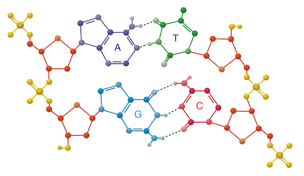
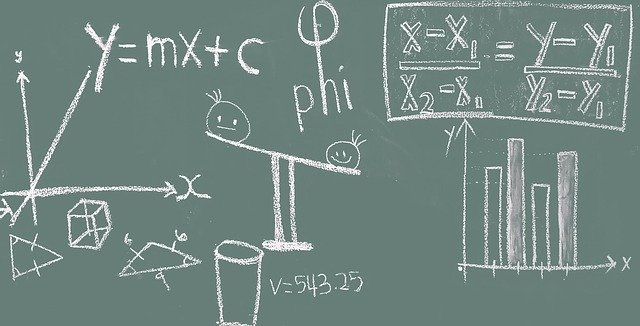

This is the first post in my [‘DNA for kids’ series,](/posts/dna-for-kids) helping you to give your child a window into the fascinating molecular world that forms the blueprint for life on Earth.

From this post your child will:

- Learn what molecules and cells are
- Find out what makes DNA so amazing
- Watch a single cell turn into a salamander
- Think about DNA as a messy instruction manual for life
- Consider the importance of plants
- Take a peek at the DNA blueprint for building a daffodil
- Learn how similar humans are to bananas
- Understand the basic structure of DNA
- Learn what a gene is
- Think about how genes are controlled
- Know how to read the DNA code
- Watch how DNA is copied by molecular machines

To supplement my [‘DNA for kids’ series](https://www.palebluemarbles.com/dna-for-kids/), I’ve created a **printable activity pack with DNA-themed puzzles, worksheets, quiz and colouring pages**. 


Download PDF


First things first.

Molecules.

## What is a molecule?

If your child is not familiar with molecules then you can introduce the topic by explaining to them that everything in our Universe that takes up space (like us, our pets, our food, our kitchen tables, their toys, the air we breathe, the Sun and the clouds) is made up of tiny, tiny **building blocks called [atoms](https://en.wikipedia.org/wiki/Atom).**

A bit like a sandcastle is made up of grains of sand, a sand grain itself is made up of its own grains: atoms.

Atoms come in different varieties according to their own building blocks, which themselves have building blocks – we’ll stick to the level of atoms for now.

**When atoms group together we call them molecules.**

A water molecule (H2O)

Water, another amazing molecule that is required for all life that we know of, is made up of just two types of atoms: hydrogen and oxygen. There are two hydrogen atoms and one oxygen atom in one molecule of water (H2O). Sucrose (a sugar) contains twelve carbon atoms, twenty-two hydrogen atoms and eleven oxygen atoms (C12H22O11) arranged in two rings.

> Can your child list any other molecules? Look up their chemical formulae and show them the chemical structures.

## What is DNA?

DNA (**d**eoxyribo**n**ucleic **a**cid) is a very big molecule (a macromolecule) made up of billions (yes, billions!) of just five types of atoms: hydrogen, oxygen, carbon, nitrogen and phosphorus.

**There are nearly as many atoms in a molecule of DNA as there are stars in a galaxy!** (to get a grasp on the number of stars in the Universe try [counting them with grains of sand).](/posts/count-the-stars-in-grains-of-sand/))

This is because DNA is so long:

- A single human DNA molecule stretched out (it is normally coiled up) would be about 4 cm long
- The DNA in a single human cell would measure 2 m
- It would take the equivalent of 507 trips to the Sun to stretch out all your DNA molecules end-to-end: it takes light nearly 3 days to travel that distance! If your child is curious about how to compute this see the bonus maths box at the end of the post.

That’s impressive, but it’s not why DNA is so amazing. Read on!

## Why is DNA so amazing?

DNA carries information. A lot of information. Enough information, in fact, to turn a single cell into a fully grown human being – like you!

Think about that for a second. One cell can grow and divide into [37.2 trillion cells](https://www.ncbi.nlm.nih.gov/pubmed/23829164) of over [200 different types:](http://sciencenetlinks.com/student-teacher-sheets/cells-your-body/) because of the DNA molecules it has nestled inside!

## What is a cell?

If your child does not know what cells are you can tell them that they are the tiny building blocks of living things. Different types of cells do different jobs: the cells in their eyes let them see; the cells in their brain let them think.

>  Can your child list other types of cells? What are their jobs?

## How to grow a salamander

**Your DNA is unique to you but with a few tweaks, it could also turn a single cell into another human, or a cat, starfish or salamander.**

You can witness the whole process for the salamander in the incredible video from National Geographic below.

> As you watch the video with your child, talk about how the cells are dividing and taking on different jobs. That is how you go from a single egg cell to a salamander, and it is all directed by the salamander’s DNA.



I hope your child is convinced at this point that DNA is amazing!

> Ask your child what else they think contains DNA.

## The blueprint for life on Earth

You can think of the information carried by DNA as a blueprint, or an instruction manual, for building life.

**Different living things carry different instruction manuals, but, on Earth, they are all written in DNA** (with the exception of some viruses that write their blueprint in RNA (another type of nucleic acid), although viruses are often not considered to be “alive” – stay tuned for a separate post on viruses!)

During the building process, the **DNA blueprint is copied into every new cell**. But **each cell follows only part of the blueprint at any given time or in any given body part**.

This is critical.

After all, as a well-behaved cell, you don’t want to follow instructions for making eyelashes if your body doesn’t yet have a head. And you don’t want to follow instructions for making a heart if you are located under a toenail.

## The library of life

Let’s have a flip through one of these instruction manuals.

In the library of life there are many to choose from and they all have fascinating tales to tell. We’ve already had a glimpse at the result of following the salamander’s manual. Let’s take a look at another life form.

**For life on Earth, plants are arguably more important than animals.**

They have this amazing talent of being able to **convert sunlight into food**. This process, called photosynthesis, is what most life on Earth depends on (exceptions exist of course, which is exciting and will be a topic for a future post).

Photosynthesis has likely evolved on other planets since **stars are such enormous sources of energy and any life that can tap into this will be successful**.

If humans vanished from the Earth, life would continue to flourish (given how we treat our planet, it would actually do much better): if plants vanished they would take most animal life with them and the world would become a very empty place.

> Ask your child to name an animal then have fun tracing all food chains back to plants!

## How to build a daffodil

It’s Spring as I write this and bulbs are flourishing all around, so let’s take a quick peek at the “How to Build a Daffodil” manual.

As we flip through we soon see that this is not a book that is read cover-to-cover. There is very little chronological order and it is full of cross-references to distant parts of the manual. Some of it is even written backwards! This is the case in the manuals of all living things: they are messy.

 

We can make out pieces of step-by-step instructions distributed through the manual: these are instructions for **building toolkits that make up the molecular machinery of the cell.**

**Some toolkits are used by all cells, some are only used in certain types of cells** (like those in pollen, petals, stems, leaves or roots) **or at certain times** (like in Spring or Winter).

**Many of these instructions are also found in the manuals of other plants** (like how to build a toolkit to make a leaf) and some are **only found in the daffodil manual** (like how to build a toolkit to make their characteristic yellow trumpet).

The tools and building blocks that make up the tool kits of a cell are protein and RNA molecules: **these are the products of our DNA blueprint; they are** manufactured in the cell and put to work to **bring the DNA blueprint to life**.

Some of these tools are shared by all life – **about [60% of your molecular tools have counterparts in a banana](https://science.howstuffworks.com/life/genetic/people-bananas-share-dna.htm) (and most likely a daffodil too!)**

### Evolution’s tinkering

**Most of the diversity we see in life comes from the way the tools are used, rather than the tools themselves.**

Evolution has tinkered with these blueprints for billions of years – taking short cuts, repurposing tools, editing, remodeling, adding, removing, reordering, reversing and duplicating pages – so, **while the complexity of the DNA blueprint is beautiful, it is neither neat nor tidy and is often redundant**! It will take scientists many years to figure out how it all works.

## The shape of DNA

Let’s get back to the DNA molecule itself. What do the instructions for life actually look like?

### The double helix

DNA, famously, has a wonderful double spiral shape made up of two strands, called the backbone, connected by what look like rungs of a ladder.

The rungs are made by pairs of four different molecular building blocks called bases (adenine, cytosine, guanine and thymine; represented by the letters A, C, G and T).

### Encoding molecular tools

Remember the tools and building blocks that a DNA blueprint produces?

**The instructions for building each tool are written into the DNA molecule as a specific sequence of DNA base pairs.**

**This sequence is called a gene.**

How many tools to build and when to build them is also encoded in the DNA as **special sequences of bases that create “on/off” or “dimmer” switches for genes**.

If a cell is supposed to be a leaf cell then all the genes that make the tools needed to build a leaf cell will be switched on and all the genes that make tools that are only used to build cells in roots and flowers will be switched off. The tools that flip the switches have their own switches.

**Switches for genes make up more of the DNA than the genes themselves.**

### The master switches of life

If you follow the trail of switches you eventually end up with some master regulators of DNA that have to be switched on before anything else can happen. This is what happens in those first few cells. The DNA blueprint is activated piece-wise until a single cell is transformed into a fully grown life form – whether that is a salamander, a daffodil, a human or something else is determined by the combination and timing of switches and toolkits.

### The rules and regulations of DNA

Back to the DNA bases.

There are special rules for which bases pair together.

Due to the different shapes of the bases:

- A always pairs with T
- G always pairs with C

This means the blueprint can be reconstructed from a single strand of DNA: unzip the double helix and match new base pairs according to the pairing rules and you now have two identical double helices; **this is how DNA is copied**!

You can watch a nice animation of how DNA is copied in the following video.

Look at those molecular machines in action: this is happening in your body right now!



> Ask your child why they think it is important to copy DNA. What would happen if a cell did not have any DNA?

The base-pairing rules are also used to transcribe and translate the instructions in DNA into the RNA and protein tools of the cell (more on this in another post).

The way the base pairs like to stack gives DNA its right-handed double helix. A left-handed double helix is less stable and is therefore rare.

>#### Bonus maths
>
> 
>
>Is your child is interested in how to calculate the total length of DNA? Have fun taking them through the following calculations. You can also talk about:
>
>- [Using scientific notation](https://www.mathsisfun.com/numbers/scientific-notation.html) to write very small or very large numbers (see my post on [counting stars with grains of sand](/posts/count-the-stars-in-grains-of-sand/) for more on large numbers)
>- How we have to use estimates for numbers we are uncertain about – try the calculation with a larger or smaller number of cells in the body. What happens to the final number for the length of DNA? **The concept of error and uncertainty in measurements is very important in science.**
>
>### How long is DNA?
>
>- **The distance from one base pair (bp) to the next in DNA is 340 pm** (explain that 1 pm (pico metre) is 1 metre split into a trillion pieces: 340 x 10-12 m)
>- **There are around 3 billion base pairs (3 x 109 bp) in the human genome**
>- Multiplying these two numbers we find that the **length of the human genome is around 1.02 metres:**
>    - (340 x 10-12) x (3 x 109) = 1.02 m
>- There are two copies of your genome in each cell so **each cell has about 2.04 metres of DNA**: 
>    - 1.02 x 2 = 2.04 m
>- **There are around 37.2 trillion cells in the adult human body so each human** adult has around 75.9 trillion metres of DNA 
>    - 2.04 x (37.2 x 1012) = 75.888 x 1012 m of DNA
>- **The distance to the Sun is 1.496 x 1011 m** (1 AU: Astronomical Unit)
>- Using this we find that **the length of all the DNA in an adult human is equivalent to around 507 times the distance from Earth to the Sun (AU) or 253.6 trips to the Sun and back**
>    - 75.888 x 1012 m of DNA / 1.496 x 1011 m to the Sun = 507.27 AU
>    - 507.27 / 2 = 253.63 trips to the Sun and back
>- It takes light 8 minutes to travel 1 AU
>- **So light would take 2.8 days to travel the length of your DNA!**
>    - 507.27 AU x 8 minutes = 4058 light minutes
>    - 4058 / 60 = 67.6 light hours
>    - 67.6 / 24 = 2.81 days

## More to explore

This is just a peek into the wonderful world of DNA and how it gives rise to life. There is much more to explore!

The next posts in [the ‘DNA for kids’ series](https://www.palebluemarbles.com/dna-for-kids) are hands-on activities to spark your child’s curiosity.

Future topics to explore include:

- How did DNA originate?
- What conditions are needed?
- How are its instructions carried out by the cell?
- What genes are shared by all life?
- Can DNA survive in space?
- What is the RNA world?
