**Astrobiology for kids? What is astrobiology? Why is it so important?** Read on to find out, and gain a deeper appreciation of your place in the Universe that you can share with your curious child.

As babies grow and develop they build models about the world around them and build up experience of what life is. They learn about everyday objects, basic actions, other animals. Pretty soon they are recognising letters and singing along to the alphabet song. But **one day astrobiology will find a missing piece to the puzzle of life will be so important that children will learn astrobiology well before their ABCs**.

## What is astrobiology?

Astrobiology is the study of life from a cosmic perspective.

Why is this important?

Let’s start by taking a cosmic perspective on our own lives and look to the night sky.

## The vastness of space

Go outside and look up on a dark, clear night and you will see a sky [plastered with stars](/posts/count-the-stars-in-grains-of-sand/), all twinkling at you from light-years away. If you sweep your gaze overhead you will see a milky band arching over you. You are looking into the plane of our galaxy. What goes through your mind?

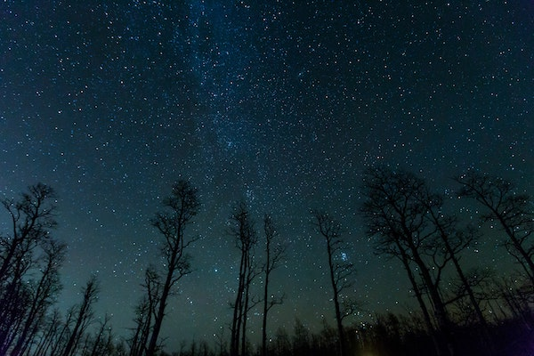

Most likely you’ll feel some sense of awe. It is a humbling experience to feel the [vastness of space](/posts/how-big-is-the-solar-system/). What you may not think about is how incredibly lucky you are to experience it.

Let’s dwell on that a while for some additional perspective on our place in the Universe. It will help you to fully appreciate the importance of astrobiology.

## Why so lucky?

Aside from living on a planet at just the right distance from just the right star and being a member of a species capable of contemplating the Universe, plus enjoying access to an enormous body of knowledge on it, **you are the product of nearly 4 billion years of evolution and trillions upon trillions of ancestors** that managed to survive long enough to pass their genes on to the next generation. You can check out what some of your ancestors may have looked like by watching the video below.

<iframe allowfullscreen="allowfullscreen" frameborder="0" height="315" src="https://www.youtube.com/embed/hSSzn4bIwZg" width="560"></iframe>

For every one of quadrillions of choices your ancestors made — swim towards that light or away from it, run from that spooky shadow in the bushes or stay in the open and enjoy the tasty food, take this job in the country or that one in the city, finish this cup of tea and drive to work or skip the tea and catch the bus — another potential person (or even another creature entirely) could be standing in your place right now.

**If they hadn’t made exactly those choices, you would not exist**.

Just like all the quadrillions of people that could exist in the future, but never will.

And yet here you are. You exist. You are here, **contemplating your own existence**. Possibly, drinking tea.

Take a moment to let that sink in, celebrate, then **thank your lucky stars**, as well as all your billions of ancestors for making the choices that meant that **you are the one that now gets to gaze up at the night sky**.

And because of the addition of your choices, on top of those quadrillion others, your child also gets to enjoy the same privilege.

## The potential of life is mind-blowing

You are just one of [more than 7.5 billion people on Earth](https://www.worldometers.info/), each with their own unique evolutionary history and trillions of ancestors.

That is astounding enough.

Humans, though, are just a small part of the life on Earth (with a disproportionate effect on the rest — more on that in a later post). Take a look at the chart below: humans are low on both the abundance and biomass scale compared to many other branches of life.

<iframe src="https://ourworldindata.org/grapher/biomass-vs-abundance-taxa" style="width: 100%; height: 600px; border: 0px none;"></iframe>

**The diversity and abundance of life on Earth is staggering.** Have a look at a few of the amazing creatures we have here, from ocean-dwelling giants to microscopic bacteria:

 
  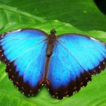
  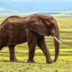
  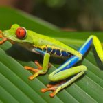
  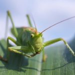
  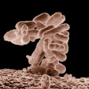
  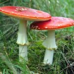
  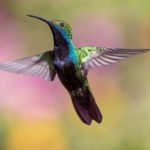
  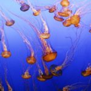
  
  
  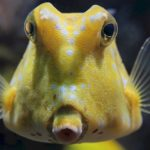
  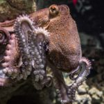
  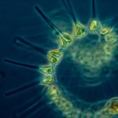
  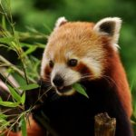
  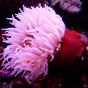
  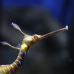
  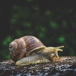
  
  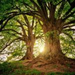
  
  


What’s even more staggering is that all of the life that exists right now is just a tiny part of the life that has ever existed on this planet. **And that is just a minuscule part of the life that could potentially exist given other choices or environments.**

Life is AMAZING.

## How many stars can you see?

Now look back at that night sky and all its twinkling stars. What you are seeing is actually only about 4000 stars, at best (you can see more if you have binoculars or a telescope).

These 4000 stars constitute only the most visible part of our tiny neighbourhood on one spiral-arm-suburb of a galaxy containing a whopping 400 billion stars. [See my post on counting stars with sand to get a better grip on this number](/posts/count-the-stars-in-grains-of-sand/).

Stars have, on average, 1.3 planets. Meaning there are over 400 billion planets in our galaxy!

That is a lot of potential for life.

Even if a tiny fraction of those [planets is habitable](/posts/what-does-habitability-mean/) that is still a colossal number. And that is just our galaxy. There are billions of galaxies in the Universe.

**The whole Universe could be teeming with life – we just haven’t found it yet.**

And now we are closing in on what astrobiology is all about. First, let’s briefly return to the night sky.

## A window on other worlds

Some of the stars that we know have planets you can actually see for yourself.

Take a look at the constellations. If you can find Orion, Taurus or Ursa Major then you can see stars that host exoplanets (see constellation maps below). There are many more in the night sky. [NASA has an amazing exoplanet explorer](https://exoplanets.nasa.gov/eyes-on-exoplanets/) if you want to search for more.

. NASA Eyes on Exoplanets.") 

. NASA Eyes on Exoplanets.") 

There have even been images taken of planets outside of [our solar system](/posts/how-big-is-the-solar-system/). 

The video below shows images of 4 massive (larger than Jupiter) planets around a star in the constellation Pegasus (this star is also visible to the naked eye).

<iframe allowfullscreen="allowfullscreen" frameborder="0" height="315" src="https://www.youtube.com/embed/gcHXGZaS_6M" width="560"></iframe>

## Questions for astrobiology

What are planets outside our solar system like? How can we find out? Do they have life? What kind of life? Is it anything like ours? How can we detect it? Is it intelligent?

Can life survive in [extreme environments](/posts/what-does-habitability-mean/)? What other environments exist? Is there life in other parts of our own solar system?

How did life originate on Earth? [How did it evolve?](/posts/evolution-of-flowers/) Would it evolve the same way on other planets?

Are there universal features of life? What is life, anyway?

Could humans live in space? Or on another world? How would we get there?

These, and many more, are the questions of astrobiology. **The study of life from a cosmic perspective.**

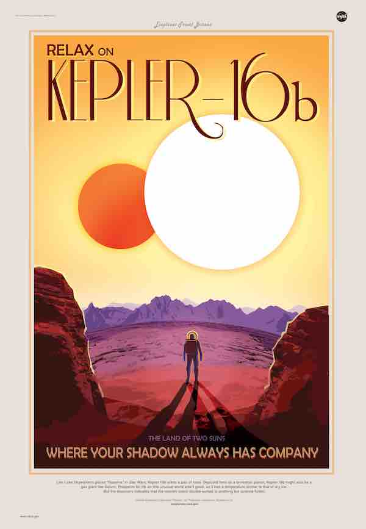

## Why is astrobiology important?

Humans have been fascinated by the questions of astrobiology for millennia.

The answers will be profound.

Finding them will require **cooperation on an international level** across **many fields of science**.

**It will bring people together** to answer the most ancient question: **are we alone?**

### Astrobiology before ABCs

**Imagine we’ve discovered life on another planet.** Imagine looking at that star and knowing that there are **others looking back** (albeit from the past — since it will take their light years to reach you).

**Suddenly the Universe is not so lonely.**

What do we do with this knowledge?

**Our view of our place in the cosmos will be forever changed**.

It will unite us.

It will give us **another reason to take better care of each other**, human and non-human, on our own planet, **our little community in the broader galaxy**.

**The knowledge that there is life elsewhere in the Universe will be so important that children will be taught it from birth.**

“This is a cat.”

“That is a dog.”

“Those are our galactic neighbours.”

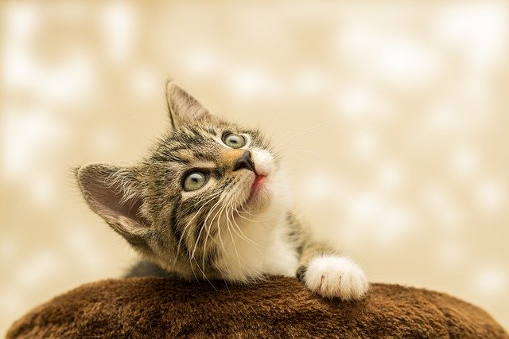

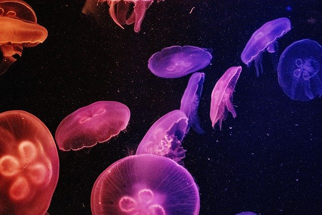 

Already, our mindset is shifting because of the discoveries of astrobiology.

**We are no longer the rare blue marble in space**.

We are one of billions of planets that may harbour life. Our definition of a [habitable environment](/posts/what-does-habitability-mean/) has been shaken up by the discovery of bacteria that do not rely on sunlight, bacteria that can survive under metres of ice.

**What else is possible?**

With every generation, human knowledge explodes. We are learning things at an incredible rate.

**Our children’s generation will find the answers to questions we haven’t even thought of yet.**

**Let’s get them started on the right path!**
